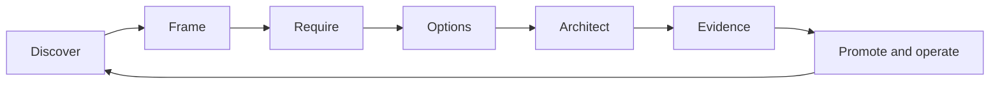

# The AI solution architecture method

> _Last reviewed: 2026-07-16 — see the [freshness policy](../appendix/maintenance.md)._

## Learning objectives

After this chapter you will be able to:

- frame an AI opportunity as a measurable system decision;
- translate uncertainty into quality attributes, budgets, controls, and fallbacks;
- describe the system through stakeholder-specific views and decision records;
- choose rules, search, ML, GenAI, agents, human work, or abstention deliberately;
- produce an architecture evidence pack that survives review and change.

## Decision in one sentence

> **Design the smallest socio-technical system that achieves a valuable user outcome within explicit quality, risk, latency, cost, and accountability boundaries.**

An AI solution architect does not begin with a model. The work begins with a decision, workflow, affected people, authoritative data, consequence, and observable success state.

## Why probabilistic components change architecture

Traditional services can still fail, but a valid response normally has deterministic semantics. A model can return syntactically valid, fluent, policy-violating, unsupported, or subtly wrong output. Its behavior can vary with wording, context order, model revision, retrieved data, tool state, and sampling.

Therefore architecture must contain:

- an evaluated operating envelope rather than a capability claim;
- deterministic invariants around identity, policy, transactions, and schemas;
- evidence and uncertainty visible to users and downstream systems;
- repeated evaluation and production outcome monitoring;
- bounded authority, time, tokens, spend, and side effects;
- safe degradation, correction, appeal, rollback, and retirement.

## The seven-step method



| Step | Diagram stage | Detailed description |
| ---: | --- | --- |
| 1 | Discover | Observe the real workflow, actors, inputs, exceptions, incentives, systems of record, and current outcome baseline. |
| 2 | Frame | Express the user, decision, desired outcome, unacceptable outcome, evidence standard, and safe fallback as a testable problem statement. |
| 3 | Require | Convert goals into measurable quality, safety, privacy, reliability, latency, cost, and human-workload requirements. |
| 4 | Options | Compare non-AI, deterministic, search, model, agent, and human approaches before committing to a solution pattern. |
| 5 | Architect | Define components, trust boundaries, data and control flows, authority, failure containment, and operational ownership. |
| 6 | Evidence | Test the architecture against representative cases, critical slices, adversarial conditions, baselines, and release thresholds. |
| 7 | Promote and operate | Release progressively, observe real outcomes, manage incidents and drift, and feed production evidence into the next discovery cycle. |

### 1. Discover the real workflow

Observe current work, users, inputs, handoffs, exceptions, systems of record, delays, corrections, and incentives. Interview people who perform, supervise, receive, and are affected by the decision. Sample real cases before writing a solution statement.

### 2. Frame the decision

Write:

```text
For [user/actor] in [context], improve [workflow decision/outcome]
from [baseline] to [target], while never [unacceptable outcome].
Evidence will be [measure and population]. If confidence or service is
insufficient, the system will [safe fallback].
```

Separate assistance, recommendation, decision, and action. Each implies different authority and accountability.

### 3. Define requirements and quality attributes

Use scenarios, not adjectives:

```text
When 2,000 interactive requests/minute arrive during a provider outage,
95% of eligible low-risk requests complete within 8 seconds through an
approved fallback; consequential writes pause without duplicate effects.
```

Specify outcome quality, harmful-failure ceiling, privacy, security, fairness, accessibility, evidence, freshness, consistency, TTFT/completion latency, availability, recoverability, scalability, portability, observability, cost per success, and human workload. Rank them; architecture is how conflicts are resolved.

Allocate four budgets:

- **uncertainty:** what the system may not know before abstaining;
- **failure:** how many invalid or harmful outcomes are tolerable by slice;
- **latency/capacity:** time and resources available across stages;
- **authority:** data, tools, money, scope, autonomy, and duration granted.

### 4. Compare options, including no AI

| Pattern | Prefer when | Warning |
| --- | --- | --- |
| Rules/workflow | logic and state transitions are stable | rule explosion under semantic ambiguity |
| Search/analytics | users need evidence or aggregation | retrieval is not synthesis or action |
| Predictive ML | repeated labeled prediction | drift, proxy bias, delayed labels |
| Generative model | language or multimodal transformation | unsupported output and variable cost |
| RAG | current governed evidence must support claims | ingestion, ACL, freshness, citation burden |
| Agent | path is open-ended and tool use must adapt | authority, state, reliability, cost complexity |
| Human service | consequence or exceptions require judgment | capacity, consistency, delay |

Use AI only where its marginal outcome improvement exceeds the added risk and lifecycle cost. Escalation and abstention are valid architecture components.

### 5. Describe the architecture through views

[ISO/IEC/IEEE 42010:2022](https://www.iso.org/standard/74393.html) distinguishes an architecture from its description and formalizes stakeholders, concerns, viewpoints, and model kinds. For an AI system, maintain at least:

- context: people, external systems, responsibility and trust boundaries;
- containers/components: gateway, context, model, tools, state, policy, evaluation;
- sequence: normal, approval, denial, timeout, cancellation, partial effect;
- data/provenance: collection, transformation, use, retention, deletion;
- identity/authority: subject, actor, workload, delegation, resource policy;
- deployment: accounts/projects, regions, networks, runtimes, isolation;
- evaluation/operations: datasets, gates, SLOs, traces, incidents, rollback;
- economics: workload, capacity, unit cost, human work and benefit.

A diagram without assumptions, decisions, qualities, and failure behavior is illustration, not an architecture argument.

### 6. Build evidence

Prototype the highest-uncertainty assumption, not the easiest UI. Use representative cases, critical slices, adversarial tests, load/failure injection, security and privacy review, cost modeling, and human usability. Compare against the current workflow and a simpler option.

### 7. Promote, operate and revisit

Release one versioned system manifest through shadow and canary. Monitor user outcomes and controls. Provider, model, data, prompt, policy, tool, population, scale, and purpose changes can invalidate evidence and trigger a new decision cycle.

## Architecture decision record

Each material decision records context, decision, status/date/owner, options, quality-attribute tradeoff, evidence, risks, consequences, reversibility, monitoring, and evidence that would change it. Avoid “use vector DB” ADRs; record why a retrieval pattern satisfies concrete questions, access and freshness.

## Northstar worked framing

Northstar does not ask “Which agent framework should we use?” It asks whether a support system can reduce delayed-shipment resolution time without unauthorized data disclosure or refund. Rules handle order state and policy limits; retrieval supplies current evidence; a bounded agent handles ambiguous investigation; a person approves exceptions; the refund service validates authority and idempotency. Success is confirmed resolution, not conversation quality.

## Practical artifact: architecture evidence pack

Include problem/effect statement, current workflow, stakeholder and impact map, functional and quality scenarios, option analysis, architecture views, ADRs, data and threat models, evaluation plan/results, model/tool authority, reliability/cost model, human controls, rollout/SLOs, governance dossier, and retirement/exit plan.

## Lab

Frame Northstar's delayed-shipment case. Produce three options—deterministic workflow, copilot, bounded agent—then rank eight quality attributes, draw context and failure sequence views, write two ADRs, define five release thresholds, and state what evidence would reverse the decision.

## Check yourself

1. What is the observable user outcome and reference workflow?
2. Which decisions are deterministic, model-driven, or human-owned?
3. What is the highest-consequence failure and safe fallback?
4. Which architecture view exposes each trust boundary?
5. Which assumption should be tested first?

## Further reading

- [ISO/IEC/IEEE 42010:2022 overview](https://www.iso.org/standard/74393.html).
- [AI discovery and problem framing](01-discovery-framing.md).
- [Requirements, NFRs and quality attributes](02-requirements-nfrs.md).
- [C4, sequence diagrams and AI ADRs](03-diagrams-adrs.md).
