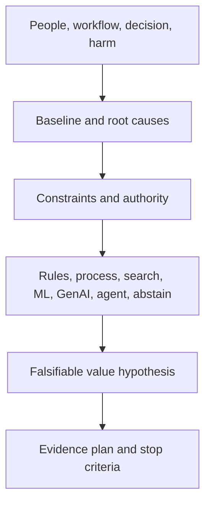

# AI discovery & problem framing

> Last reviewed: 2026-07-16. See the [freshness policy](../appendix/maintenance.md).

## Learning objectives

After this chapter you will be able to frame a workflow decision before choosing technology, establish a baseline and counterfactual, identify affected people and authority, and define evidence that supports build, buy, automate, assist, or abstain.

## Begin with the decision or work

“We need a chatbot” is a solution claim. Discovery starts with who is trying to do what, why the current workflow fails, what decision or action changes, and who bears errors.



## Discovery questions

### Workflow and people

- What event starts the work and what observable outcome ends it?
- Which steps require judgment, retrieval, calculation, communication, or action?
- Who performs, reviews, receives, and is affected by the work?
- Where are queues, rework, handoffs, ambiguity, or policy exceptions?
- What happens to people when the system is wrong, unavailable, or slow?

### Baseline

Measure volume and arrival pattern, cycle and touch time, error/rework, outcome, cost, escalation, variability, user experience, and distribution across important slices. Sample real cases and observe work; process documents often describe the intended rather than actual workflow.

### Authority and data

Identify authoritative records, ownership, quality, access, purpose, retention, residency, and update cadence. Separate recommendation, draft, approval, and execution authority. A model that can compose a refund request is not thereby authorized to issue one.

### Constraints and alternatives

Test policy/process repair, training, better search, rules, analytics, classical ML, assistive GenAI, and bounded agents. AI is justified when variability requires it and evidence shows advantage after control and operating cost.

## Opportunity canvas

```yaml
use_profile: shipment_support_advice
population: trained Northstar support agents
current_workflow:
  trigger: customer asks about delayed shipment
  outcome: correct answer or escalation with evidence
baseline:
  monthly_cases: 18000
  median_touch_minutes: 11
  repeat_contact_rate: 0.18
problem_causes: [fragmented_policy, slow_order_lookup]
value_hypothesis: "reduce median touch time 20% without increasing repeat contact"
authority: draft_only
prohibited: [refund_execution, legal_advice]
constraints: [Canada_residency, p95_first_response_3s]
alternatives: [unified_search, rules, grounded_copilot]
evidence_gate: "offline task success >= 90%; policy violation <= 0.1%; controlled trial"
owner: VP_customer_operations
stop_condition: "no qualified outcome improvement after 12 weeks"
```

## Find the smallest testable use profile

Split broad visions into profiles with one purpose, population, authority, and outcome. Start with a high-frequency, evidence-rich, reversible slice. Exclude rare high-consequence exceptions until controls and data support them. This improves evaluation and prevents a low-risk assistant from becoming an unreviewed action agent.

## Assumptions and unknowns

Maintain an assumption register with importance, evidence, owner, test, deadline, and consequence if false. Prioritize tests for assumptions that are both uncertain and architecture-changing: source quality, user adoption, model capability, latency, legal authority, provider terms, or action reversibility.

## Discovery exit criteria

Proceed to architecture only when there is a named outcome owner, observed baseline, scoped profile and prohibited uses, affected-person analysis, viable data and authority path, alternatives, value and risk hypotheses, evaluation plan, and stop decision. Otherwise conduct a bounded spike or stop.

## Northstar decision

Northstar rejects “autonomous customer-service agent” as too broad. It starts with shipment evidence and draft replies for trained agents. Refund execution is excluded. A controlled trial compares it with unified deterministic search and measures correctly resolved cases, effort, repeat contact, and policy violations.

## Artifact, lab, and checks

Produce an **AI opportunity canvas**, current-state workflow, assumption register, and discovery decision. For the lab, interview three Northstar roles, sample ten cases, and recommend build, buy, process repair, or abstention.

1. Which observed root cause requires probabilistic behavior?
2. Who bears a false positive and a false negative?
3. What cheaper alternative is the AI option compared against?
4. Which result would stop the initiative?

## Further reading

- [NIST AI RMF: Map](https://airc.nist.gov/airmf-resources/airmf/5-sec-core/)
- [FinOps Foundation: Unit Economics](https://www.finops.org/framework/capabilities/unit-economics/)
