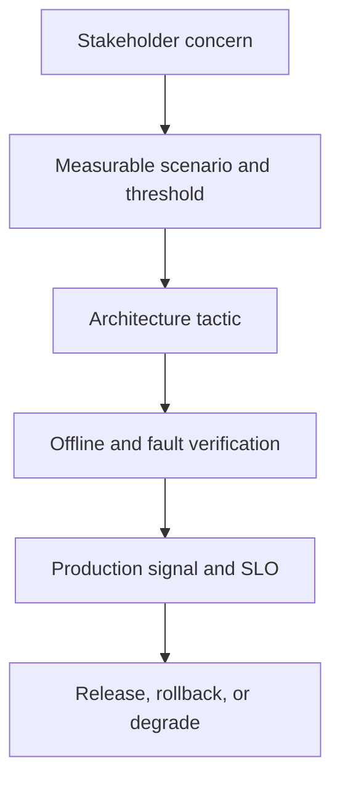

# Requirements, NFRs & quality attributes

> Last reviewed: 2026-07-16. See the [freshness policy](../appendix/maintenance.md).

## Learning objectives

After this chapter you will be able to convert “accurate, safe, fast, and affordable” into measurable scenarios, prioritize conflicts, connect requirements to tests and runtime signals, and define useful degraded behavior.

## Write scenario-based requirements

An AI requirement needs population, trigger, environment, response, measure, threshold, evidence method, and owner:

```yaml
id: Q-017
quality: grounded_task_success
population: shipment_policy_questions
trigger: authorized support agent submits a question
environment: normal production; corpus freshness <= 4h
response: answer claims cite valid accessible evidence
threshold:
  offline_lower_confidence_bound: 0.90
  production_unsupported_claim_rate: 0.001
measurement: expert rubric + deterministic citation validation
degraded_behavior: curated search with no generated answer
owner: support-product-owner
```

## Quality-attribute model



## Minimum quality attributes

| Attribute | Example measure |
|---|---|
| Task quality | expert task success with uncertainty and critical slices |
| Grounding | supported-claim and citation precision/recall |
| Safety | severe failure rate under normal and adversarial inputs |
| Security/privacy | unauthorized retrieval/action rate; leakage tests |
| Fairness/accessibility | outcome and usability by relevant groups |
| Reliability | successful qualified requests; dependency and degraded mode |
| Latency | p50/p95/p99 TTFT and end-to-end by workload class |
| Capacity | admitted tokens/tasks at deadline and quality target |
| Recoverability | containment, reconciliation, and restoration time |
| Operability | trace coverage, version attribution, runbook exercise |
| Cost/value | cost per qualified task and realized outcome |
| Maintainability | change lead time, regression rate, portability |

## Separate layers

Model metrics, component metrics, system task metrics, and business outcomes are not interchangeable. A retrieval recall improvement may not improve task success; task success may not produce adoption or value. Create a metric tree and state which layer each threshold governs.

## Population and uncertainty

Define the cases to which the threshold applies and critical slices: language, input length, domain, tenant, risk, tool, user group, and adversarial class. Report confidence intervals and sample size. “95% accurate” without a population, rubric, and uncertainty is not a requirement.

For rare severe harm, a small test set cannot demonstrate a tiny production rate. Combine analysis, adversarial campaigns, independent controls, limited authority, monitoring, and staged exposure.

## Prioritize conflicts

Name the dominant attribute and tie-break rule per journey. A routing example:

| Journey | First priority | Second | Trade-off |
|---|---|---|---|
| Public FAQ | grounded quality | cost | may wait slightly for verification |
| Voice turn | latency | conversational quality | shorter response/model route |
| Refund action | authorization/integrity | latency | fail closed and wait for approval |
| Batch report | quality/completeness | throughput | asynchronous deadline |

Record minimum acceptable thresholds before optimization. Pareto comparisons are more honest than a single weighted score when values are non-compensatory.

## SLOs and error budgets

SLOs cover system outcomes under stated conditions. Measure qualified success, not HTTP 200. Keep availability, latency, quality, and safety budgets separate: spare availability cannot compensate for a privacy breach.

Define dependency budgets, observation windows, exclusions, delayed outcomes, and response to budget consumption. A quality breach may disable one corpus while infrastructure remains available.

## Degraded requirements

Specify behavior under model, retrieval, tool, policy, memory, region, and capacity failure. A degraded mode declares reduced guarantees and user communication. Consequential actions fail closed if authorization or policy is unavailable; informational use may fall back to curated search.

## Requirements traceability

Maintain:

```text
stakeholder concern → requirement → design tactic → test/evaluation
→ release gate → production signal → owner/runbook → review evidence
```

Version requirements with the use profile. A changed threshold or population is a product/risk decision, not merely dashboard configuration.

## Northstar scorecard

Northstar uses grounded task success ≥90% lower confidence bound for core shipment cases, zero known cross-tenant retrieval in adversarial tests, p95 TTFT ≤3 seconds, p95 total ≤12 seconds, and cost per qualified resolution below the baseline. Refund actions require valid delegated identity and matching approval; latency does not override those invariants.

## Artifact, lab, and checks

Produce a **prioritized NFR scorecard** with scenarios, slices, thresholds, uncertainty, tactics, tests, runtime signals, owners, degraded behavior, and conflict decisions. Test it against one provider failure and one quality regression.

1. What population does each quality threshold cover?
2. Which attributes are non-compensatory?
3. What is a qualified successful request?
4. Which production signal triggers degradation?

## Further reading

- [ISO/IEC 25010 systems and software quality models](https://www.iso.org/standard/78176.html)
- [Google SRE: Service Level Objectives](https://sre.google/sre-book/service-level-objectives/)
- [NIST AI RMF: Measure](https://airc.nist.gov/airmf-resources/airmf/5-sec-core/)
