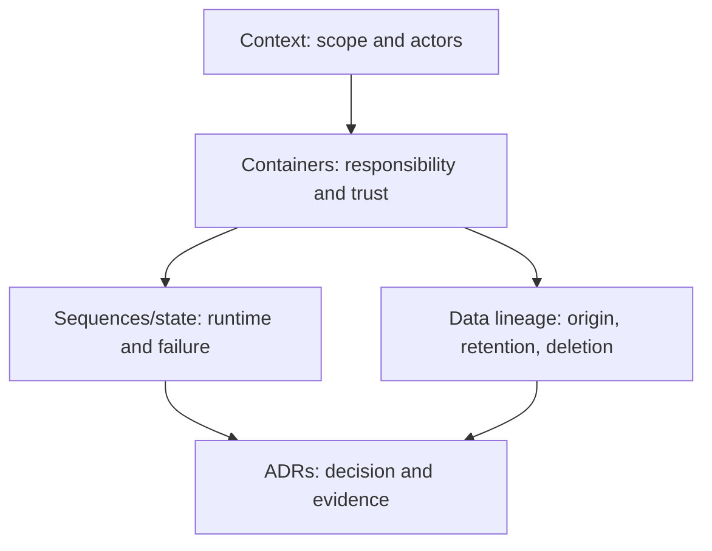
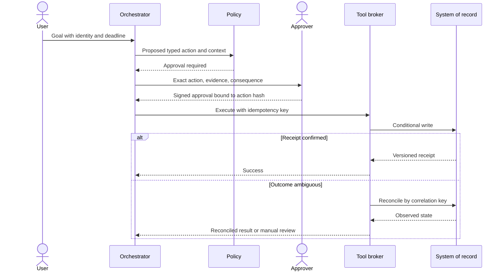

# C4, sequence diagrams & AI ADRs

> Last reviewed: 2026-07-16. See the [freshness policy](../appendix/maintenance.md).

## Learning objectives

After this chapter you will be able to choose a diagram for the question under review, expose trust and runtime behavior, write falsifiable ADRs, and keep decisions linked to evidence and releases.

## One diagram cannot answer every question

| View | Question | Required AI detail |
|---|---|---|
| Context | Who and what interacts with the system? | affected people, providers, systems of record, external authority |
| Container | Where are responsibilities and trust boundaries? | gateway, retrieval, policy, orchestration, model, tools, evidence |
| Component | Which internal module owns a control? | validators, brokers, schedulers, memory policy |
| Sequence | What happens for one scenario? | identity, deadlines, retrieval, model, tool, approval, failure |
| Data/lineage | Where does information originate and persist? | chunks, embeddings, memory, caches, evals, deletion |
| Deployment | Where does it run and fail? | regions, networks, accelerators, control/data planes |
| State machine | Which transitions are legal and recoverable? | agent run, approval, action, incident, compensation |

## Context-to-runtime set



Draw boundaries, not product logos. Label protocols, identity propagation, data classification, regions, stores, side effects, and human authority. A model box without its surrounding controls is not an AI architecture.

## Sequence the dangerous path

Use a sequence diagram for the highest-consequence or most failure-prone scenario, including timeouts and alternatives:



## Diagram quality rules

- title the decision or scenario, not “architecture”;
- include a legend for trust/data classifications if needed;
- number flows when order matters and accompany dense diagrams with prose/table;
- distinguish control plane, data plane, and evidence plane;
- show the source of identity and authorization;
- show stores and retention, not only calls;
- show degraded and failure behavior;
- include accessibility descriptions and keep labels concise;
- version diagrams with the release/ADR they represent.

## AI ADR template

```markdown
# ADR-014: Use bounded planner-executor for unusual support cases

Status: Accepted, expires 2026-10-16
Context: decision, use profile, constraints, current evidence
Decision: chosen option and precise scope
Options: workflow; routed workflow; bounded agent; abstain
Dominant quality attribute: action integrity
Consequences: benefits, costs, risks, operational ownership
Controls: authority, data, evaluation, recovery, human role
Evidence: benchmark/eval IDs and uncertainty
Assumptions and defeaters: conditions that invalidate the decision
Rollout and rollback: gates, signals, last known-good tuple
Review triggers: material changes and review date
```

An ADR records one significant decision. It is not a meeting transcript or evergreen design document. Supersede it; do not rewrite history. Link consequences to backlog and controls to tests.

## Decide with evidence

Compare options against prioritized quality scenarios. Record what would change the decision. Prototype the highest uncertainty, not the easiest demo. When evidence is weak, make a reversible decision with an expiry and limited blast radius.

## Review pack

For a consequential system include context/container views, key sequences and state machines, data/lineage and deployment views, NFR scorecard, threat model, evaluation plan/results, cost model, governance/risk card, operating model, and ADR index. Provide a one-page summary linking rather than duplicating details.

## Northstar decision

Northstar’s core set includes context, container, retrieval sequence, refund action sequence/state, data lineage, and regional deployment. ADRs cover managed hosting, hybrid retrieval, and bounded agent authority. Each names its dominant attribute, evidence, rollback, and review trigger.

## Artifact, lab, and checks

Produce a **C4 context/container pair, one critical sequence, a data-flow view, and three ADRs**. Run a review in which another team must identify all authorities, stores, and failure modes without verbal explanation.

1. Which question does each diagram answer?
2. Where is identity converted into tool authorization?
3. Which assumption would supersede the ADR?
4. Can the runtime failure path be reconstructed from the views?

## Further reading

- [C4 model](https://c4model.com/)
- [Architecture Decision Records](https://adr.github.io/)
- [Mermaid syntax reference](https://mermaid.js.org/intro/)
