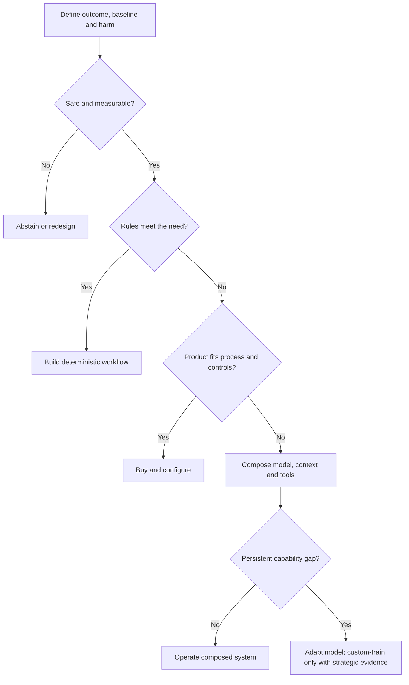

# Build, buy, adapt, or abstain

> _Decision guide — last reviewed: 2026-07-25. See the [freshness policy](../appendix/maintenance.md)._

## Learning objectives

After this chapter you will be able to:

- separate a business capability from an attractive AI feature;
- compare abstain, rules, compose, buy, adapt, and custom-build options;
- define evidence, stop conditions, and an exit path before committing.

## The decision in one sentence

Choose the least-custom option that meets the risk-adjusted outcome, and abstain when no option clears the evidence and control gates.

## Start with the outcome, not the model

“Should we build an agent?” is already too narrow. Write a one-page decision brief with the user, decision or task, economic value, unacceptable harm, required service levels, data constraints, and a measurable baseline. Include the current manual or deterministic process. AI must beat that baseline after review effort, exception handling, and failure cost—not only on a demo set.

Use six options:

| Option | Best fit | Hidden cost | Evidence gate |
|---|---|---|---|
| Abstain or redesign | harm is high, value is weak, or feedback is unavailable | opportunity cost | no safe, testable operating envelope exists |
| Deterministic software | stable rules and exact outcomes | rule maintenance | rules cover the important cases |
| Compose with managed models | differentiated workflow, commodity model capability | integration and operations | system-level evaluation passes |
| Buy a product | common business process with acceptable fit | process change and vendor dependence | end-to-end pilot with your data |
| Adapt an existing model | persistent domain or behavior gap | data, training, and regression burden | prompting/RAG cannot close the gap |
| Train a custom model | strategic capability and unique data at sufficient scale | research, compute, safety, serving | an investment case survives downside analysis |

## Evidence-led decision flow

| Step | SA question | Required artifact |
|---|---|---|
| Define | What outcome and harm can stakeholders recognize? | outcome contract and baseline |
| Eliminate | Can rules or process redesign solve it? | non-AI alternative |
| Validate fit | Does a product satisfy data, control, UX, and integration needs? | scripted proof of value |
| Compose | Can retrieval, tools, and workflow close the gap? | system evaluation report |
| Adapt | Is the remaining gap stable and worth owning? | data rights, training, rollback, and TCO plan |

## Score the whole lifecycle

A weighted matrix is useful only when weights come from agreed quality attributes. Score outcome quality, safety, integration fit, data control, time to value, operability, portability, skills, three-year cost, and supplier viability. Add confidence beside each score; an unsupported “5” is not evidence. Treat hard constraints—residency, accessibility, regulated approval, recovery point, or license—as pass/fail before weighting.

Calculate expected value across normal, degraded, and harmful outcomes. Include human review minutes, model and tool calls, integration change, evaluation upkeep, incident response, vendor migration, and decommissioning. Run sensitivity analysis: if a small change in token price or review rate changes the winner, the decision is fragile.

## Northstar example

Northstar wants faster benefits-case triage. Fully automated approval is rejected because errors create financial and regulatory harm. Rules already validate completeness and eligibility. A purchased document product extracts common fields, while a composed retrieval-and-reasoning service drafts a recommendation with citations. A human retains approval authority. Adaptation is deferred until six months of adjudicated examples show a stable error class that prompt, retrieval, or UI changes cannot fix.

The ADR records three stop conditions: citation coverage below target, reviewer disagreement above threshold, or no reduction in end-to-end handling time. The exit plan exports source documents, normalized facts, decisions, evaluation cases, prompts, and audit events in open formats.

## Practical artifact: option dossier

For every finalist capture:

1. architecture and trust boundaries;
2. evaluation results on representative and adversarial cases;
3. hard constraints and residual risks;
4. three-year cost range and sensitivity;
5. operating model, incident owner, and rollback;
6. commercial assumptions, data rights, and exit test;
7. the evidence that would reverse the decision.

## Check yourself

1. Which hard constraint removes an option before scoring?
2. Does the business case include review and failure costs?
3. What result triggers abstention or a deterministic fallback?
4. Which asset must remain portable to preserve negotiating power?

## Further reading

- [NIST AI Risk Management Framework](https://www.nist.gov/itl/ai-risk-management-framework)
- [FinOps Framework](https://www.finops.org/framework/)
