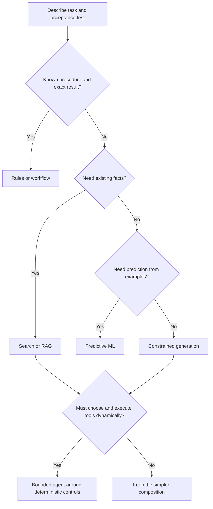

# Rules, search, ML, GenAI, and agents

> _Pattern-selection guide — last reviewed: 2026-07-25._

## Learning objectives

- match a problem to deterministic, predictive, generative, retrieval, or agentic patterns;
- combine patterns without assigning probabilistic components unnecessary authority;
- identify when an agent is architectural overreach.

## The decision in one sentence

Use the lowest-autonomy pattern that can meet the outcome, and compose patterns around explicit contracts instead of treating an LLM as the whole system.

## Pattern catalogue

| Pattern | Use when | Output contract | Main failure |
|---|---|---|---|
| Rules/workflow | policy is explicit and stable | exact state transition | rule explosion |
| Search/retrieval | the answer exists in governed sources | ranked evidence | missing or stale evidence |
| Predictive ML | repeated labeled outcomes exist | score/class with calibration | drift and proxy bias |
| Generative model | language or media must be transformed | constrained draft/artifact | unsupported content |
| RAG | generation must be grounded in changing knowledge | answer plus citations | retrieval-generation mismatch |
| Agent | the path cannot be fully prescribed and tools must be selected dynamically | bounded goal, actions, terminal state | compounding error and unsafe action |

## Selection flow

| Step | Design question | Control |
|---|---|---|
| Acceptance | Can success be checked automatically or by rubric? | executable evaluation |
| Knowledge | Is truth in a governed source? | retrieval scope and citation validation |
| Prediction | Are labels representative and lawful? | calibration and drift monitoring |
| Generation | Can output be constrained and reviewed? | schema, grounding, moderation |
| Action | Is runtime path selection worth its added risk? | least privilege, budget, approval, terminal states |

## Compose by uncertainty

A strong production design often uses every pattern in a deliberate order. Rules authenticate the user and enforce entitlements. Search retrieves eligible evidence. Predictive ML prioritizes cases. A generative model drafts a human-readable result. An agent is introduced only if the workflow contains genuine runtime branching—such as selecting among multiple evidence sources or negotiating a repair—and its actions remain behind deterministic policy enforcement.

Do not ask an LLM to calculate what a library can calculate, remember what a database can store, authorize what a policy engine must decide, or retry what a workflow engine can recover. This division reduces hallucination surface and makes failures observable.

## A five-axis autonomy envelope

Document autonomy independently across:

- **scope:** one task to an open-ended goal;
- **time:** one request to a long-running process;
- **tools:** read-only to irreversible action;
- **environment:** sandbox to production systems;
- **oversight:** every step approved to exception-only review.

An “agent” may be high on one axis and low on others. Release decisions should specify the envelope, not use a binary autonomous/not-autonomous label.

## Northstar example

Northstar’s case intake uses rules for eligibility and required fields, OCR and extraction for documents, retrieval for policy evidence, a calibrated classifier for routing, and constrained generation for the explanation. A durable workflow owns state. The agentic portion may request missing evidence or select an approved lookup tool, but it cannot approve a claim, change a beneficiary record, or invent a new process path.

## Practical artifact: pattern decision record

Record the task, uncertainty source, selected pattern, rejected simpler pattern, state owner, output contract, evaluation, authority boundary, failure mode, and fallback. Revisit the record when the task, model, data, or regulatory classification changes.

## Check yourself

1. Which component owns truth, state, authorization, and recovery?
2. Could a deterministic workflow replace the agent?
3. What is the smallest useful autonomy envelope?
4. How is each probabilistic output verified before it affects state?

## Further reading

- [NIST AI RMF Core](https://airc.nist.gov/airmf-resources/airmf/5-sec-core/)
- [CloudEvents specification](https://github.com/cloudevents/spec)
