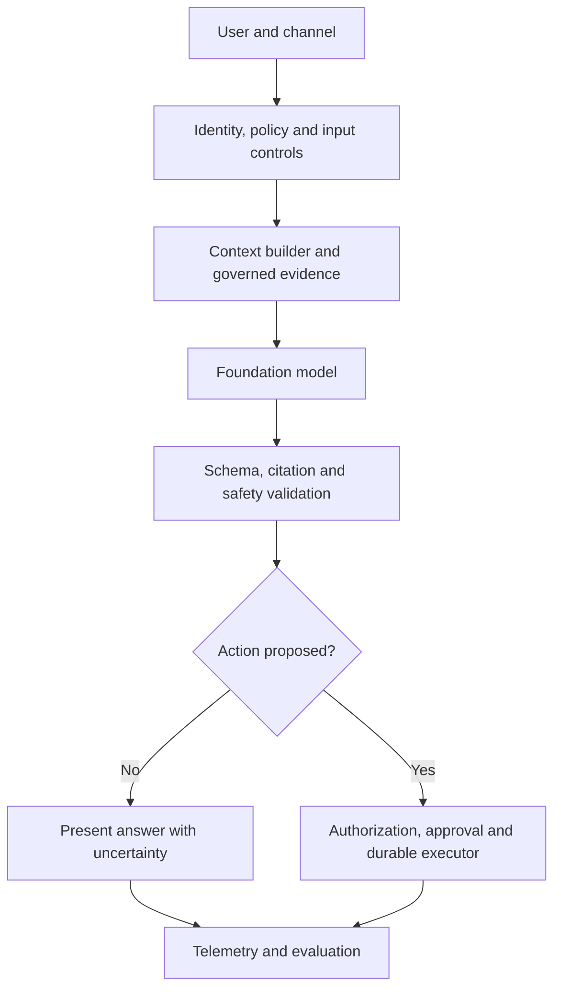

# Foundation model capabilities and limits

> _Capability guide — last reviewed: 2026-07-25._

## Learning objectives

- reason about foundation models as probabilistic components rather than knowledge bases;
- separate model capability from system capability;
- design tests for limitations that matter to the use case.

## The decision in one sentence

Select a model only after proving the system can bound its uncertainty, verify consequential outputs, and tolerate provider or version change.

## What foundation models provide

Foundation models compress broad patterns learned from large datasets and adapt at inference time through instructions and context. They can transform language, code, images, audio, and video; extract structured information; classify; summarize; reason over supplied material; and propose tool calls. They are especially valuable where inputs and outputs are semantically rich and exhaustive rules are impractical.

They do not inherently provide current truth, durable memory, identity, authorization, transactionality, legal accountability, calibrated confidence, or guaranteed repeatability. Those are system responsibilities.

| Capability | Useful architectural role | Required companion |
|---|---|---|
| language/media understanding | normalize unstructured input | schema validation and source retention |
| generation | draft, explain, translate, transform | grounding, policy, and review |
| in-context reasoning | plan over supplied facts | tool verification and step budgets |
| tool selection | choose among described actions | authorization and durable execution |
| multimodality | connect visual, audio, and text evidence | modality-specific evaluation |

## Model versus system boundary

| Layer | Responsibility | Never delegate solely to the model |
|---|---|---|
| Input | identity, consent, classification | entitlement |
| Context | freshness, provenance, minimization | source of truth |
| Model | semantic inference and proposal | final authority |
| Validation | structure, citations, policy | self-attestation |
| Execution | idempotency, transaction, recovery | irreversible side effect |
| Operations | versions, traces, evaluation | unexplained silent change |

## Limits that shape architecture

**Hallucination and grounding.** Plausible language is not evidence. Retrieve authoritative material, preserve citations, and validate that claims are entailed by cited passages.

**Nondeterminism and sensitivity.** Small changes in prompt, context order, sampling, or provider implementation can change behavior. Version the full request envelope and run regression suites.

**Context is finite and attention is uneven.** A large window does not guarantee correct use of every token. Select, structure, rank, and summarize context; test long-context failure modes.

**Reasoning traces are not proof.** A convincing explanation can accompany a wrong answer. Verify results with tools, constraints, independent evidence, or domain review.

**Knowledge and cultural coverage are uneven.** Cutoff, language, geography, and domain gaps require current retrieval and locally authored evaluation.

**Confidence is not native calibration.** Verbal confidence may be misleading. Derive operational confidence from evidence coverage, verifier results, task class, and observed error rates.

**Security boundaries are external.** Prompt injection can influence model behavior. Separate untrusted content from instructions and enforce tool permissions outside the model.

## Capability card and model portfolio

Maintain a capability card for each approved model: modalities, context and output limits, supported regions, data handling, latency distribution, cost, structured-output reliability, tool-use performance, safety behavior, known language gaps, evaluation date, and fallback compatibility. Treat model choice as a route in a portfolio, not a permanent global default.

## Northstar example

Northstar does not ask the model to determine policy eligibility. It retrieves the current policy, extracts case facts with field-level provenance, and asks the model for a structured recommendation. Deterministic checks verify calculations and mandatory criteria. The interface shows cited evidence and routes low-coverage or conflicting cases to an adjudicator.

## Practical artifact: limitation-to-control map

For every important limitation record the triggering condition, affected outcome, detector, preventive control, recovery, owner, and evaluation case. A limitation with no detector or recovery is an accepted risk and must be named as such.

## Further reading

- [NIST Generative AI Profile](https://nvlpubs.nist.gov/nistpubs/ai/NIST.AI.600-1.pdf)
- [Model Cards for Model Reporting](https://doi.org/10.1145/3287560.3287596)
