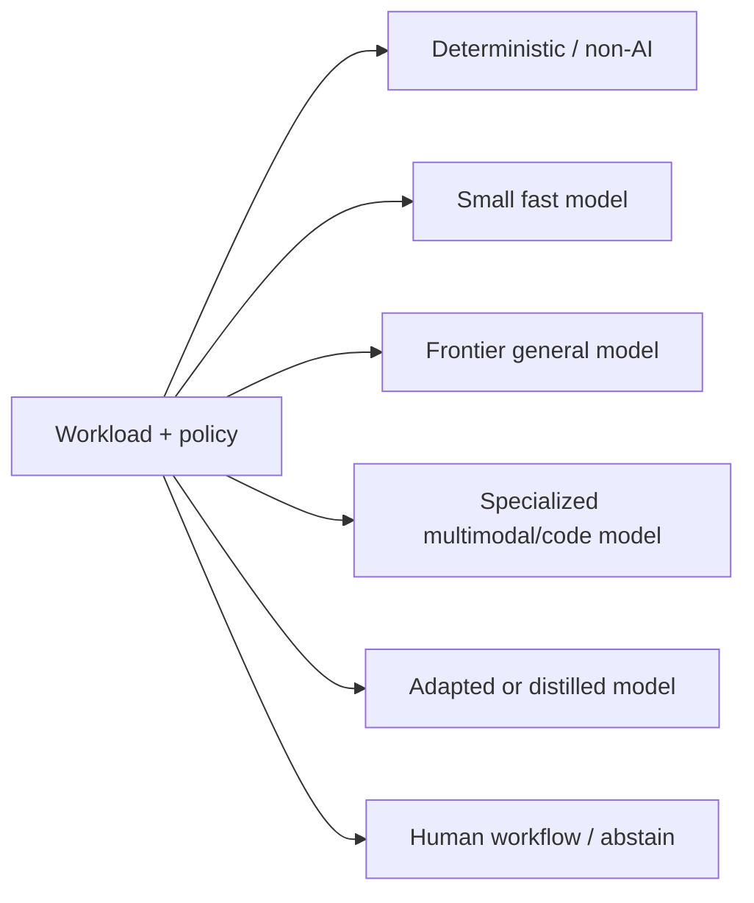

# Model portfolio strategy and evidence-based selection

> _Last reviewed: 2026-07-16 — see the [freshness policy](../appendix/maintenance.md)._

## Learning objectives

After this chapter you will be able to:

- turn workload classes into a governed model portfolio;
- compare frontier, small, specialized, adapted, hosted, and self-hosted models;
- evaluate quality, risk, latency, capacity, cost, and portability together;
- design routing, fallback, adaptation, and retirement rules;
- produce a repeatable bake-off and model decision record.

## Decision in one sentence

> **Select the smallest, safest operational model that clears the task’s evaluated threshold, and manage models as a portfolio with explicit routes, fallbacks, and exit criteria.**

There is no universally “best” model. A support classifier, visual document extractor, code agent, policy synthesizer, and real-time voice turn occupy different Pareto frontiers.

## Begin with workload classes

Create classes based on observable differences:

| Dimension | Questions |
| --- | --- |
| Task | classify, extract, generate, reason, plan, call tools, perceive? |
| Consequence | advisory, reversible write, financial/legal/safety impact? |
| Input/output | languages, modalities, context distribution, structured output? |
| Quality | what end-to-end and critical-slice threshold must be met? |
| Performance | TTFT, completion deadline, concurrency, region, availability? |
| Data | sensitivity, residency, retention, training-use terms? |
| Economics | volume, burst, token distribution, cost per successful task? |
| Operations | hosted or self-hosted skills, capacity, patching, observability? |

Do not start the bake-off with a public leaderboard. Start with representative tasks and constraints from [evaluation-driven development](../06-evaluation/00-quality-strategy.md).

## Portfolio roles



- **Deterministic software** wins for stable rules, arithmetic, authorization, and transactions.
- **Small models** suit high-volume bounded tasks when they clear slice thresholds.
- **Frontier models** justify their cost for ambiguous, long-horizon, multimodal, or high-complexity work that shows measured gain.
- **Specialized models** may dominate a general model for embeddings, reranking, speech, vision, moderation, or code.
- **Adapted/distilled models** make sense when stable volume and proprietary task data justify lifecycle cost.
- **Human or abstention routes** remain valid portfolio members for unsupported or consequential cases.

## Hosted, managed customization, or self-hosted

| Option | Strength | Cost/risk |
| --- | --- | --- |
| Managed model API | fastest adoption, provider-operated scaling | policy fit, variability, portability, usage economics |
| Managed custom endpoint | more adaptation/control with managed operations | training/deployment lifecycle and capacity commitment |
| Self-hosted open-weight | weights/runtime control, isolation, optimization | accelerators, reliability, patching, security, expertise |
| Multiple providers | resilience and bargaining power | lowest-common contracts, duplicated governance/evals |

As a dated cloud example, the [AWS Bedrock or SageMaker AI decision guide](https://docs.aws.amazon.com/decision-guides/latest/bedrock-or-sagemaker/bedrock-or-sagemaker.html), updated June 2025, positions Bedrock for managed access to pretrained foundation models and SageMaker AI for greater training, customization, and deployment control. Use the decision dimensions, not current product inventories, as the durable lesson.

## Bake-off protocol

1. Freeze dataset, slices, task harness, tool contracts, system instruction, and scoring method.
2. Confirm model eligibility: data terms, region, security, legal, modality, context, and provider risk.
3. Tune each candidate fairly within a declared effort budget; do not optimize only the favorite.
4. Run repeated trials with production-like token and concurrency distributions.
5. Measure task outcome, critical failures, calibration, latency, throughput, availability assumptions, and total cost.
6. Test tool/schema compatibility, prompt injection, refusal, long context, multilingual and adversarial slices.
7. Plot the non-dominated candidates; apply predeclared tie-breakers.
8. Record limitations, evidence validity period, and triggers for retest.

Track cost per successful task:

```text
(input + output + reasoning + retrieval + tool + retry + hosting
 + evaluation + observability + human review) / successful tasks
```

Cheap tokens can be expensive if retries or corrections rise. High-quality models can be uneconomic when used for every simple route.

## Routing is a policy decision

Use deterministic routing first: workload class, tenant policy, data region, modality, latency tier, and explicit user choice. Add a learned or model router only if it beats rules on a labeled routing evaluation and its own failures are safe.

Every route declares an allowed model set, minimum quality, data boundary, tool capability, maximum spend, deadline, fallback chain, and abstention. Keep authorization and safety policy invariant across routes. A fallback cannot send restricted data to an unapproved provider or silently lose structured/tool behavior.

The [Google Cloud agentic architecture guide](https://docs.cloud.google.com/architecture/choose-agentic-ai-architecture-components) is a useful current product mapping for choosing model, runtime, framework, state, memory, tools, and observability as separate components. Recheck product availability before implementation.

## Adaptation ladder

Use the cheapest reversible intervention that addresses the measured failure:

1. fix requirements, source data, tool, or workflow;
2. improve instructions and structured output;
3. retrieve authoritative context;
4. add verifier or test-time compute for valuable hard cases;
5. fine-tune or distill for stable repeated behavior;
6. train or self-host only when differentiation and scale justify it.

Fine-tuning does not reliably add current facts, enforce authorization, or repair a missing system of record. Adapted models introduce dataset governance, evaluation, lineage, rollback, and monitoring obligations.

## Portability and concentration risk

Define a provider-neutral internal request/response envelope, but do not pretend all capabilities are interchangeable. Maintain a capability matrix for context, modalities, tools, schemas, streaming, safety controls, regions, quotas, version policy, and telemetry.

Test exit paths periodically. Export prompts, evals, fine-tuning data, retrieval assets, and traces in governed formats. Measure the quality and engineering loss of a second route before claiming portability. Concentration risk includes model, provider, region, identity, gateway, and specialized feature dependencies.

## Model change management

Pin versions where supported. Treat a model alias update as a release candidate, not routine maintenance. Re-run affected evaluations for model, endpoint, parameters, safety settings, prompt, tool schemas, and routing changes. Canary with rollback and compare delayed outcome labels.

Retire a model when it no longer meets quality/risk, terms, security, capacity, support, economic, or strategic requirements. Preserve the decision evidence and ensure old task replays identify the historical model.

## Northstar worked decision

Northstar uses deterministic code for order state and refund policy; a small model for intent and language detection; a stronger tool-capable model for ambiguous shipment cases; a vision model for damaged-package photos; and a human route for policy exceptions. Restricted tenants have a smaller eligible provider set. Each route has a tested secondary and a search-only or human fallback.

## Practical artifact: portfolio scorecard

Include workload classes, eligibility gates, candidate/configuration IDs, dataset and slices, quality and risk results with uncertainty, latency/capacity, cost per success, hosting/operational requirements, data and contractual terms, fallback compatibility, concentration risk, selected route, review date, and disconfirming evidence.

## Lab

Run at least three model classes against 50 Northstar tasks: a small model, a strong general model, and a specialized or adapted candidate. Include repeated tool tasks and critical slices. Design a deterministic router, calculate portfolio cost per success under expected traffic, simulate primary unavailability, and defend the route/fallback decision.

## Check yourself

1. Why is a leaderboard insufficient for selection?
2. When can a smaller model be the architecturally superior choice?
3. Which properties must a fallback preserve?
4. What measured failure would justify fine-tuning?
5. How do you prove an exit plan works?

## Further reading

- [AWS: Bedrock or SageMaker AI?](https://docs.aws.amazon.com/decision-guides/latest/bedrock-or-sagemaker/bedrock-or-sagemaker.html).
- [Google Cloud: choose agentic AI architecture components](https://docs.cloud.google.com/architecture/choose-agentic-ai-architecture-components).
- [Fine-tuning, distillation and small models](04-adaptation.md).
- [Portability, lock-in and exit plans](../08-platform-operations/05-portability.md).
