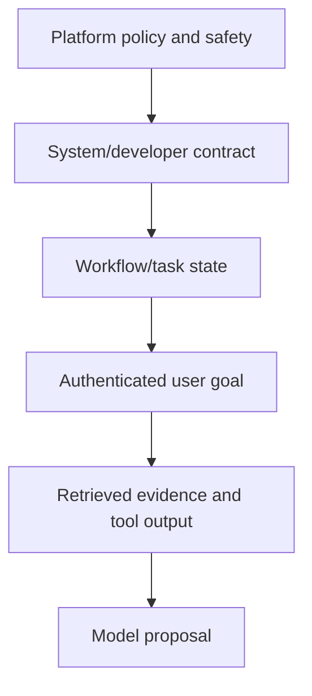

# Prompt contracts, structured outputs and constrained generation

> _Last reviewed: 2026-07-16 — see the [freshness policy](../appendix/maintenance.md)._

## Learning objectives

After this chapter you will be able to:

- design instruction and context layers with explicit authority;
- define typed input, output, error and evidence contracts;
- choose schema-constrained generation, validation and repair strategies;
- version and evaluate prompts as system artifacts;
- contain injection and unsafe downstream interpretation.

## Decision in one sentence

> **Use natural language to express judgment and examples; use schemas, code and policy to express invariants and interfaces.**

A prompt is not merely prose. In production it is one versioned component of a contract between user, context builder, model, tools, validators and downstream consumers.

## Instruction and data hierarchy



Lower layers cannot grant authority or rewrite higher layers. Retrieved documents, web pages, email, memory and tool results are data even when they contain instructions. Keep stable policy, task state and evidence in distinguishable fields rather than one concatenated text blob.

## Prompt contract

Specify:

```text
purpose and eligible tasks
authenticated subject, tenant and policy handles
input schema and normalization
authoritative evidence and conflict rules
allowed tools and when to use them
output schema and semantic invariants
abstention, clarification and escalation reasons
prohibited behavior and data handling
latency/token/tool budgets and stop conditions
examples, including boundary and failure cases
prompt/model/tool/evaluation versions
```

Avoid personas that imply authority. “You are the refund manager” must not replace resource authorization.

## Structured output is more than valid JSON

[JSON Schema Draft 2020-12](https://json-schema.org/draft/2020-12) provides a portable vocabulary for structure and validation. A production schema should use required fields, closed objects where appropriate, enums, bounds, formats, discriminated result types and version identifiers.

```json
{
  "type": "object",
  "required": ["status", "evidence_ids"],
  "additionalProperties": false,
  "properties": {
    "status": {"enum": ["answer", "clarify", "abstain", "escalate"]},
    "answer": {"type": "string"},
    "evidence_ids": {"type": "array", "items": {"type": "string"}},
    "reason_code": {"type": "string"}
  }
}
```

Syntax validation proves shape, not truth, authorization or business validity. After parsing, validate references, units, temporal state, policy, evidence support and allowed transitions.

## Generation patterns

| Pattern | Use | Tradeoff |
| --- | --- | --- |
| Free text | human-readable drafting | unsafe for machine control |
| Prompted JSON + validation | broad model compatibility | malformed output and repair |
| Provider-native schema/tool call | typed integration | feature/version portability |
| Grammar/constrained decoding | strict syntax | grammar complexity; semantics remain |
| Extract then verify | evidence-backed records | extra latency/cost |
| Model proposes, code executes | consequential workflows | explicit two-phase design |

Prefer a discriminated union of answer, clarification, abstention and escalation to fabricated placeholder values.

## Validation and repair

1. parse with size/depth limits;
2. validate schema;
3. normalize only safe mechanical differences;
4. validate semantic/business/policy invariants;
5. perform at most a bounded repair using exact errors and original evidence;
6. route to fallback, abstention or human when repair fails.

Never execute a side effect before validation completes. A repaired consequential action requires the same authorization and approval as the original.

## Prompt design practices

- state the observable task and audience;
- provide smallest sufficient context with provenance;
- put important constraints near the relevant operation;
- define terms, units, dates and source precedence;
- show diverse positive, negative, abstention and conflict examples;
- request evidence IDs rather than invented citation text;
- separate reasoning aids from user-visible explanation;
- avoid hidden chain-of-thought dependencies; request concise evidence or checks;
- make tool descriptions narrow, typed and explicit about effects.

Long prompts can accumulate contradictions and obsolete patches. Refactor policy into code, retrieval or dedicated validators when possible.

## Prompt lifecycle

Version instructions with model route, parameters, schemas, tools, retrieval and policy. Each change declares hypothesis, affected slices and rollback. Run deterministic contract tests, representative evaluations, injection cases and repeated trials. Shadow/canary before broad release.

Monitor schema validity, repair rate, abstention, unsupported claims, tool errors, user corrections, latency, tokens and cost per success. A falling parse error can coexist with worse task quality.

## Security boundaries

Delimiters and “ignore malicious instructions” are helpful context cues, not security controls. Enforce tenant, resource, tool, network and side-effect policy outside the model. Escape model output for its sink: HTML, Markdown, SQL, spreadsheets, shells and code have different injection risks.

Do not log full prompts by default. Template text can be versioned; sensitive inputs and evidence require minimization, redaction, access and retention controls.

## Northstar contract

Northstar's assistant outputs `answer`, `clarify`, `abstain` or `propose_action`. A proposal references verified order and policy IDs but contains no executable credential. Code validates customer, amount, currency, order state and policy; a human approves the exact preview; the refund tool then executes idempotently.

## Practical artifact: prompt interface record

Include purpose/scope, instruction hierarchy, input/output/error schemas, context/evidence rules, tools, validation/repair, safety/privacy, model compatibility, examples, evaluation slices/thresholds, telemetry and change history.

## Lab

Create three Northstar variants: free text, prompted JSON and constrained schema. Test malformed output, conflicting policy, missing evidence, injected document, unit/date ambiguity and model change. Compare task quality, schema validity, repair rate, latency and cost; prove no invalid proposal reaches a write tool.

## Check yourself

1. Which requirements belong in code rather than the prompt?
2. What does schema validity fail to prove?
3. When should repair stop?
4. How is retrieved text prevented from changing authority?
5. Which artifacts must be versioned together?

## Further reading

- [JSON Schema specification](https://json-schema.org/specification).
- [Agent tool design](../05-agents/01-tools-authorization.md).
- [Evaluation-driven development](../06-evaluation/00-quality-strategy.md).
