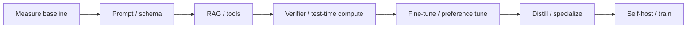

# Fine-tuning, distillation and inference optimization

> _Last reviewed: 2026-07-16 — see the [freshness policy](../appendix/maintenance.md)._

## Learning objectives

After this chapter you will be able to:

- choose prompting, RAG, tools, fine-tuning, distillation or no adaptation;
- design governed training and preference datasets;
- evaluate parameter-efficient tuning and smaller-model distillation;
- plan quantization, serving capacity and model lifecycle;
- produce an adaptation decision and experiment record.

## Decision in one sentence

> **Adapt a model only for a stable, repeated behavior gap that data and evaluation can demonstrate—and only when lifecycle value exceeds prompt, retrieval, workflow or model-routing alternatives.**

Fine-tuning is not a substitute for current facts, access control, business rules or missing source data. It changes statistical behavior and creates a new model artifact to govern.

## Adaptation ladder



Stop at the first level that clears quality, risk, latency and cost thresholds. Fix the system layer that caused the error.

## Pattern selection

| Need | Preferred first move |
| --- | --- |
| current private knowledge | RAG or governed tool |
| exact policy/transaction | deterministic code and authorization |
| stable format/style/tone | schema/prompt, then supervised fine-tuning |
| repeated domain behavior | fine-tuning with representative examples |
| cheaper/faster route | distill to smaller model; quantify quality loss |
| long hard reasoning | routing/test-time compute before retraining |
| private deployment/control | managed customization or self-host with full TCO |

## Dataset design

An adaptation dataset needs purpose, source authority and rights, collection period, population/slices, transformations, deduplication, sensitive-data controls, labels/preferences and agreement, exclusions, contamination analysis, split policy, retention and deletion lineage.

Use high-quality, diverse, task-relevant examples rather than volume alone. Include negative, abstention, conflict, multilingual and edge cases. Preserve a sequestered evaluation set and prevent benchmark leakage. Synthetic examples may expand coverage but must be validated against real distributions.

## Supervised and preference adaptation

- **Supervised fine-tuning:** learn desired input-output behavior from demonstrations.
- **Preference optimization:** use ranked/paired candidates to shape relative behavior.
- **Continued pretraining:** adapt domain language/distribution; high data and forgetting risk.
- **Parameter-efficient tuning:** train small adapters while freezing most weights.

The original [LoRA paper](https://arxiv.org/abs/2106.09685) introduces low-rank trainable matrices while freezing pretrained weights, reducing trainable parameters for the studied models. Treat its results as evidence for that technique and experimental setting—not a guarantee for every modern model or task.

Preference data can encode annotator bias, verbosity preference or policy inconsistency. Define rubric and qualified population, blind candidate identity, randomize presentation and report agreement by slice.

## Distillation

Distillation trains a smaller student from teacher outputs, probabilities or rationales. It can reduce latency and cost for stable high-volume tasks but inherits teacher errors and may lose rare capabilities.

Design the teacher-data policy: what inputs may be sent, whether outputs may train the student, how provenance/licensing works, and how sensitive data is minimized. Evaluate student against independent ground truth—not only teacher agreement. Route unsupported hard cases back to a stronger model or human.

## Quantization and serving optimization

Quantization reduces numeric precision to lower memory and improve throughput. Benefits depend on hardware, runtime, architecture, sequence lengths and batching; quality loss can concentrate in rare tasks. Benchmark representative contexts and critical slices.

Serving choices include continuous/dynamic batching, prefix/KV caching, speculative decoding, parallelism, compilation and accelerator placement. Measure TTFT, tokens/second, p95 completion, concurrency, memory, utilization, energy where relevant and cost per successful task. Optimization that changes outputs is a model release.

## Experiment protocol

1. define the measured failure and simpler baselines;
2. freeze evaluation, critical slices and unacceptable outcomes;
3. establish data eligibility and dataset card;
4. set effort/compute budget and candidate configurations;
5. train with versioned code, base model, data and hyperparameters;
6. evaluate repeated end-to-end tasks, safety, regression and calibration;
7. load-test the serving configuration;
8. compare total lifecycle cost and operational risk;
9. canary with rollback and delayed outcomes.

Report uncertainty and case-level regressions. An average gain cannot offset a critical safety or tenant-isolation failure.

## Lifecycle and supply chain

Record base-model identity/license, weights/checksums, data versions, code/container/dependencies, training environment, hyperparameters, adapters/merged weights, evaluations, approvals and deployment regions. Scan artifacts, sign releases and restrict registry access.

Monitor drift, route share, calibration, harmful output, fallback, latency and cost. Retraining triggers are evidence-based; avoid feedback loops in which model-generated output becomes unreviewed training truth. Support rollback, deletion obligations, base-model deprecation and adapter compatibility.

## Economics

```text
adaptation value = inference/review savings + outcome improvement
                 - data/label/train/eval/serve/govern/change cost
```

Account for accelerator idle capacity, engineers, labeling, repeated experiments, safety evaluation, deployment variants and opportunity cost. A managed API can remain cheaper despite higher token price; a tuned small model can dominate at stable scale.

## Northstar decision

Northstar keeps current policy in RAG and order state in tools. After enough labeled volume, it considers a small tuned model for stable intent routing—not refunds. A frontier teacher helps generate candidates, but domain experts label the final set. The student handles eligible low-risk cases; uncertainty and policy exceptions route upward.

## Practical artifact: adaptation decision record

Include target behavior, root-cause evidence, alternatives, data card/rights, base model, method/configurations, evaluation and critical regressions, serving benchmarks, security/privacy, TCO/break-even, routing/fallback, release/rollback and retraining/retirement triggers.

## Lab

Compare prompting, few-shot, RAG, LoRA-style tuning or a simulated tuned candidate, and a smaller student on Northstar intent tasks. Use clean, rare, multilingual and must-escalate slices. Report quality, harmful error, latency, throughput and cost/success; recommend whether adaptation is justified.

## Check yourself

1. Why does fine-tuning not replace retrieval or authorization?
2. Which real distribution does the dataset represent?
3. How is a student evaluated independently of its teacher?
4. When does quantization require a new release decision?
5. What is the lifecycle break-even point?

## Further reading

- [LoRA](https://arxiv.org/abs/2106.09685), Hu et al.
- [Model portfolio strategy](02-model-selection.md).
- [Evaluation measurement science](../06-evaluation/06-measurement-science.md).
