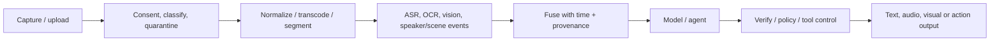

# Multimodal, real-time voice and computer-use architectures

> _Last reviewed: 2026-07-16 — see the [freshness policy](../appendix/maintenance.md)._

## Learning objectives

After this chapter you will be able to:

- design image, document, audio, video and real-time interaction pipelines;
- compare cascaded and native multimodal/voice patterns;
- budget turn latency, interruption, concurrency and degradation;
- secure browser/computer-use actions and untrusted media;
- evaluate modality-specific quality, safety and accessibility.

## Decision in one sentence

> **Select modalities from the user task and environment, then preserve provenance, synchronization, control and safe degradation across every transformation.**

Multimodal does not mean “send a file to a larger model.” Each modality adds acquisition, encoding, timing, accessibility, privacy and attack surfaces.

## Architecture patterns

| Pattern | Strength | Risk/tradeoff |
| --- | --- | --- |
| Specialized cascade | inspectable ASR/OCR/vision → text → LLM → TTS | accumulated errors and latency |
| Native multimodal model | cross-modal reasoning, simpler prompt path | weaker component diagnosis/control |
| Real-time duplex model | natural low-latency interaction | turn control, cost, observability complexity |
| Deterministic perception + model | exact extraction/measurement plus language | integration and confidence fusion |
| Computer-use agent | works through existing UI | broad authority, visual deception, brittleness |

Start with the cascade when component evidence, independent replacement or deterministic checks matter. Choose native end-to-end interaction when measured user benefit justifies reduced decomposability.

## Media pipeline



Preserve source media ID, checksum, timestamps, page/region/time offsets, transformation versions, confidence and access policy. An answer citation should locate the frame, segment, page or region that supports it.

## Document and vision systems

Use structure-aware parsing for layout, reading order, tables, forms, handwriting, charts and embedded images. OCR confidence is not field correctness; validate high-impact values against schema, checksums, cross-field rules or humans. Defend against active documents, oversized images, steganographic/invisible instructions and adversarial text in images.

For image/video tasks distinguish description, classification, detection, measurement, identity and decision. Each needs different ground truth and consequence. Sample frames based on events and coverage; do not imply exhaustive video review from sparse frames.

## Real-time voice path

The [W3C WebRTC Recommendation](https://www.w3.org/TR/webrtc/) defines browser APIs for real-time media and data communication. A voice-agent path also needs session/signaling, media transport, turn detection, speech recognition or native audio model, reasoning/tools, synthesis, safety, recording policy and telephony integration.

Budget:

```text
end-of-turn detection + network + recognition/input processing
+ model/tool latency + synthesis startup + playback buffer
```

Measure perceived turn latency, not only model TTFT. Support barge-in: stop playback, cancel downstream work when safe, preserve partial transcript and clarify overlapping speech. Use adaptive jitter buffering and degrade to lower bitrate, text, callback or human transfer.

## Conversation control

Expose listening, thinking, tool/action, speaking, muted and disconnected states. Let users pause, interrupt, correct transcript, switch modality and reach a human. Confirm names, addresses, amounts and consequential parameters in an accessible channel before action. Do not infer consent from continued speech.

## Browser and computer use

Visual agents interact with an environment built for humans, not a typed API. Prefer APIs for consequential actions. When UI automation is required, isolate browser profile/desktop, restrict origins/downloads/uploads/clipboard, broker credentials, detect navigation and material changes, preview the exact action, require approval and verify the final system state.

Web pages, documents and images are untrusted and may contain indirect prompt injection. The model cannot grant itself a new site, file, tool or credential.

## Privacy, safety and abuse

Voice, faces, surroundings, screens and biometrics can expose bystanders and sensitive attributes. Define notice/consent, recording indicator, purpose, retention, region, human access, redaction, deletion and lawful handling. Minimize raw media; derived transcripts and embeddings remain sensitive.

Threats include spoofed voice/image, replay, deepfakes, speaker confusion, malicious QR/text, background injection, harassment, impersonation and automated high-volume abuse. Use identity channels separate from voice likeness, rate limits, liveness/risk checks where appropriate and human escalation.

## Evaluation

| Modality | Measures |
| --- | --- |
| Documents | field/page/table accuracy, reading order, citation region |
| Image/video | class/detection/temporal accuracy, coverage, unsafe miss |
| Speech input | word/entity accuracy, language/accent/noise slices, turn detection |
| Speech output | intelligibility, latency, pronunciation, interruption |
| Interaction | task success, correction burden, overtalk, transfer, accessibility |
| Computer use | action/state success, wrong-target rate, recovery, unauthorized effect |

Evaluate the joint task under noise, packet loss, low bandwidth, crosstalk, accents, assistive technology, small screens, OCR degradation, deceptive UI and dependency outage. Include text-only and human baselines.

## Northstar design

Northstar accepts damage photos and voice calls. Photos are quarantined, scanned, normalized and cited by region; they support an investigation but do not authorize refund. Voice uses streaming transport, explicit recording policy and transcript correction. Amounts are confirmed visually or repeated, and a typed refund workflow remains outside the audio model. Computer use is excluded because order APIs exist.

## Practical artifact: multimodal interaction record

Include user/environment, modality rationale, acquisition/consent, media pipeline/provenance, latency and capacity budget, synchronization, model/cascade choice, action boundaries, privacy/security, accessibility, evaluation slices, degradation/transfer and cost.

## Lab

Design Northstar voice plus damaged-package intake. Inject noisy speech, overlapping turns, wrong amount transcript, rotated scan, hidden instruction, packet loss and disconnect before refund. Demonstrate correction, barge-in, safe cancellation, evidence citation, text fallback and human transfer.

## Check yourself

1. Which transformations can alter meaning?
2. How is evidence localized in time or space?
3. What happens when a user interrupts during a tool call?
4. Why is voice likeness not authentication?
5. When is a typed API safer than computer use?

## Further reading

- [W3C WebRTC](https://www.w3.org/TR/webrtc/).
- [Document intelligence reference architecture](../10-reference-architectures/02-document-intelligence.md).
- [Real-time voice agent](../10-reference-architectures/06-voice-agent.md).
- [Secure agent execution](../07-security-governance/06-secure-agent-execution.md).
