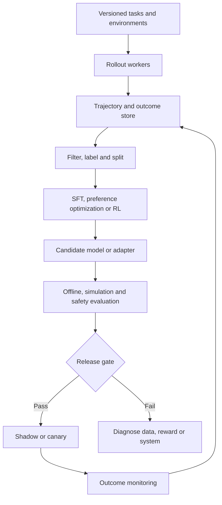

# Agent post-training and trajectory learning

> _Last reviewed: 2026-07-25 — see the [freshness policy](../appendix/maintenance.md). Agent-training frameworks, algorithms and model licenses change quickly; verify the current model, data and deployment terms._

## Learning objectives

After this chapter you will be able to:

- decide whether an agent needs prompt, workflow, retrieval, skill or model-weight improvement;
- distinguish supervised fine-tuning, preference optimization and reinforcement learning;
- design governed trajectory data, environments, rewards and release evidence;
- explain multi-turn credit assignment, reward hacking and training-serving mismatch;
- produce an SA training decision record rather than prescribing an algorithm.

## Decision in one sentence

**Change model weights only when a repeatable capability gap survives system-level fixes and when representative trajectories, trustworthy rewards, evaluation environments and rollback controls exist.**

## The improvement ladder

Use the least irreversible intervention that meets the requirement.

| Level | Intervention | Best fit | Main risk |
|---|---|---|---|
| 1 | Prompt, examples or structured output | unclear behavior contract | brittle instruction stack |
| 2 | Context, retrieval or memory | missing or stale evidence | leakage and bad retrieval |
| 3 | Tool, skill or workflow | missing capability or control | integration complexity |
| 4 | Distillation or supervised fine-tuning | stable demonstrations and format/tool behavior | imitation of data defects |
| 5 | Preference optimization | comparative quality has a reliable preference signal | preference overfitting |
| 6 | Agent reinforcement learning | outcomes require multi-step interaction with an environment | reward gaming and costly rollouts |

Fine-tuning is not a substitute for authorization, current knowledge, deterministic validation or durable orchestration. It changes behavior probabilities; it does not create a transaction boundary.

## Training architecture



| Step | SA design responsibility |
|---:|---|
| 1 | Version task definitions, tools, policies, simulators and initial state. |
| 2 | Capture full trajectories without storing unnecessary secrets or raw personal data. |
| 3 | Remove duplicates, leakage, policy violations and unverifiable outcomes; split by user, time and scenario. |
| 4 | Select the least complex method supported by the signal and deployment constraints. |
| 5 | Evaluate the candidate against the unchanged baseline with repeated trials and critical slices. |
| 6 | Promote model, prompt, tool schema and policy as a compatible release tuple. |
| 7 | Monitor real outcomes and route failures back through governed curation—not directly into training. |

## SFT, preference learning and RL

**Supervised fine-tuning (SFT)** learns from target responses or trajectories. Use it for stable formats, domain language, tool-call conventions and common reasoning patterns. Preserve failed examples separately; silently deleting difficult cases creates misleading training and evaluation distributions.

**Preference optimization** learns from ranked alternatives. It fits cases where experts can compare two outcomes more reliably than write an ideal answer. Define who expresses the preference, what rubric they use and whether it represents user value, policy compliance or stylistic taste.

**Reinforcement learning (RL)** learns from rewards produced after interaction. It is appropriate when the agent must discover valid paths and the environment can return meaningful outcomes. Current TRL documentation supports tool-using GRPO rollouts with resettable stateful environments; [Microsoft Agent Lightning](https://github.com/microsoft/agent-lightning) separates agent execution from training through recorded spans and resources. These are implementation options, not proof that RL is warranted.

## Trajectory and environment contract

```yaml
task_version: refund-investigation-v4
environment_image: northstar-sim@sha256:...
initial_state_ref: case-2841-snapshot
allowed_tools: [policy.lookup, order.read, carrier.read]
forbidden_effects: [refund.commit, customer.export]
terminal_states: [resolved, needs_human, safely_abstained]
reward:
  outcome: 0.60
  policy: 0.25
  efficiency: 0.15
hard_zero:
  - cross_tenant_access
  - fabricated_tool_receipt
  - unauthorized_effect
```

A training environment must reset deterministically, isolate each rollout, enforce the same schemas and permissions as serving, record hidden ground truth, and expose no answer through identifiers or error messages. Keep training, validation and release-test tenants separate.

## Credit assignment and reward safety

A final success signal does not identify which step caused success. Process rewards can provide denser feedback but may force one preferred path when several paths are valid. Outcome rewards preserve flexibility but are sparse. Combine:

- hard invariants for authorization and forbidden transitions;
- milestone credit for verified intermediate state;
- outcome reward from environment state, not model prose;
- bounded efficiency incentives that cannot outweigh safety;
- human review for ambiguous high-consequence cases.

Test for reward hacking by constructing agents that exploit missing fields, terminate early, repeat cheap milestones, manipulate judges or trigger simulator bugs. A reward model is another fallible component and needs calibration, access control and versioning.

## Release and operating controls

The release unit includes base model, adapter, chat template, tokenizer, system prompt, tool schemas and decoding policy. Check serving compatibility, latency, memory, quantization, regional availability, licenses and rollback. Compare task success, severe violations, calibration, steps per success, cost per success and slice performance—not training loss alone.

## Northstar decision

Northstar first repairs retrieval freshness and adds a deterministic refund-policy validator. Residual evaluation shows the model still produces malformed carrier tool calls across several paraphrases. The team creates governed demonstrations and trains a small adapter for tool-call fidelity. It rejects agent RL because refund outcomes are too sparse, the simulator does not model carrier ambiguity well, and no weight change is needed for authorization.

## Practical artifact: agent training decision record

Document the surviving capability gap, baseline, alternatives, data rights, trajectory schema, environment, reward/rubric, method, compute, privacy, security, evaluation gates, serving compatibility, rollback and accountable owners.

## Lab

For one Northstar failure, compare prompt repair, deterministic validation, SFT and RL. Design twenty training cases and twenty isolated release cases. Red-team the reward and defend the least complex acceptable intervention.

## Further reading

- [Hugging Face TRL: agent training with GRPO](https://huggingface.co/docs/trl/main/grpo_trainer)
- [Microsoft Agent Lightning](https://github.com/microsoft/agent-lightning)
- [The RLHF Book](https://github.com/natolambert/rlhf-book)
- [Agent evaluation environments and benchmarks](../06-evaluation/09-agent-evaluation-environments.md)
- [Fine-tuning, distillation and inference optimization](04-adaptation.md)

