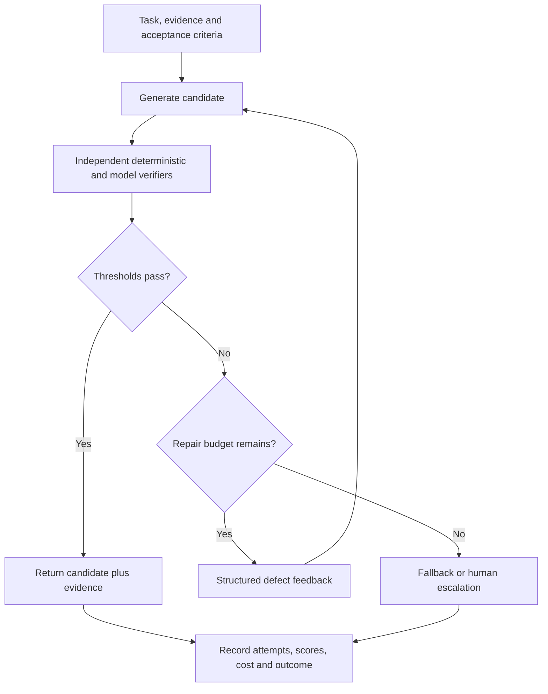

# Reflection, metacognition, and verifier loops

> _Reliability pattern — last reviewed: 2026-07-25._

## Learning objectives

- distinguish resampling, critique, verification, repair, and search;
- decide when extra inference improves expected value;
- prevent self-review from becoming unbounded, expensive theater.

## The decision in one sentence

Spend test-time compute only when an independent, task-relevant verifier can select or repair candidates better than the generator alone.

## Patterns

“Reflect” is too vague for architecture. Choose a concrete loop:

| Pattern | Mechanism | Good fit | Weakness |
|---|---|---|---|
| Retry/resample | generate another candidate | stochastic creative tasks | no selection signal |
| Self-critique | model identifies issues | style and checklist repair | correlated blind spots |
| External verifier | tests facts, code, math, schema | executable constraints | verifier coverage |
| Debate/ensemble | compare diverse candidates | ambiguous analysis | cost and shared bias |
| Search/planning | explore branches with scores | high-value combinatorial tasks | latency explosion |
| Human escalation | adjudicate uncertainty or harm | consequential exceptions | queue and consistency |

## Bounded verifier architecture

| Step | Design requirement | Metric |
|---|---|---|
| Generate | diversity without changing task contract | candidate success |
| Verify | independent evidence or executable oracle | verifier precision/recall |
| Control | maximum attempts, latency, cost | amplification factor |
| Repair | structured defects, not vague “think harder” | repair yield |
| Terminate | accept, fallback, or escalate | unresolved-risk rate |

## Independence matters

Asking the same model to “check itself” may improve formatting but can reproduce the original misconception. Prefer deterministic tools, retrieved primary evidence, a separately prompted or different model, or a qualified human. Measure verifier error explicitly: false acceptance creates harm; false rejection creates cost and frustration.

Use a controller outside the model. Set maximum candidates, rounds, wall time, token and tool budget, and a monotonic acceptance rule. Do not expose verifier secrets or expected answers in untrusted context. Cache verification where inputs and versions match.

Evaluate the complete policy against a single-pass baseline: task success, harmful acceptance, false rejection, latency p95, cost per successful task, escalation, and user value. A loop that adds 3× cost for a negligible gain should be removed or restricted to high-risk cases.

## Northstar example

Northstar’s recommendation generator outputs policy claims and calculations. A citation verifier checks that quoted policy text entails each claim; deterministic code recomputes benefit amounts; a second rubric evaluator checks completeness. One repair is allowed. Remaining calculation or entitlement conflicts go to an adjudicator rather than another reflection round.

## Practical artifact: verifier contract

Document accepted input, output schema, evidence source, independence assumptions, coverage, thresholds, error costs, retry budget, fallback, model/tool versions, and calibration dataset.

Use the contract with [evaluation measurement science](../06-evaluation/06-measurement-science.md) and the [synthetic trajectory factory](../06-evaluation/10-synthetic-trajectory-factories.md).

## Further reading

- [Self-Refine](https://arxiv.org/abs/2303.17651)
- [Reflexion](https://arxiv.org/abs/2303.11366)
- [Tree of Thoughts](https://arxiv.org/abs/2305.10601)
