# AI data readiness, lineage and provenance

> _Last reviewed: 2026-07-16 — see the [freshness policy](../appendix/maintenance.md)._

## Learning objectives

After this chapter you will be able to:

- assess data fitness for RAG, evaluation, adaptation, memory and analytics;
- design source-to-serving contracts with authority, quality and access controls;
- preserve lineage across extraction, chunks, embeddings, graphs and datasets;
- manage licenses, consent, retention, correction and deletion;
- produce a data-readiness and provenance record.

## Decision in one sentence

> **No AI use is production-ready until its sources, authority, permitted purpose, transformations, quality, access, freshness and deletion path are explicit and testable.**

More data is not readiness. A large corpus can be stale, unauthorized, duplicated, unrepresentative, poisoned or impossible to correct.

## Classify the data product

| Use | Unit | Dominant readiness question |
| --- | --- | --- |
| RAG/GraphRAG | document, chunk, entity, claim | can current permitted evidence be retrieved and cited? |
| Evaluation | task, label, rubric, outcome | does it represent population, consequences and slices? |
| Adaptation | example, preference pair, media | is use permitted, clean and sufficiently representative? |
| Agent memory | event, fact, preference, procedure | should this persist, for whom, for what purpose and how long? |
| Analytics | event, metric, aggregate | are semantics, joins, time and privacy valid? |

Create separate contracts when one source supports different purposes. Production logs permitted for security may not be permitted for model improvement.

## Source-to-serving pipeline

```mermaid
flowchart LR
    S["Source + owner"] --> A["Authority / license / consent"]
    A --> I["Ingest and quarantine"]
    I --> P["Parse / OCR / normalize"]
    P --> C["Classify / ACL / provenance"]
    C --> Q["Quality and security checks"]
    Q --> D["Derive chunks, embeddings, graph, dataset"]
    D --> V["Validate and publish version"]
    V --> M["Monitor, correct, delete"]
```



Quarantine untrusted inputs before parsers and agent access. Scan active content and archives; cap size and complexity; patch parsing dependencies; preserve source bytes or governed references where needed for audit.

## Data contract

Record owner/steward, source system, canonical ID, schema/media, semantics/units, data class, tenant, authority/license/consent, allowed/prohibited purposes, geographic constraints, ACL mapping, freshness, quality thresholds, retention/deletion, incident contact, change notice and SLO.

For unstructured data add parser/OCR version, layout/page offsets, language, extraction confidence, canonical URI, source revision, effective time and checksum.

## Quality is task-relative

Assess coverage, correctness, completeness, consistency, uniqueness, timeliness, representativeness, label agreement, parse fidelity and access metadata. Weight dimensions by failure consequence. A visually minor OCR error in a refund limit can be material; a missing decorative image is not.

Use slice dashboards and sampled source comparison. Track unknown/unparseable content rather than silently dropping it. Evaluate tables, forms, scans, handwriting, code, formulas, multiple languages, duplicates and conflicting revisions.

## Provenance model

The W3C [PROV-O Recommendation](https://www.w3.org/TR/prov-o/) models provenance around entities, activities and agents and supports interoperable specialization. A practical AI record links:

```text
source entity --wasUsedBy--> parser/extractor activity
derived chunk/claim --wasGeneratedBy--> activity
activity --wasAssociatedWith--> software/model/human agent
new revision --wasRevisionOf--> prior entity
answer/eval/training artifact --wasDerivedFrom--> governed inputs
```

You do not need RDF for every system, but preserve equivalent identifiers and relations. Provenance is useful only when a citation, incident, correction, deletion or model version can traverse it.

## Authority and conflict

Define authority tiers by domain and question. A signed policy may outrank a wiki; current system-of-record state may outrank a conversation; a user-confirmed preference may outrank an inferred one. Keep conflicting claims with source, valid time and confidence rather than overwriting history. The answer layer exposes material conflict or abstains.

## Dataset governance

For evaluation and adaptation, publish a dataset card containing purpose, collection/sampling, population, exclusions, sources/rights, transformations, labels and agreement, sensitive attributes, known gaps, contamination analysis, splits, access, retention and versions.

Prevent evaluation leakage into training and prompt examples. Deduplicate across splits and inspect benchmark contamination. Synthetic data expands controlled variations but cannot establish real-world prevalence or replace affected-population evidence.

## Poisoning and supply chain

Assign trust labels at ingestion. Untrusted content cannot become instructions, policy or durable procedural memory. Validate surprising volume, source changes, entity merges and high-impact claims. Pin and inventory datasets, parsers, embedding models and extraction prompts. Sign published manifests where integrity matters.

## Change, correction and deletion

Use source events plus periodic reconciliation. Version every published corpus/dataset and support atomic alias switch/rollback. Maintain reverse lineage from source to chunks, embeddings, graph, summaries, caches, training/evaluation copies and exports. Define SLOs for change-to-serving, revocation-to-non-retrieval and deletion verification.

## Northstar readiness assessment

Northstar separates live order state from policy documents and customer-provided evidence. Each has a different owner, freshness and authority. Policy PDFs preserve revision/effective date and page offsets; order facts come from typed tools; photos are quarantined and classified; evaluation cases are governed copies. A source deletion traverses the lineage index to remove derivatives.

## Practical artifact: data readiness record

Include use/purpose, source inventory and authority, contracts, data flow, quality baseline and slices, parser/extraction evaluation, ACL/tenant mapping, provenance graph, dataset card, threat analysis, freshness/deletion SLOs, cost/capacity, publication/rollback and owners.

## Lab

Assess five Northstar sources for RAG, evaluation and memory. Build a 20-item gold parse set, define authority/conflict rules, model provenance from one PDF to an answer, inject a poisoned revision, and demonstrate correction plus deletion across chunks, embeddings and evaluation copy.

## Check yourself

1. Is the source permitted for this particular use?
2. Which transformation can materially change meaning?
3. How is a claim traced to source revision and activity?
4. Which source wins a conflict and why?
5. Can deletion find every derivative?

## Further reading

- [W3C PROV-O](https://www.w3.org/TR/prov-o/).
- [Production RAG](02-rag-patterns.md).
- [Data governance, lineage and provenance](05-governance-provenance.md).
- [Evaluation datasets and rubrics](../06-evaluation/01-datasets-rubrics.md).
