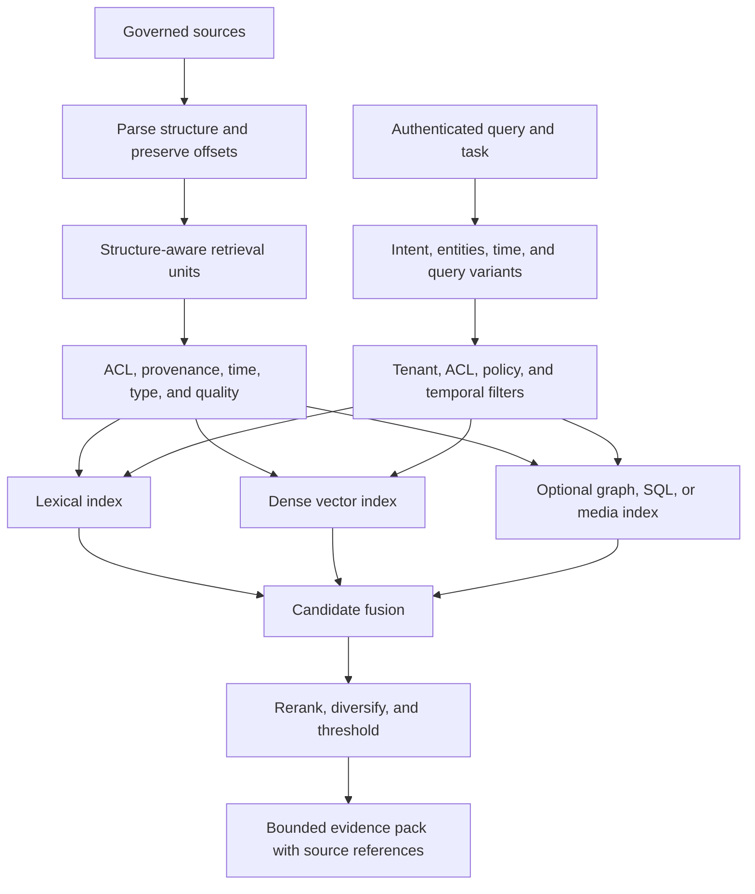

# Embeddings, chunking and retrieval

> _Last reviewed: 2026-07-16 — see the [freshness policy](../appendix/maintenance.md). Model/index product mappings are dated; validate them on the target corpus._

## Learning objectives

After this chapter you will be able to select lexical/dense/hybrid retrieval, design structure-aware chunks and metadata, evaluate retrieval independently, plan index lifecycle and capacity and avoid treating similarity as authority.

## Decision in one sentence

> **Choose representation and retrieval from the question/evidence shape, then prove the choice on governed source-level relevance—not embedding intuition.**

## 1. Start with question and evidence classes

| Question/evidence | Useful first retrieval |
| --- | --- |
| exact order, error code, policy clause | lexical/keyword plus metadata |
| paraphrased concept or support issue | dense semantic retrieval |
| names/acronyms plus semantic intent | hybrid lexical+dense |
| current account/order state | typed API/SQL, not vector index |
| multi-hop relationships | graph/SQL plus supporting text |
| broad corpus theme | community/global GraphRAG or analytic pipeline |
| time-valid claim | temporal filters and source-effective dates |

Do not embed data merely because it is text. Exact authoritative fields often belong behind typed queries.

## 2. Retrieval pipeline



## 3. Embeddings are geometric representations

An embedding maps input to a vector where distance/similarity reflects patterns learned by the embedding model. It does not encode source authority, permission, truth or time unless the retrieval system adds those controls.

Evaluate embedding models on:

- target language/domain and exact entity formats;
- query-to-passage rather than passage-to-passage task;
- supported input length and truncation behavior;
- dimension/storage/search latency and cost;
- version stability, region/data terms and batch throughput;
- retrieval gain after reranking and metadata filters;
- robustness to adversarial/boilerplate content.

Changing embedding model is a data migration and behavior release. Build a new index version and compare before switching.

## 4. Distance and normalization

Cosine similarity, dot product and Euclidean distance behave differently depending on model training and vector normalization. Follow the model's intended similarity and configure the index consistently. Never compare raw scores from different models/indexes as calibrated probabilities.

Approximate nearest-neighbor indexes trade recall, memory, build/update cost and latency. Tune on measured Recall@k and production load, not a vendor default.

## 5. Structure-aware chunking

Chunking defines what can be retrieved and cited. Preserve logical units:

- headings, sections and parent hierarchy;
- paragraphs/lists/procedures;
- tables with header/row context;
- code symbols and file/module context;
- transcript speaker/time turns;
- form/document regions and page coordinates;
- policy clause/effective date;
- parent summary and adjacent relationships.

Use overlap only to preserve meaning at boundaries. Excess overlap creates duplicates, wastes context and can over-weight repeated claims.

Store stable source/chunk IDs, parent, offsets, source revision, checksum and chunker version. A generated chunk summary is derived data and must link to original text.

## 6. Metadata and filters

Every retrieval unit should carry tenant, ACL/resource labels, data class, source authority/type, language, effective/expiry time, revision, canonical URI, parser/chunker/embedding versions and quality signals.

Apply authorization and tenant filters before candidates enter model context. Some ANN systems apply filters after search and can lose recall under restrictive predicates; test filter behavior and consider partitioning/pre-filter-capable indexes for strict scopes.

## 7. Lexical, dense and hybrid

Lexical retrieval is strong for exact names, codes, rare terms and quoted clauses. Dense retrieval helps paraphrase and concept matching. Hybrid retrieval combines candidate lists, often with reciprocal-rank fusion or learned ranking.

```text
RRF score(document) = sum over lists 1 / (k + rank_in_list)
```

Fusion avoids treating incomparable raw lexical/vector scores as the same scale. Tune fusion by query class and preserve route evidence.

## 8. Query transformation

Useful transformations include spelling/acronym expansion, entity normalization, decomposition, multi-query generation, hypothetical-answer embeddings and history-aware rewriting. Each can improve recall while adding latency, cost and drift.

Preserve the original query and validate transformations. Never let a model-authored rewrite expand tenant, time or authorization scope. Bound variant count and stop when candidates/evidence suffice.

## 9. Reranking and diversity

Use a more precise cross-encoder/model/rules on a bounded candidate set. Include query, passage and useful metadata; do not expose restricted candidates to an unauthorized reranker/provider.

Diversify by source, section and viewpoint. Avoid returning ten overlapping chunks from one document when the question needs independent evidence. Keep dissenting or superseding sources when material.

## 10. Evidence packing

Order context intentionally and fit within a token budget reserved for instructions/tools/output. Include source title/ID, authority, effective date and citation offsets. Compress boilerplate before evidence. Do not truncate away qualifiers or table headers.

Measure performance as context changes: relevant evidence position, distractors, conflicts, duplicate chunks and long-context loss.

## 11. Lifecycle and operations

Use versioned immutable indexes with validate/publish/rollback. Ingest from source events where possible and reconcile to catch missed changes. Monitor source-to-index lag, failed parses, unexpected volume, ACL completeness and vector coverage.

Deletion/correction propagates through chunks, indexes, caches and evaluation data. Use tombstones and verify with source/chunk queries. Re-embedding/rechunking requires capacity for parallel indexes and rollback.

Capacity model includes documents/chunks, vector dimension/precision, replicas, index build time, update rate, query rate, candidate count, filter cardinality, reranker throughput, latency and egress.

## 12. Evaluation

Label relevance at source and passage level, plus required authority/time/ACL. Measure Recall@k, Precision@k, MRR/nDCG, filter/temporal correctness, source diversity, latency/cost and downstream supported-task success.

Slice by query class, language, exact identifiers, source type, length, freshness, restrictive ACL and adversarial content. Evaluate the complete pipeline; a better embedding can underperform after poor chunking or filtering.

## 13. Failure modes

| Failure | Control |
| --- | --- |
| correct source not indexed | source coverage/reconciliation and publish checks |
| answer split across chunks | structural/parent retrieval or query decomposition |
| exact identifier missed | lexical route and normalization |
| duplicate chunks dominate | deduplication and diversity |
| expired policy retrieved | effective-time filters and conflict handling |
| protected candidate enters context | server-derived pre-filter and isolation tests |
| malicious document ranks high | trust/authority signals and injection containment |
| embedding migration regresses | parallel index, fixed evaluation and rollback |

## Northstar worked example

Northstar uses lexical+dense retrieval for policies, lexical/metadata for error codes and typed order tools for live status. Chunks follow clauses and procedures with policy effective dates and employee/customer ACLs. A reranker sees only authorized candidates. The evidence pack preserves conflicting versions and the assistant abstains when no current authoritative policy is found.

## Practical artifact

Submit question/evidence classes, corpus/source contract, chunking ADR, embedding/index comparison, metadata/ACL schema, query/fusion/rerank plan, evidence-pack budget, lifecycle/capacity model, evaluation set and failure controls.

## Lab

Compare lexical, dense and hybrid retrieval on a small Northstar corpus with exact codes, paraphrases, tables, expired policies and ACLs. Change chunking and embedding versions, report layer metrics and demonstrate versioned publish/rollback and deletion.

## Check yourself

1. Which query belongs in SQL/API rather than a vector index?
2. Why is similarity not authority or truth?
3. At what stage must ACL filtering occur?
4. How can overlap reduce retrieval quality?
5. What makes an embedding change a production release?

## Further reading

- [Sentence-BERT](https://arxiv.org/abs/1908.10084).
- [Production RAG](02-rag-patterns.md).
- [Knowledge graphs, SQL and hybrid retrieval](03-hybrid-retrieval.md).
