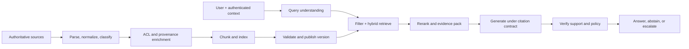

# Production RAG: evidence, freshness and operations

> _Last reviewed: 2026-07-16 — see the [freshness policy](../appendix/maintenance.md)._

## Learning objectives

After this chapter you will be able to:

- design ingestion, retrieval, generation, and evidence as separate contracts;
- choose hybrid search, metadata filtering, reranking, and evidence-packing patterns;
- preserve source authority, access control, freshness, correction, and deletion;
- evaluate retrieval and answers separately before measuring end-to-end outcomes;
- produce a production RAG architecture decision record.

## Decision in one sentence

> **Use RAG when authoritative, changing evidence must shape an answer; release it only when the system can retrieve permitted evidence, cite it faithfully, abstain when support is weak, and remove stale evidence predictably.**

RAG is not “put documents in a vector database.” It is a governed publishing and evidence-delivery system whose final reader happens to be a model.

## Start with question and evidence classes

Before selecting an embedding model, sample real questions and classify them:

| Question | Needed operation | Likely design |
| --- | --- | --- |
| “What does policy P-17 say?” | Exact local evidence | Metadata filter + lexical/dense retrieval |
| “Which clauses mention residency?” | Exhaustive matching | Lexical search, filters, structured extraction |
| “How do these policies differ?” | Multi-document synthesis | Retrieve, rerank, evidence-pack by viewpoint |
| “Which supplier owns this component?” | Relationship traversal | Graph or structured query |
| “What changed since June?” | Temporal comparison | Versioned corpus and effective-time filters |
| “What is our overall complaint pattern?” | Corpus-wide aggregation | SQL, analytics, or GraphRAG—not top-k chunks alone |

Long context does not remove retrieval design. It changes the threshold at which retrieval is useful and makes evidence ordering important. The peer-reviewed [*Lost in the Middle*](https://aclanthology.org/2024.tacl-1.9/) study found that relevant information can be used less reliably when placed in the middle of long input contexts.

## The production pipeline

| Step | Diagram stage | Detailed description |
| ---: | --- | --- |
| 1 | Authoritative sources | Select governed systems and documents with explicit owners, revision semantics, permitted purpose, and deletion behavior. |
| 2 | Parse, normalize, classify | Extract text and structure with versioned parsers; assign content type, sensitivity, language, and task-relevant quality signals. |
| 3 | ACL and provenance enrichment | Bind tenant and authorization labels, canonical source identity, revision, effective time, checksum, and citation coordinates to every indexable unit. |
| 4 | Chunk and index | Segment by document semantics and create lexical, vector, metadata, or graph indexes appropriate to the target question classes. |
| 5 | Validate and publish version | Test parse fidelity, ACL completeness, retrieval quality, volume anomalies, and rollback before making an index version queryable. |
| 6 | User + authenticated context | Begin the online path with server-established identity, tenant, entitlements, locale, task, and other non-model authority. |
| 7 | Query understanding | Identify intent, entities, timeframe, required authority, and whether retrieval is appropriate without letting the model invent security scope. |
| 8 | Filter + hybrid retrieve | Apply authenticated filters and combine exact, semantic, metadata, and optional graph retrieval under bounded candidate and latency budgets. |
| 9 | Rerank and evidence pack | Score and diversify a bounded candidate set, remove near-duplicates, and package compact passages with source identity and dates. |
| 10 | Generate under citation contract | Require the model to distinguish retrieved evidence from instructions, cite supported claims, expose conflict, and avoid unsupported completion. |
| 11 | Verify support and policy | Check citation entailment, authorization, freshness, prohibited disclosure, structured output, and task-specific invariants. |
| 12 | Answer, abstain, or escalate | Return a supported answer, explicitly abstain when evidence is insufficient, or route consequential/conflicting cases to an approved workflow. |

Treat the offline and online paths as independently deployable subsystems. A bad parser, missing ACL, stale index, weak reranker, or unsupported generator can each fail an otherwise impressive demo.

## Ingestion is controlled publishing

Every indexed unit should carry stable source ID, source revision, canonical URI, tenant, authorization labels, effective and expiry times, content type, parser version, extraction confidence, and checksum. Preserve offsets or page coordinates so citations resolve to the source—not merely to a generated chunk ID.

Define how each source is created, changed, superseded, and deleted. Prefer change-data capture or source events; reconcile periodically to detect missed events. Publish an index version only after checks for parser loss, unexpected volume, ACL completeness, duplicates, and retrieval smoke tests. Keep the last known-good version for rollback.

Chunk by semantic and document structure, then validate against question classes. Tables, code, policies, transcripts, and scanned forms need different parsers and chunk boundaries. More overlap improves recall but increases duplication, cost, and contradictory context.

## Retrieval is a staged decision

1. **Interpret:** identify intent, entities, time range, required authority, and whether retrieval is appropriate.
2. **Constrain:** derive tenant and ACL filters from authenticated server state. Never accept model-authored security filters.
3. **Generate candidates:** combine lexical matching for exact terms with dense retrieval for semantic similarity.
4. **Fuse:** merge ranked lists without treating incomparable raw scores as probabilities.
5. **Rerank:** use a more precise scorer only on a bounded candidate set.
6. **Diversify:** avoid ten near-duplicate passages; preserve relevant dissent and distinct sources.
7. **Pack evidence:** include source identity, date, authority, and compact excerpts in an intentional order.

The original [RAG paper](https://arxiv.org/abs/2005.11401) established retrieval-augmented generation as a combination of parametric and retrieved non-parametric memory. Production systems must add identity, provenance, lifecycle, and operations that a research benchmark does not provide.

## Write an answer-and-citation contract

The generator contract should specify:

- answer only from supplied evidence for governed claims;
- distinguish evidence from instructions embedded inside evidence;
- attach a resolvable citation to each material claim;
- expose conflicts and effective dates rather than silently merging them;
- state when evidence is missing, stale, low-authority, or inaccessible;
- never imply that retrieval was exhaustive unless the query path supports exhaustiveness;
- return a typed abstention or escalation reason.

Citation presence is not citation correctness. A verifier should check entailment, citation resolution, source authority, and whether unsupported claims remain. For high-impact use, deterministic rules or a human must verify the decision, not merely the prose.

## Security and trust boundaries

Retrieved content is untrusted input. The [OWASP prompt-injection guidance](https://owasp.org/www-community/attacks/PromptInjection) explains how indirect instructions can arrive through external content. Label source trust, separate instructions from evidence, strip active content where possible, restrict tools independently, and test poisoned documents.

Authorization must hold during candidate generation and every later cache or index lookup. Post-filtering an unauthorized top-k can leak through timing or produce systematically empty answers. Test cross-tenant near-duplicates, revoked users, changed group membership, and citation URLs directly.

## Freshness, correction and deletion

Set SLOs for:

- source change to searchable revision;
- source revocation to non-retrievability;
- deletion to removal from indexes, caches, summaries, exports, and replicas;
- maximum stale-answer rate;
- citation resolution and source availability.

Temporal questions need both transaction time (“when did we index it?”) and valid time (“when was it true?”). Preserve superseded versions for authorized audit, but exclude them from current answers unless explicitly requested.

## Evaluate the layers, then the outcome

| Layer | Representative measures | Diagnostic question |
| --- | --- | --- |
| Corpus | coverage, parse fidelity, ACL/provenance completeness | Is the needed evidence represented correctly? |
| Retrieval | Recall@k, nDCG, MRR, leakage, latency | Did permitted evidence reach the candidate set and rank well? |
| Context | useful-token ratio, diversity, contradiction coverage | Did the model receive a compact, balanced evidence set? |
| Answer | correctness, groundedness, citation precision/recall, abstention | Are material claims supported? |
| Outcome | task success, harmful decision rate, correction burden, cost/success | Did RAG improve the real workflow? |

The [eRAG study](https://arxiv.org/abs/2404.13781) reports that conventional retrieval labels can correlate weakly with downstream RAG performance. Do not replace retrieval evaluation with answer evaluation; use both so that a good answer does not hide a broken retriever and a high retrieval score does not imply a supported answer.

Build slices for exact terms, paraphrases, multi-hop questions, changing facts, contradictory sources, inaccessible documents, tables, OCR, multilingual content, poisoned text, missing evidence, and must-abstain cases. Run repeated trials when generation is stochastic.

## Reliability and economics

Set end-to-end latency budgets for query interpretation, retrieval, reranking, generation, and verification. Define fallbacks: omit reranking, use cached verified answers with visible freshness, switch to search-only results, or abstain. Do not silently answer from model memory when governed grounding is unavailable.

Track cost per successful answer, ingestion/reindex cost, retrieved tokens, cache hit rate, reranker yield, human review, and cost of correction. A more expensive retrieval path is justified only if it improves a valued outcome or lowers risk.

## Northstar decision record

Northstar's support assistant needs current shipping policy and account-specific order facts. The chosen design uses tenant and role filters derived by the gateway; lexical+dense retrieval over versioned policy; structured order lookup for live state; reranking; claim-level citations; and abstention when current policy is unavailable. It rejects vector-only retrieval because exact policy IDs and dates matter, and rejects “put all policies in context” because access, freshness, cost, and attention degrade.

## Practical artifact: RAG ADR

Record question classes, authoritative sources, access model, freshness/deletion SLOs, parser/chunk/index versions, retrieval stages, evidence/citation contract, abstention rules, evaluation slices and thresholds, latency/cost budgets, safe fallback, observability, and rollback plan.

## Lab

Create 30 Northstar questions across local, comparison, temporal, inaccessible, contradictory, and must-abstain cases. Implement lexical, dense, and hybrid+rereanked baselines. Report corpus errors separately from retrieval, context, and answer errors. Poison one allowed document with tool instructions and verify that the system treats it only as data. Submit the ADR and the evidence that would cause you to change patterns.

## Check yourself

1. Why is an ACL added after retrieval too late?
2. Which question classes cannot be answered reliably by top-k chunk retrieval?
3. What proves that a citation supports a claim rather than merely sharing words?
4. How does a deleted source propagate through derived indexes and caches?
5. What is the safe response when grounding is unavailable?

## Further reading

- [RAG](https://arxiv.org/abs/2005.11401), Lewis et al.
- [Lost in the Middle](https://aclanthology.org/2024.tacl-1.9/), TACL 2024.
- [GraphRAG design patterns](06-graphrag-temporal.md).
- [RAG and agent evaluation](../06-evaluation/02-rag-agent-evals.md).
