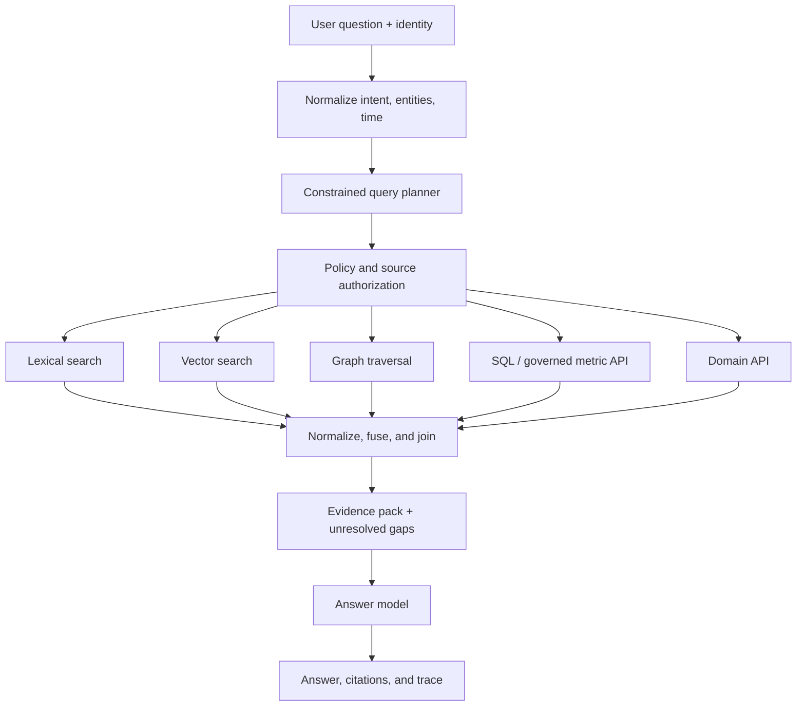

# Knowledge graphs, SQL & hybrid retrieval

> Last reviewed: 2026-07-16. See the [freshness policy](../appendix/maintenance.md).

## Learning objectives

After this chapter you will be able to:

- route questions to lexical, vector, graph, SQL, or API retrieval;
- design a typed, authorized query plan rather than an opaque search prompt;
- combine evidence without comparing incompatible raw scores;
- evaluate answer quality, plan quality, latency, and access-control correctness.

## The architecture decision

A user asks: “Which delayed Northstar orders are affected by the supplier notice, and what is the revenue exposure?” No single index can answer it. The notice is unstructured text, supplier relationships are a graph, order status is operational data, and revenue is an governed metric. A vector-only implementation may return a relevant notice but invent the join.

Hybrid retrieval is therefore **query planning across evidence systems**. Use each system for the operation it can execute faithfully, and preserve the lineage of every join.

| Question shape | Preferred source | Why |
|---|---|---|
| Exact identifier, phrase, regulation number | Lexical or exact index | Token and phrase precision |
| Concept, paraphrase, similar passage | Vector index | Semantic neighborhood |
| Relationship, dependency, path, ownership | Knowledge graph | Explicit edges and multi-hop traversal |
| Count, filter, aggregate, time series | SQL or governed analytics API | Typed operations and metric semantics |
| Current status or side-effect-free lookup | Domain API | System-of-record freshness |
| Mixed question | Planned combination | Each sub-question keeps the right execution model |

## Reference architecture



The planner does not receive unrestricted database credentials. It selects from registered operations, and an independent policy layer verifies every source, tenant, field, row, and graph traversal.

## The query-plan contract

Make the plan inspectable and executable without natural-language interpretation:

```json
{
  "question_id": "q_01J...",
  "principal": {"tenant": "northstar", "subject": "user-42"},
  "deadline_ms": 3500,
  "as_of": "2026-07-16T17:00:00Z",
  "steps": [
    {
      "id": "notice",
      "operator": "hybrid_search",
      "source": "supplier_notices",
      "query": "component delay affecting ACME-7",
      "filters": {"tenant": "northstar", "effective_at_lte": "$as_of"},
      "limit": 12
    },
    {
      "id": "suppliers",
      "operator": "graph_expand",
      "source": "supply_graph",
      "from": "$notice.entities.supplier_id",
      "edge": "SUPPLIES",
      "max_hops": 2
    },
    {
      "id": "exposure",
      "operator": "metric_query",
      "source": "governed_orders",
      "metric": "revenue_at_risk",
      "dimensions": ["supplier_id", "order_id"],
      "where": {"supplier_id": "$suppliers.ids", "status": "delayed"}
    }
  ],
  "join": {"keys": ["supplier_id"], "missing": "report_gap"}
}
```

Validate this object against a schema. Reject unknown operators, unconstrained scans, excessive hops, unbounded result sets, and joins on unclassified free text.

## Plan before retrieval

### 1. Resolve entities and time

Map “ACME” to candidate entity IDs; do not silently choose among collisions. Normalize relative dates using the user’s timezone and capture the data’s `as_of` time. If a question mixes “current” operational status with a month-end financial snapshot, expose that mismatch.

### 2. Decompose only when necessary

Every extra step adds latency and failure surface. A simple policy lookup needs one search. A supply-chain exposure question needs several typed sub-questions and a deterministic join. Limit decomposition depth, number of sources, and replans.

### 3. Authorize the plan, not just the final answer

Authorization must happen before retrieval. Propagate tenant and subject claims into each query, apply row- and field-level controls in the source, and verify graph paths do not cross forbidden partitions. Post-generation redaction cannot undo unauthorized retrieval or model exposure.

### 4. Reserve a budget

Allocate the end-to-end deadline across planning, retrieval, joins, reranking, and generation. Optional enrichment should be the first work cancelled. A plan that cannot finish inside its budget should return a smaller, explicit answer rather than time out after doing expensive work.

## Source-specific design

### Lexical and vector

Lexical search is strong on rare tokens, codes, names, and exact language. Vector search is strong on paraphrase and conceptual similarity. Run both when the corpus and query justify it, then combine **ranks**, not raw scores. BM25 and cosine scores are not calibrated to the same scale.

Reciprocal Rank Fusion is a robust baseline:

```text
RRF(document) = sum(1 / (k + rank_in_result_list))
```

Use source weights only after offline evaluation. Preserve the originating rank, index version, query transformation, and document version for debugging.

### Graph traversal

Graphs are useful when relationships are first-class evidence: ownership, component dependencies, fraud rings, care pathways, or citation networks. Constrain allowed node labels, edge types, direction, maximum hops, fan-out, and time validity. A graph is not automatically correct; stale or inferred edges need provenance and confidence.

Use graph retrieval to identify candidates or paths, then fetch authoritative attributes from the system of record when freshness matters. Graph path text should not be mistaken for a source citation.

### SQL and governed metrics

Do not let the model invent arbitrary production SQL. Prefer a semantic layer or allowlisted query templates with typed dimensions, measures, filters, and aggregation rules. Enforce read-only credentials, row limits, statement timeouts, cost guards, and tenant policies in the database.

Validate generated plans statically and, where supported, inspect the database query plan before execution. Return the metric definition and snapshot time with the result.

### Domain APIs

APIs are often the best source for current state. Register request and response schemas, freshness expectations, rate limits, and error semantics. Retries are safe only for idempotent reads. Cache behavior must respect authorization and staleness limits.

## Joining and evidence packing

Normalize every result into a common evidence envelope:

```yaml
evidence_id: ev_7f3
source: governed_orders
source_record: order/18431
retrieved_at: 2026-07-16T17:00:01Z
valid_at: 2026-07-16T16:59:43Z
principal_scope: northstar:user-42
claims:
  - predicate: order_status
    value: delayed
confidence: authoritative
```

Join only on stable identifiers. If entity resolution is probabilistic, carry candidate confidence and require confirmation at the threshold appropriate to the consequence. The evidence pack should contain supporting and conflicting evidence, missing fields, freshness, and source lineage. The answer model may summarize it; it must not repair a failed join by guessing.

## Failure and degradation policy

| Failure | Safe behavior |
|---|---|
| Planner emits invalid operator | Reject and fall back to a simpler registered plan |
| Vector index unavailable | Use lexical retrieval and disclose reduced semantic coverage |
| Graph is stale | Skip affected relationships or label them with their `as_of` time |
| SQL exceeds budget | Cancel, return partial non-aggregated evidence if permitted |
| Entity match is ambiguous | Ask for clarification; do not join candidates |
| Sources conflict | Show the conflict and source timestamps |
| Authorization context missing | Retrieve nothing |

Circuit breakers should be source-specific. One degraded index must not cause the planner to retry every path or exceed the global deadline.

## Evaluation

Evaluate four layers independently:

- **planning:** correct operators, sources, constraints, decomposition, and join keys;
- **retrieval:** recall@k, nDCG, entity/path recall, filter correctness, and freshness;
- **composition:** join accuracy, evidence coverage, contradiction handling, and citation precision;
- **system:** task success, authorization violations, p95 latency, cost, and degraded-mode usefulness.

Build adversarial cases for tenant leakage, prompt injection in retrieved text, graph fan-out, expensive SQL, ambiguous entities, stale edges, and conflicting snapshots. A high answer score cannot compensate for an unauthorized or fabricated plan.

## Northstar decision

Northstar uses lexical-plus-vector retrieval for policy and notice text, a governed supplier graph for dependency traversal, and a metric API for revenue exposure. The planner can select only registered operations. All joins use supplier and order IDs, every source enforces tenant scope, and the result identifies snapshot times. If entity resolution is ambiguous, the assistant asks for a supplier selection.

## Architecture artifact

Produce a **hybrid retrieval ADR** containing:

1. question classes and their source/operator mapping;
2. query-plan schema and authorization invariants;
3. deadline, fan-out, hop, row, and cost limits;
4. fusion and join strategy;
5. evidence envelope and freshness policy;
6. evaluation set, failure behavior, and rollout thresholds.

## Lab

Create five Northstar questions: exact lookup, semantic policy question, graph relationship, aggregate, and mixed question. Write a valid plan for each, inject one source failure, and document the useful degraded response. Submit plan traces and layer-specific evaluation results.

## Check yourself

1. Why is post-generation redaction insufficient for hybrid retrieval?
2. When should graph traversal return paths rather than prose?
3. Why should BM25 and vector similarity scores not be compared directly?
4. What evidence would justify replacing a deterministic query template with model planning?

## Further reading

- [Neo4j Cypher Manual: indexes](https://neo4j.com/docs/cypher-manual/current/indexes/)
- [Neo4j Cypher Manual: vector search and score fusion guidance](https://neo4j.com/docs/cypher-manual/current/clauses/search/)
- [Retrieval-Augmented Generation for Knowledge-Intensive NLP Tasks](https://arxiv.org/abs/2005.11401)
- [Reciprocal Rank Fusion outperforms Condorcet and individual rank learning methods](https://dl.acm.org/doi/10.1145/1571941.1572114)
- [From Local to Global: A GraphRAG Approach to Query-Focused Summarization](https://arxiv.org/abs/2404.16130)
