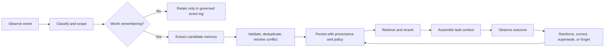
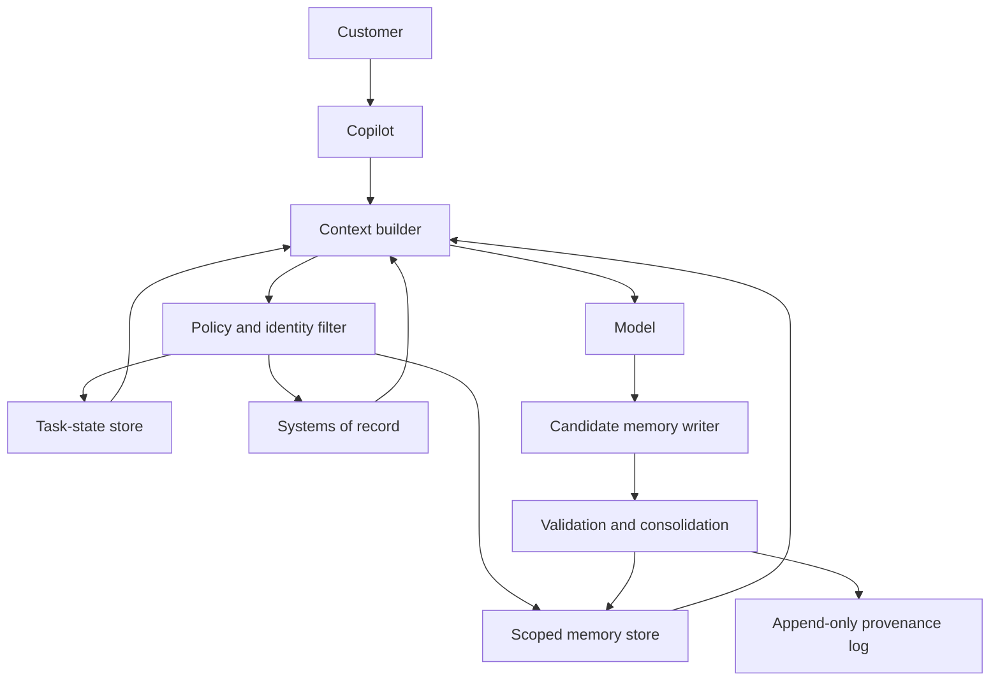

# Agentic memory systems

> _Last reviewed: 2026-07-16 — see the [freshness policy](../appendix/maintenance.md)._

## Learning objectives

After this chapter you will be able to:

- distinguish context, state, and working, episodic, semantic, procedural, and artifact memory;
- design explicit policies for capturing, consolidating, retrieving, correcting, and forgetting memories;
- assemble high-signal context within a token and latency budget;
- compare flat, hierarchical, and graph-backed memory architectures;
- produce an agent memory contract that can survive privacy and architecture review.

## Decision in one sentence

> **Persist only the information that has demonstrated future value, with explicit ownership, provenance, correction, retrieval, and deletion behavior.**

## Why memory is an architecture, not a feature

A chat transcript is not a memory system. It is an event log. Passing the entire transcript to a model eventually becomes costly, distracting, and impossible. Summarizing it reduces size but makes an irreversible choice about what to keep. Vectorizing every message makes it searchable but preserves errors, duplicates, secrets, and expired facts.

The durable problem is a lifecycle:



| Step | Diagram stage | Detailed description |
| ---: | --- | --- |
| 1 | Observe event | Capture a task, conversation, tool, correction, or outcome event with subject, tenant, time, source, and trust metadata. |
| 2 | Classify and scope | Determine the candidate memory class, subject and workspace boundary, sensitivity, permitted purpose, retention, and authority. |
| 3 | Worth remembering? | Apply an explicit usefulness and risk policy; transient details and unverified claims should normally remain events rather than durable memory. |
| 4 | Retain only in governed event log | Preserve the original event under its audit and retention policy without promoting it into future task context. |
| 5 | Extract candidate memory | Convert the useful part into a typed candidate fact, preference, episode, procedure, or relationship linked to its evidence. |
| 6 | Validate, deduplicate, resolve conflict | Check source authority, schema, identity, existing equivalent memories, contradictions, and whether a correction supersedes an older claim. |
| 7 | Persist with provenance and policy | Store the accepted memory with stable identity, version, confidence, source links, access controls, validity, expiry, and deletion lineage. |
| 8 | Retrieve and rerank | Enforce scope before search, combine suitable retrieval signals, and rank by relevance, authority, freshness, diversity, and risk. |
| 9 | Assemble task context | Select a bounded context that labels memory as evidence rather than instruction and keeps system-of-record facts distinct. |
| 10 | Observe outcome | Record whether the memory improved or harmed task success, caused correction, leaked scope, or became stale. |
| 11 | Reinforce, correct, supersede, or forget | Feed outcome evidence back into governed updates; never let the model silently overwrite durable history. |

The memory subsystem is therefore partly a data system, partly a retrieval system, and partly a policy system. The model may propose memories, but code and policy must determine identity boundaries, retention, authorization, and destructive updates.

## Separate context, state, and memory

These terms are related but not interchangeable.

| Concept | Purpose | Typical lifetime | Example |
| --- | --- | --- | --- |
| Context | Tokens supplied for the current inference | One model call | Current instructions, evidence, and tool results |
| Working state | Authoritative progress for the active task | One task or workflow | Plan, completed steps, approval status, retry count |
| Session history | Ordered interaction record | One conversation or support case | User and assistant messages |
| Long-term memory | Selected information expected to help future tasks | Across sessions | Confirmed preference or durable account fact |
| System of record | Authoritative business truth | Business-defined | Customer address, contract, shipment status |

Memory must never silently replace a system of record. “The customer prefers email” may be a useful memory. “The customer has a $10,000 credit limit” belongs in an authoritative business system and should be retrieved from there when needed.

## A practical memory taxonomy

Use the taxonomy to decide representation, retention, and retrieval—not to imitate human cognition literally.

| Memory type | Contains | Useful representation | Main risk |
| --- | --- | --- | --- |
| Working memory | Immediate goal, plan, observations, open questions | Typed task state plus compact context | Losing critical state during compaction |
| Episodic memory | What happened in a specific interaction | Timestamped event or summarized episode | Treating one event as a timeless fact |
| Semantic memory | Stable facts, preferences, entities, relationships | Records, vectors, or knowledge graph | Staleness and contradiction |
| Procedural memory | How to perform a recurring task | Versioned instruction, workflow, or verified skill | Learning an unsafe shortcut |
| Artifact memory | Files, decisions, outputs, and their lineage | Artifact store plus metadata and links | Using an obsolete version |
| Social or team memory | Information intentionally shared between agents or people | Scoped shared store | Cross-user or cross-tenant leakage |

The peer-reviewed [Generative Agents study](https://doi.org/10.1145/3586183.3606763) used a memory stream, retrieval, reflection, and planning to maintain more coherent behavior. [MemGPT](https://arxiv.org/abs/2310.08560), a preprint, frames limited context as a hierarchy of faster and slower memory tiers. Treat these as architectural inspirations, not proof that every enterprise agent needs human-like memory categories.

## Define a memory contract before choosing storage

Every memory class needs a contract:

```yaml
memory_class: user_preference
owner: user
scope: tenant/user
allowed_sources: [explicit_user_statement, confirmed_profile_update]
write_authority: memory_policy_service
readers: [customer_copilot]
representation: structured_fact_plus_source_link
confidence_rule: explicit_confirmation_required
conflict_rule: newest_confirmed_value_supersedes
retention: until_withdrawn_or_account_deleted
user_controls: [inspect, correct, delete, disable]
prohibited_content: [passwords, payment_credentials, health_data]
fallback: ask_or_retrieve_from_system_of_record
```

This contract prevents the common failure of implementing a vector database first and inventing policy later.

## Capture and write policies

Write fewer, better memories. A candidate should pass five gates:

1. **Future utility:** is it likely to change a later answer or action?
2. **Authority:** did it come from the user, a trusted tool, an inferred summary, or untrusted retrieved text?
3. **Scope:** does it belong to this task, user, tenant, team, or global knowledge base?
4. **Sensitivity:** may it be persisted, and for how long?
5. **Verifiability:** can the system retain a source event, timestamp, and confidence?

Do not store a model's guess as a confirmed user fact. Use typed statuses such as `observed`, `inferred`, `confirmed`, `superseded`, and `revoked`. If an inference is useful but uncertain, preserve that uncertainty in the data model and in downstream presentation.

### What usually belongs in memory

- explicit and durable user preferences;
- decisions and the evidence or approver behind them;
- verified outcomes of completed work;
- stable mappings between entities and identifiers;
- reusable procedures that passed evaluation;
- unresolved commitments that must survive a context reset.

### What usually does not

- secrets, credentials, or authentication factors;
- transient tool output available from an authoritative API;
- unverified model speculation;
- copied prompt-injection instructions from retrieved content;
- redundant details with no plausible future use;
- sensitive data without a purpose, lawful basis, and retention rule.

## Consolidation, reflection, and forgetting

Raw events grow without bound. Consolidation turns them into more useful representations while retaining links to originals.

### Consolidation operations

- **Deduplicate:** merge semantically equivalent candidates without erasing their sources.
- **Summarize:** create an episode summary while keeping the underlying event IDs recoverable.
- **Reflect:** infer a higher-level pattern, clearly marked as derived rather than observed.
- **Promote:** move a fact from task scope to user or team scope after validation.
- **Supersede:** close the validity interval of an old fact when a replacement becomes true.
- **Decay:** lower retrieval priority when time reduces expected utility.
- **Delete:** remove content and derived indexes according to user request or policy.

For example:

```text
Observed at T1: User says, “Ship this order to Vancouver.”
Observed at T2: Account profile is updated to Victoria.
Bad consolidation: preferred_city = Vancouver AND preferred_city = Victoria
Better model:
  shipping_instruction(order_184) = Vancouver, valid for order_184 only
  profile_city(user_27) = Victoria, valid from T2, source = profile service
```

Forgetting is a product requirement. Expiration, revocation, account deletion, source deletion, and correction must propagate to embeddings, summaries, caches, graph edges, and replicas—not only to the primary record.

## Retrieval is a policy-aware ranking problem

Similarity alone is rarely enough. Candidate generation and ranking can combine:

```text
score(memory, task) =
    semantic_relevance
  + entity_overlap
  + temporal_relevance
  + task_state_match
  + importance
  + source_authority
  - staleness_penalty
  - uncertainty_penalty
  - sensitivity_penalty
```

The exact formula can be learned or rule-based, but authorization is a hard filter—not a score. A highly relevant memory from another tenant must never enter the candidate set.

[LongMemEval](https://proceedings.iclr.cc/paper_files/paper/2025/hash/d813d324dbf0598bbdc9c8e79740ed01-Abstract-Conference.html), published at ICLR 2025, decomposes long-term memory into indexing, retrieval, and reading. Its results support session decomposition, fact-enriched indexing, and time-aware query expansion rather than treating a conversation as undifferentiated text.

## Context assembly: smallest sufficient evidence

Retrieval produces candidates; context assembly decides what the model will actually see.

1. Reserve tokens for stable policy and the current goal.
2. Add authoritative task state.
3. Retrieve a small, diverse set of permitted memories.
4. Prefer source-linked facts over free-form summaries for consequential decisions.
5. Resolve or expose contradictions before generation.
6. include timestamps when time changes meaning.
7. Retain space for tool results and the model's answer.

Anthropic's [context-engineering guidance](https://www.anthropic.com/engineering/effective-context-engineering-for-ai-agents) recommends treating context as finite, retrieving information just in time, using progressive disclosure, and externalizing structured notes for long-horizon work. A large context window does not remove the need to select high-signal information.

## Flat, hierarchical, and graph-backed memory

| Pattern | Strength | Weakness | Choose when |
| --- | --- | --- | --- |
| Recent history | Simple and faithful to latest turns | Fails across long horizons | Short, bounded sessions |
| Flat vector memory | Fast semantic lookup | Weak on time, exact identity, and multi-hop relations | Independent facts and approximate recall |
| Structured fact store | Strong typing and updates | Requires schema and extraction discipline | Stable preferences and business entities |
| Hierarchical summaries | Multiple abstraction levels | Summaries may omit future-critical detail | Long episodes and corpus-level questions |
| Knowledge graph memory | Explicit entities, relations, provenance, and paths | Higher extraction and operations cost | Multi-hop, temporal, and relationship-heavy tasks |
| Hybrid memory | Routes among several stores | More policy and evaluation complexity | Enterprise systems with mixed question types |

[RAPTOR](https://proceedings.iclr.cc/paper_files/paper/2024/hash/8a2acd174940dbca361a6398a4f9df91-Abstract-Conference.html), published at ICLR 2024, recursively clusters and summarizes text into a retrieval tree. [HippoRAG](https://proceedings.neurips.cc/paper_files/paper/2024/hash/6ddc001d07ca4f319af96a3024f6dbd1-Abstract-Conference.html), published at NeurIPS 2024, combines knowledge graphs with Personalized PageRank for multi-hop retrieval. Both illustrate why memory can require organization beyond nearest-neighbor chunks.

## Northstar architecture walkthrough

Northstar's customer copilot should remember that a user prefers concise email updates, but it must read the current shipment status and refund eligibility from systems of record.



Trust boundaries are explicit:

- the model cannot select another user's memory scope;
- retrieved content cannot directly write durable memory;
- preference memory may shape presentation but not override refund policy;
- every memory used in an answer is traceable to its record and source;
- users can inspect, correct, or delete their persisted preferences.

## Practical artifact: agent memory design record

For each proposed memory class, record:

| Field | Question |
| --- | --- |
| Purpose | Which future decision improves because this persists? |
| Owner and scope | User, task, tenant, team, or organization? |
| Source authority | Observed, inferred, confirmed, or system-of-record? |
| Schema | Fact, episode, procedure, artifact, node, or edge? |
| Write policy | Who proposes, validates, and commits it? |
| Conflict policy | Merge, supersede, retain both, or ask? |
| Retrieval policy | Which filters and ranking signals apply? |
| Retention | TTL, event-driven deletion, or indefinite with review? |
| User control | Can the subject inspect, correct, export, and delete it? |
| Evaluation | What proves that this memory helps without leaking or misleading? |
| Fallback | What happens when memory is missing, stale, or contradictory? |

Reject a memory class when its future utility cannot be stated, its owner is ambiguous, or deletion cannot be implemented end to end.

## Lab: design and test a scoped preference memory

Create a minimal Northstar memory service that stores confirmed communication preferences and task commitments.

Deliver:

1. the memory contract and schema;
2. write, retrieve, correct, and delete flows;
3. ten multi-session test conversations, including contradictions and two users with similar names;
4. a context-assembly trace showing why each memory was included;
5. evidence that deleting a memory also removes it from retrieval indexes and caches.

Acceptance criteria:

- no cross-user retrieval in adversarial scope tests;
- confirmed corrections supersede old values;
- expired and deleted memories never enter model context;
- authoritative APIs win conflicts with remembered business facts;
- the system abstains or asks when two permitted facts remain unresolved.

## Check yourself

1. Why is a transcript an event log rather than a complete memory architecture?
2. Which Northstar facts belong in memory, and which must come from systems of record?
3. When should an inferred memory be promoted to a confirmed semantic fact?
4. How does temporal validity differ from simply keeping the newest vector?
5. What must happen outside model discretion when a user deletes a memory?

## Further reading

- Park et al., [*Generative Agents: Interactive Simulacra of Human Behavior*](https://doi.org/10.1145/3586183.3606763), UIST 2023.
- Sarthi et al., [*RAPTOR: Recursive Abstractive Processing for Tree-Organized Retrieval*](https://proceedings.iclr.cc/paper_files/paper/2024/hash/8a2acd174940dbca361a6398a4f9df91-Abstract-Conference.html), ICLR 2024.
- Gutiérrez et al., [*HippoRAG: Neurobiologically Inspired Long-Term Memory for Large Language Models*](https://proceedings.neurips.cc/paper_files/paper/2024/hash/6ddc001d07ca4f319af96a3024f6dbd1-Abstract-Conference.html), NeurIPS 2024.
- Wu et al., [*LongMemEval: Benchmarking Chat Assistants on Long-Term Interactive Memory*](https://proceedings.iclr.cc/paper_files/paper/2025/hash/d813d324dbf0598bbdc9c8e79740ed01-Abstract-Conference.html), ICLR 2025.
- Packer et al., [*MemGPT: Towards LLMs as Operating Systems*](https://arxiv.org/abs/2310.08560), 2023 preprint.
- Anthropic, [*Effective context engineering for AI agents*](https://www.anthropic.com/engineering/effective-context-engineering-for-ai-agents).
- Google Cloud, [Agent Platform Memory Bank documentation](https://docs.cloud.google.com/gemini-enterprise-agent-platform/scale#memory-bank).
