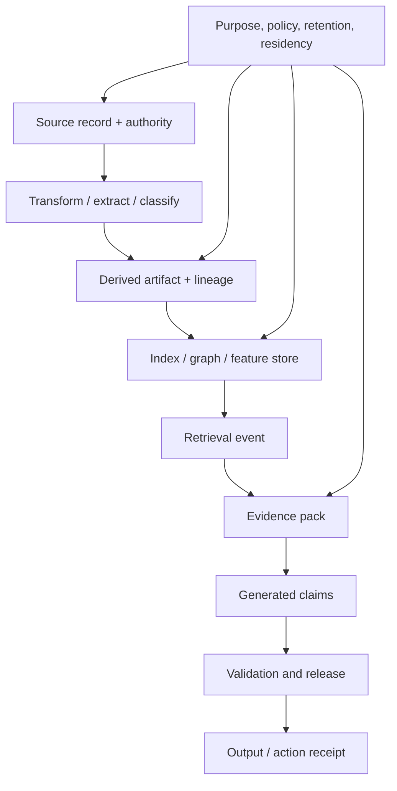

# Data governance, lineage & provenance

> Last reviewed: 2026-07-16. See the [freshness policy](../appendix/maintenance.md).

## Learning objectives

After this chapter you will be able to:

- trace source records through extraction, indexing, retrieval, generation, and action;
- enforce purpose, authority, retention, residency, and deletion on derived data;
- design a provenance envelope that supports citations, audits, and incidents;
- distinguish lineage, authenticity, integrity, and truth.

## Provenance answers “what happened,” not “is it true”

Lineage describes transformations and dependencies. Provenance records origin, actors, versions, and events. Integrity mechanisms show that an artifact has not changed since it was identified or signed. Authenticity connects a claim to an identity under a trust model. None alone proves that the original source was accurate.

## End-to-end lineage



Every arrow is a governed transformation with an actor, time, code/config version, input IDs, output IDs, and policy decision.

## Provenance envelope

```yaml
artifact_id: ev_01J...
artifact_type: retrieved_passage
tenant: northstar
source:
  system: policy_repository
  record_id: shipping-policy-44
  version: 17
  valid_from: 2026-07-01T00:00:00Z
transformation:
  pipeline: publish-policy-v8
  code_digest: sha256:...
  inputs: [doc_01J...]
governance:
  purpose: shipment_support
  classification: internal
  retention_until: 2027-07-01
  allowed_regions: [ca-central]
integrity:
  content_digest: sha256:...
observed_at: 2026-07-16T17:00:00Z
```

Use stable identifiers and immutable versions. A citation to a mutable URL without the observed version cannot reproduce the answer.

## Policy travels with derivation

Derived embeddings, chunks, graph edges, summaries, caches, evaluation samples, and memories can retain sensitive facts even after raw text is removed. Inherit the strictest applicable classification and purpose unless a documented transformation justifies a change. Track which controls survive aggregation or de-identification.

Enforce policy in the storage and query layer. Metadata attached after retrieval cannot prevent unauthorized access. A lineage service should help discover affected artifacts, not become the only authorization mechanism.

## Freshness and temporal truth

Record event time, valid time, ingestion time, and observation time when the distinction matters. “Latest” can mean last written, currently effective, or most recently observed. Temporal joins must select versions valid for the same business time or disclose the mismatch.

Use explicit supersession and tombstones. Do not overwrite history needed for audit, but do not retain personal data indefinitely under the label of lineage.

## Deletion and correction propagation

Maintain reverse lineage from a source subject/record to chunks, embeddings, graph nodes/edges, caches, memories, fine-tuning sets, eval sets, and outputs where technically and legally required. A deletion workflow should:

1. authenticate the request and determine applicable scope;
2. block new publication of the source;
3. delete or tombstone affected derived artifacts;
4. rebuild or compact indexes where necessary;
5. invalidate caches and memory;
6. verify absence through independent queries;
7. record minimal completion evidence.

Corrections should publish a new version, invalidate stale evidence, and identify material outputs or actions that need human follow-up.

## Data contracts and quality

Register ownership, schema, semantics, quality expectations, freshness SLO, allowed purposes, regions, retention, and change process. Validate source identity, duplicate rate, missingness, extraction confidence, label consistency, and poisoning indicators before publication.

Quarantine untrusted or malformed content. Provenance from an untrusted signer remains untrusted; do not confuse a valid signature with an approved source.

## Output claim lineage

Map answer claims to evidence IDs, not just an answer to a list of documents. Preserve whether a claim was directly supported, calculated by a deterministic operator, inferred by the model, or unresolved. When evidence conflicts, retain both and the resolution rule.

For consequential actions, link the final output to the run, policy decision, approval, tool call, idempotency key, and target receipt. This creates a chain from source evidence to business effect.

## Operational queries

The lineage system should answer:

- Which outputs used source version 16 after it was superseded?
- Which indexes and caches contain data for subject X?
- Which model releases used dataset Y or prompt Z?
- Which tenants were exposed to a poisoned document?
- Which generated media assets lack valid content credentials?

Test these queries during incident exercises and deletion drills. A lineage diagram that cannot answer them is documentation, not an operational control.

## Northstar decision

Northstar assigns immutable versions to policies and supplier notices. The publishing pipeline records input digest, extraction version, classifications, effective time, and derived chunks. Each answer claim points to an evidence ID. A correction invalidates affected cache keys and queues a review of material customer communications. Deletion verification covers vector, graph, cache, and memory stores.

## Architecture artifact

Produce a **lineage map and provenance schema** covering source authority, transformations, identifiers, versions, temporal fields, purpose and data policy, derived stores, output claims, action receipts, deletion/correction propagation, trust decisions, and incident queries.

## Lab

Trace a Northstar supplier notice into an answer and a replacement-order action. Then supersede and delete the notice. Demonstrate which artifacts are invalidated, which evidence is retained, and how an operator discovers affected outputs.

## Check yourself

1. Why does valid provenance not prove truth?
2. Which derived stores must participate in deletion?
3. How do valid time and observation time differ?
4. What lineage is required to investigate a consequential action?

## Further reading

- [W3C PROV-O](https://www.w3.org/TR/prov-o/)
- [W3C Data Catalog Vocabulary (DCAT) v3](https://www.w3.org/TR/vocab-dcat-3/)
- [C2PA Content Credentials 2.2](https://spec.c2pa.org/specifications/specifications/2.2/specs/C2PA_Specification)
- [SLSA Provenance](https://slsa.dev/spec/v1.1/provenance)
