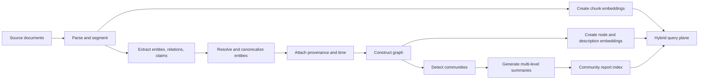
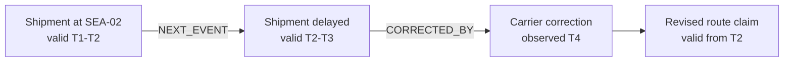

# GraphRAG and temporal knowledge

> _Last reviewed: 2026-07-16 — see the [freshness policy](../appendix/maintenance.md)._

## Learning objectives

After this chapter you will be able to:

- decide when vector search, SQL, graph traversal, GraphRAG, or a hybrid is appropriate;
- design entity, relationship, claim, provenance, and community-summary indexes;
- route entity-local, corpus-global, exploratory, and authoritative queries differently;
- model changing facts using valid time, transaction time, and supersession;
- produce a GraphRAG architecture decision record with measurable rejection criteria.

## Decision in one sentence

> **Adopt GraphRAG only when relationships or corpus-wide synthesis create measurable value that simpler retrieval cannot deliver.**

## Why ordinary RAG reaches a boundary

Flat vector RAG is good at finding passages semantically similar to a query. It is weaker when an answer requires:

- connecting evidence distributed across many documents;
- traversing several named relationships;
- distinguishing entities with similar names;
- summarizing dominant themes across an entire corpus;
- reconstructing how facts and relationships changed over time.

GraphRAG does not replace vector retrieval or databases. It adds an index that makes entities, relationships, communities, and sometimes claims explicit. This improves some questions while increasing extraction cost, schema decisions, freshness work, and failure modes.

## Start with the question shape

| Question | Preferred starting point | Reason |
| --- | --- | --- |
| “Find passages similar to this incident” | Vector or hybrid search | Semantic locality |
| “What is order 184's current status?” | SQL or system API | Authoritative structured state |
| “Which suppliers connect these three failures?” | Graph traversal or graph-local RAG | Relationship path |
| “What themes explain support escalations this quarter?” | GraphRAG global/community search | Corpus-wide synthesis |
| “How did the account relationship change after the merger?” | Temporal graph plus source retrieval | Time-bounded relationships |
| “Investigate why this shipment repeatedly fails” | Routed vector, graph, SQL, and agentic search | Mixed exploratory task |

If a SQL join or metadata filter answers the question deterministically, use it. If top-k chunks already meet the quality target, a graph is unnecessary architecture.

## The GraphRAG indexing pipeline

Microsoft's [GraphRAG indexing documentation](https://github.com/microsoft/graphrag/blob/main/docs/index/overview.md) describes a pipeline that extracts entities, relationships, and claims; detects communities; generates summaries at multiple levels; and embeds text. A vendor-neutral version is:



The outputs remain derived indexes. The source documents and systems of record remain authoritative.

## Graph construction is the hard part

### Ontology: constrain only what creates value

An ontology defines relevant entity and relationship types. Too little structure produces vague edges such as `RELATED_TO`. Too much structure makes extraction brittle and expensive.

For Northstar, begin with a small domain model:

```text
Entities: Customer, Order, Shipment, Carrier, Facility, Incident, Policy, Product
Relations: PLACED, FULFILLED_BY, ROUTED_THROUGH, AFFECTED_BY,
           GOVERNED_BY, CONTAINS, PRECEDES, SUPERSEDES
Claims: subject, predicate, object/value, source, confidence,
        valid_from, valid_to, observed_at
```

Expand only when evaluation queries cannot be represented or answered.

### Entity resolution

Extraction might create `Northstar Logistics`, `North Star Logistics`, and `NSL` as three nodes. Entity resolution must decide whether they refer to one organization.

Use, in decreasing order of authority:

1. stable identifiers from source systems;
2. deterministic normalization and domain mappings;
3. exact or probabilistic record linkage;
4. embedding or model-assisted candidate matching;
5. human review for high-impact ambiguous merges.

False merges are often worse than duplicates: they create plausible paths between facts that belong to different entities. Preserve aliases, evidence, merge decisions, and the ability to split an entity later.

### Claims and provenance

Store a claim as an assertion from a source, not as timeless truth:

```json
{
  "subject_id": "shipment:184",
  "predicate": "ROUTED_THROUGH",
  "object_id": "facility:SEA-02",
  "source_uri": "event://carrier/99317",
  "source_span": "facility_code=SEA-02",
  "confidence": 1.0,
  "valid_from": "2026-07-14T11:03:00Z",
  "valid_to": "2026-07-15T02:20:00Z",
  "observed_at": "2026-07-14T11:04:12Z",
  "extractor_version": "carrier-event-v3"
}
```

The answer layer should be able to move from summary to graph path to claim to original evidence.

## Multi-resolution knowledge

GraphRAG creates useful views at several levels:

- **source level:** raw passages or business records;
- **claim level:** attributed assertions;
- **entity level:** consolidated descriptions and relationships;
- **community level:** summaries of densely connected subgraphs;
- **corpus level:** synthesis across community reports.

The original [Microsoft GraphRAG paper](https://www.microsoft.com/en-us/research/publication/from-local-to-global-a-graph-rag-approach-to-query-focused-summarization/) builds an entity graph and pregenerates community summaries, then uses map-reduce synthesis for global questions. [RAPTOR](https://proceedings.iclr.cc/paper_files/paper/2024/hash/8a2acd174940dbca361a6398a4f9df91-Abstract-Conference.html) provides a complementary tree-based approach that recursively clusters and summarizes text without requiring a domain knowledge graph.

Both patterns trade indexing work for retrieval at multiple abstraction levels. Summaries must retain provenance because compression can omit exceptions that matter later.

## Query planning: local, global, exploratory, and authoritative

Microsoft's [GraphRAG query documentation](https://github.com/microsoft/graphrag/blob/main/docs/query/overview.md) distinguishes local, global, DRIFT, and basic vector search. Generalize these into a router:

| Mode | Starts from | Retrieves | Best for | Main cost or risk |
| --- | --- | --- | --- | --- |
| Entity-local | Recognized entities | Neighborhood, linked chunks, claims | Specific people, products, incidents | Misses disconnected themes |
| Global/community | Community reports | Broad summaries, then synthesis | Themes and corpus-wide sensemaking | High model and indexing cost |
| Exploratory/DRIFT | Broad community context | Iterative follow-up questions and local evidence | Investigations | More calls and harder stopping rules |
| Basic vector | Query embedding | Similar chunks | Direct semantic lookup and baseline | Weak relationship reasoning |
| Structured | IDs and predicates | SQL rows, API results, graph paths | Exact current facts | Requires schema and correct routing |

The router should use question features, not product labels:

- Is an authoritative current value requested?
- Are named entities and relationship verbs present?
- Does the user ask for themes, patterns, or “across all” evidence?
- Is the question exploratory and allowed a larger budget?
- Is time an explicit or implicit constraint?

When confidence is low, run a cheap baseline and one candidate specialized route, then compare evidence coverage. Do not fan out to every retriever by default.

## Temporal GraphRAG

A normal graph states that a relationship exists. A temporal graph states when it was valid and when the system learned about it.

### Two clocks

- **Valid time:** when the fact was true in the represented world.
- **Transaction or observation time:** when the platform recorded the fact.

These clocks differ when a carrier sends a late correction. Bitemporal data allows the system to answer both “what route did we believe yesterday?” and “what route do we now know the shipment actually took?”

### Model changes rather than overwriting them

Use validity intervals, events, and explicit relations such as `SUPERSEDES`, `CORRECTS`, or `DERIVED_FROM`. Never erase history merely to simplify retrieval.



[Zep: A Temporal Knowledge Graph Architecture for Agent Memory](https://arxiv.org/abs/2501.13956) describes Graphiti, which combines conversational and business data in a temporal graph. It is a useful implementation case study, but it is a vendor-authored preprint; validate its benchmark claims independently before using them in a platform decision.

## Graph-backed agent memory

Agent memory and GraphRAG converge when an agent must connect experiences over time:

- an episode becomes an event node;
- people, tasks, artifacts, and systems become entities;
- decisions link to evidence and approvers;
- procedures link to outcomes and versions;
- corrections supersede earlier claims;
- retrieval follows both semantic similarity and graph paths.

[HippoRAG](https://proceedings.neurips.cc/paper_files/paper/2024/hash/6ddc001d07ca4f319af96a3024f6dbd1-Abstract-Conference.html), published at NeurIPS 2024, combines knowledge graphs and Personalized PageRank for single-step multi-hop retrieval. Its results make graph-based memory worth evaluating, not automatically adopting.

## Failure modes and controls

| Failure | Consequence | Control |
| --- | --- | --- |
| Hallucinated edge | False causal or organizational path | Source-linked claims, confidence, validation |
| Entity over-merge | Evidence from different subjects combines | Stable IDs, conservative thresholds, reversible merges |
| Entity fragmentation | Relevant evidence remains disconnected | Alias index and candidate-link review |
| Stale community summary | Global answer ignores recent change | Incremental invalidation and freshness SLO |
| Missing temporal filter | Expired relationship appears current | Valid-time predicates by default |
| Graph poisoning | Untrusted text creates influential nodes or edges | Trust labels, write isolation, source-weighted ranking |
| Path laundering | Weak claim gains credibility through repetition | Preserve independent source count and derivation |
| Unbounded global query | Excessive latency and spend | Query budgets, community limits, cancellation |

## Northstar hybrid architecture

Northstar wants to explain recurring shipment failures.

1. SQL identifies delayed shipments in the requested period.
2. The graph links shipments, routes, facilities, carriers, products, incidents, and policies.
3. Vector retrieval finds semantically similar incident narratives.
4. Community summaries identify repeated clusters such as weather, a facility, or packaging type.
5. The answer cites source incidents and labels inferred themes.
6. Current shipment and compensation status still come from authoritative APIs.

This architecture separates facts from synthesis. If the graph service fails, Northstar degrades to SQL plus vector retrieval and states that cross-document relationship analysis is unavailable.

## Practical artifact: GraphRAG ADR

Include:

- representative questions grouped by shape;
- vector and structured-query baselines;
- graph ontology and identity strategy;
- claim, time, and provenance model;
- indexing, refresh, and deletion paths;
- local/global/exploratory routing policy;
- quality, latency, cost, and freshness targets;
- poisoning and tenant-isolation controls;
- fallback behavior;
- evidence threshold that justifies the graph's complexity.

The rejection criterion matters: “Do not adopt GraphRAG unless it improves multi-hop or global-question success by the agreed margin without violating latency, cost, or freshness constraints.”

## Lab: design a temporal incident graph

Using Northstar shipment events and support narratives:

1. define a minimal ontology;
2. extract claims with source spans and two clocks;
3. resolve deliberately ambiguous carrier and facility aliases;
4. implement one entity-local, one corpus-global, and one temporal question;
5. compare each result with vector-only and SQL-only baselines;
6. document one false merge, one stale summary, and one poisoned-source test.

Acceptance criteria:

- every answer can reach original evidence;
- current-state questions never use expired edges as current facts;
- the graph beats the simpler baseline on its target questions;
- simpler retrieval remains the route for questions where it is sufficient;
- index and query costs are reported per successful answer.

## Check yourself

1. Why should GraphRAG not replace SQL for authoritative current values?
2. What damage can a false entity merge cause?
3. When is a community summary more useful than an entity neighborhood?
4. Why are valid time and observation time both necessary?
5. What evidence would make you reject GraphRAG after a successful demo?

## Further reading

- Edge et al., [*From Local to Global: A Graph RAG Approach to Query-Focused Summarization*](https://www.microsoft.com/en-us/research/publication/from-local-to-global-a-graph-rag-approach-to-query-focused-summarization/), 2024 preprint.
- Microsoft, [GraphRAG indexing documentation](https://github.com/microsoft/graphrag/blob/main/docs/index/overview.md) and [query documentation](https://github.com/microsoft/graphrag/blob/main/docs/query/overview.md).
- Sarthi et al., [*RAPTOR*](https://proceedings.iclr.cc/paper_files/paper/2024/hash/8a2acd174940dbca361a6398a4f9df91-Abstract-Conference.html), ICLR 2024.
- Gutiérrez et al., [*HippoRAG*](https://proceedings.neurips.cc/paper_files/paper/2024/hash/6ddc001d07ca4f319af96a3024f6dbd1-Abstract-Conference.html), NeurIPS 2024.
- Rasmussen et al., [*Zep: A Temporal Knowledge Graph Architecture for Agent Memory*](https://arxiv.org/abs/2501.13956), 2025 preprint.
