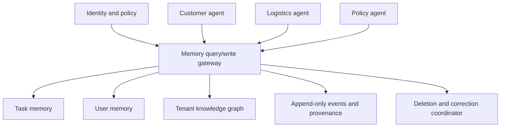
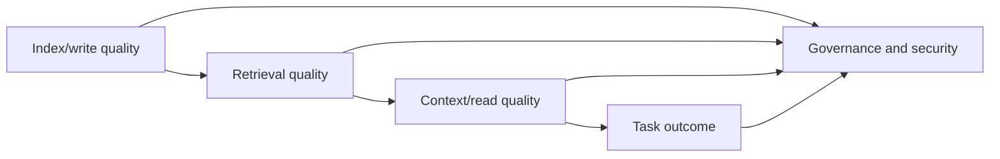

# Production memory: governance, evaluation and operations

> _Last reviewed: 2026-07-16 — see the [freshness policy](../appendix/maintenance.md)._

## Learning objectives

After this chapter you will be able to:

- design private, user, task, team, and organizational memory scopes;
- enforce consent, purpose, retention, correction, deletion, and provenance requirements;
- evaluate memory and GraphRAG as pipelines and as end-to-end systems;
- detect leakage, poisoning, staleness, contradictions, and retrieval regressions;
- build an operating and cost model for production memory.

## Decision in one sentence

> **Release persistent memory only when its owner, authority, lifecycle, isolation, measurable benefit, and safe failure behavior are all explicit.**

## Shared memory changes the trust model

A single agent with task-local notes has a small blast radius. A memory service shared across users, agents, and workflows becomes enterprise data infrastructure. It can improve continuity and coordination, but one incorrect write can influence many future decisions.

Treat memory scope as part of identity:

```text
organization / tenant / user / application / agent / task / memory-class
```

The server derives permitted scopes from authenticated identity and policy. The model may request “relevant customer preferences,” but it must not construct an arbitrary tenant or user key.

## A scope and ownership model

| Scope | Example | Who may write | Who may read | Default lifetime |
| --- | --- | --- | --- | --- |
| Inference | Retrieved evidence for one call | Context builder | Current model call | Seconds |
| Task | Plan, checkpoints, pending approval | Workflow controller | Authorized task participants | Task plus audit window |
| Agent-private | A worker's exploration notes | That agent's controlled runtime | Same agent or supervisor | Short and bounded |
| User | Confirmed preference | Validated memory service | Agents acting for that user | Purpose-based |
| Team | Approved procedure or project decision | Authorized contributor or promotion flow | Team agents and members | Versioned review cycle |
| Tenant | Domain terminology and governed knowledge | Curated ingestion pipeline | Tenant-authorized applications | Source-policy based |
| Global | Public non-sensitive reference data | Platform curator | All permitted tenants | Explicit global policy |

Promotion between scopes is a controlled operation. An agent's private note does not become company procedure merely because it produced one successful outcome.

## Multi-agent memory patterns

### Blackboard

Agents read and write a shared task board containing goals, claims, artifacts, and status. This is useful for collaboration, but needs typed records, ownership, version checks, and conflict resolution.

### Coordinator-owned state

Workers return outputs to a coordinator, which alone commits shared state. This reduces write conflicts and simplifies authority at the cost of a bottleneck.

### Event-sourced collaboration

Agents append immutable events; reducers build current views. This supports replay and audit but requires idempotency, ordering, and schema evolution.

### Federated memory

Each agent owns its memory and exposes a narrow query or delegation interface. This preserves organizational and security boundaries but increases discovery and cross-agent latency.

Select the pattern based on authority and consistency—not on analogy with human teams.



## Governance requirements

### Purpose and minimization

For every memory class, state why it exists and prohibit unrelated reuse. “Could be useful later” is not a purpose. Collect the smallest representation that achieves the defined benefit.

### Consent and user control

Where appropriate, let users see that memory is active, inspect stored items, correct them, disable future capture, and delete existing items. A conversational “forget that” request must invoke an auditable deletion workflow rather than relying on the model to ignore a fact.

### Retention and derived-data deletion

Retention can be time-based, event-based, or source-based. Deletion must cover:

- primary records and event projections where legally allowed;
- embeddings and vector indexes;
- graph nodes, edges, aliases, and community summaries;
- caches, replicas, exports, and queued jobs;
- training or evaluation datasets where applicable;
- derived memories whose only support was the deleted source.

Some audit events may need to retain evidence that deletion occurred without retaining deleted content. Resolve this with privacy, security, and legal stakeholders.

### Provenance and authority

Every durable memory should record its source, extraction method, author or subject where appropriate, timestamps, confidence, policy version, and revision history. In a conflict, source authority and temporal validity should be available to both deterministic policy and the answer layer.

Google's current [Agent Platform documentation](https://docs.cloud.google.com/gemini-enterprise-agent-platform/scale#memory-bank) separates session state from persistent memory and exposes memory generation, event ingestion, profiles, revisions, and access controls. Use it as a product example; keep the design portable through your own memory contract and export/deletion requirements.

## Threat model for agent memory and GraphRAG

| Threat | Attack or failure | Required control |
| --- | --- | --- |
| Scope confusion | Model retrieves another user's memories | Server-derived scope, deny by default, isolation tests |
| Memory poisoning | Untrusted text becomes durable instruction or fact | Source trust labels, staged writes, validation |
| Prompt persistence | Injection is summarized into procedural memory | Separate data from instructions; prohibit policy writes from content |
| Entity collision | Attacker creates a similar identity | Stable IDs, conservative resolution, review |
| Sensitive inference | System stores an inferred attribute | Prohibited classes and sensitivity classifier |
| Stale authority | Old procedure outranks current policy | Version and effective-time filtering |
| Deletion failure | Removed fact remains in summary or cache | Deletion lineage and end-to-end verification |
| Feedback corruption | Agent stores its own answer as external truth | Provenance classes and circularity detection |

Memory writes deserve the same scrutiny as tool actions because they change future behavior.

## Evaluation model

Memory evaluation has at least four layers:



| Step | Diagram layer | Detailed description |
| ---: | --- | --- |
| 1 | Index/write quality | Measure whether useful memories were extracted, correctly scoped, deduplicated, linked to provenance, indexed promptly, and deleted or corrected when required. |
| 2 | Retrieval quality | Evaluate authorized recall, precision, ranking, temporal filters, source diversity, latency, and cross-scope leakage for the target query distribution. |
| 3 | Context/read quality | Check that selected memories are compact, current, correctly attributed, conflict-aware, and interpreted as evidence rather than higher-priority instruction. |
| 4 | Task outcome | Measure verified task success, correction burden, harmful reliance, user control, escalation, latency, and cost with and without memory. |
| 5 | Governance and security | Apply privacy, authorization, retention, poisoning, audit, and deletion tests across every preceding layer instead of treating governance as a final-stage review. |

### Write and index metrics

- extraction precision and recall by memory class;
- duplicate and false-merge rates;
- contradiction detection and resolution accuracy;
- provenance completeness;
- time-to-index and deletion propagation time;
- graph entity, edge, and community quality.

### Retrieval metrics

- Recall@k and precision@k;
- mean reciprocal rank or nDCG when ranking matters;
- temporal-filter correctness;
- source and viewpoint diversity;
- cross-scope leakage rate, whose release threshold should be zero;
- retrieval latency and cost.

### Reading and answer metrics

- grounded answer correctness;
- citation or provenance accuracy;
- update handling and appropriate abstention;
- multi-session, temporal, and multi-hop reasoning;
- sensitivity to distractors and contradictory memories.

### End-to-end metrics

- successful tasks per user goal;
- harmful or policy-violating action rate;
- correction burden and user trust signals;
- p50 and p95 latency;
- cost per successful task, not merely per query;
- benefit relative to a no-memory or vector-only baseline.

## Scientific benchmarks—and their limits

[LongMemEval](https://proceedings.iclr.cc/paper_files/paper/2025/hash/d813d324dbf0598bbdc9c8e79740ed01-Abstract-Conference.html), published at ICLR 2025, evaluates information extraction, multi-session reasoning, temporal reasoning, knowledge updates, and abstention. It reported a 30% accuracy drop for commercial assistants and long-context models across sustained interaction, motivating explicit indexing, retrieval, and reading evaluation.

[LoCoMo](https://aclanthology.org/2024.acl-long.747/), published at ACL 2024, evaluates question answering, event summarization, and multimodal dialogue generation over conversations averaging 600 turns and up to 32 sessions. Its authors found continuing challenges with long-range temporal and causal dynamics.

Use these to compare techniques, not to declare production readiness. Add organization-specific datasets containing real terminology, retention rules, identity boundaries, temporal corrections, and adversarial content. Calibrate any model judge against human labels and deterministic checks.

## Evaluation dataset design

A production suite should contain:

- **must remember:** confirmed durable facts needed later;
- **must not remember:** secrets, transient data, and prohibited inferences;
- **must update:** facts that change across sessions;
- **must forget:** expired, revoked, and deleted memories;
- **must isolate:** near-identical users in different scopes;
- **must abstain:** unsupported or irreconcilably conflicting questions;
- **must traverse:** relationship and multi-hop graph questions;
- **must summarize:** corpus-wide questions with minority exceptions;
- **must resist:** prompt injections and poisoned documents;
- **must degrade:** unavailable graph, vector, or memory services.

Run repeated trials where model behavior is stochastic. Report confidence intervals for critical metrics and separately report retrieval failures from generation failures.

## Observability without uncontrolled surveillance

Trace decisions, identifiers, and policy outcomes while minimizing raw sensitive content.

One memory trace should answer:

```text
Which task and authenticated principal made the request?
Which policy produced the allowed scope?
Which query and temporal filters ran?
Which candidate IDs were considered and rejected?
Which memories entered context, in what order, and why?
Which source revisions supported them?
What did the model do with them?
Was a new memory proposed, validated, committed, or rejected?
What latency, tokens, and cost did each stage consume?
```

Use redaction, field-level controls, restricted diagnostic access, and retention limits. Observability data must not become a shadow memory store.

## Freshness and incremental operation

Define service-level objectives for:

- source event to searchable memory;
- source correction to superseded old claim;
- deletion request to removal from every serving index;
- graph change to invalidated community summaries;
- recovery point and recovery time objectives;
- maximum acceptable stale-answer rate.

Prefer incremental extraction and targeted summary invalidation over full reindexing. Version extractors, ontologies, embedding models, prompts, and summarizers so that changes can be compared and rolled back.

## Economics

Graph and memory cost occurs during writes, reads, and governance:

```text
monthly cost =
    ingestion and extraction
  + embedding and graph construction
  + consolidation and summarization
  + storage and replication
  + retrieval and generation
  + evaluation and observability
  + deletion, correction, and reprocessing
  + human review and incident response
```

Track:

- cost per ingested document, event, and accepted memory;
- cost per local, global, and exploratory query;
- cache and summary hit rates;
- reindexing cost after schema or model changes;
- cost per successful task;
- marginal quality gain over the simplest baseline.

Global GraphRAG searches and repeated agentic retrieval can be valuable but expensive. Route them only to questions whose expected value warrants the budget.

## Rollout strategy

1. **Read-only shadow:** generate and retrieve candidate memories without exposing them to the model.
2. **Context shadow:** assemble context and compare predicted answers offline.
3. **User-visible, no actions:** use memory for low-risk personalization with inspection and correction.
4. **Bounded workflow use:** permit memory to inform decisions while authoritative checks remain mandatory.
5. **Broader use:** expand scopes only after leakage, correction, freshness, and outcome gates pass.

Maintain a kill switch that disables memory reads and falls back to task state plus authoritative retrieval.

## Practical artifact: production memory review pack

Include:

- scope and access matrix;
- memory-class contracts;
- data-flow and trust-boundary diagram;
- retention, correction, and deletion lineage;
- poisoning and isolation threat model;
- benchmark and production metric tree;
- cost model and capacity assumptions;
- staged rollout, fallback, and incident runbook;
- portability and exit plan for memories, graph data, and provenance.

## Lab: production readiness review

Review the Northstar memory and GraphRAG design as an architecture board.

Deliver:

1. a scope matrix for customer, logistics, policy, and supervisor agents;
2. five memory contracts, including one prohibited memory class;
3. a 40-case evaluation dataset spanning the ten categories above;
4. leakage, poisoning, temporal-correction, and deletion tests;
5. a monthly cost model at three traffic levels;
6. a rollout decision with explicit release and rollback gates.

Do not approve release if cross-tenant leakage occurs, deletion is unverifiable, provenance is missing for consequential facts, or the design fails to outperform a simpler baseline on its target outcomes.

## Check yourself

1. Why is promotion from private agent memory to team memory an authorization event?
2. Which derived artifacts must change when a source fact is deleted?
3. Why can good Recall@k coexist with poor task outcomes?
4. How would you detect that a community summary is stale?
5. What evidence justifies paying for global GraphRAG search?

## Further reading

- Wu et al., [*LongMemEval*](https://proceedings.iclr.cc/paper_files/paper/2025/hash/d813d324dbf0598bbdc9c8e79740ed01-Abstract-Conference.html), ICLR 2025.
- Maharana et al., [*Evaluating Very Long-Term Conversational Memory of LLM Agents*](https://aclanthology.org/2024.acl-long.747/), ACL 2024.
- Microsoft, [GraphRAG documentation](https://github.com/microsoft/graphrag).
- Anthropic, [*Effective context engineering for AI agents*](https://www.anthropic.com/engineering/effective-context-engineering-for-ai-agents).
- Google Cloud, [Agent Platform documentation](https://docs.cloud.google.com/gemini-enterprise-agent-platform/scale).
