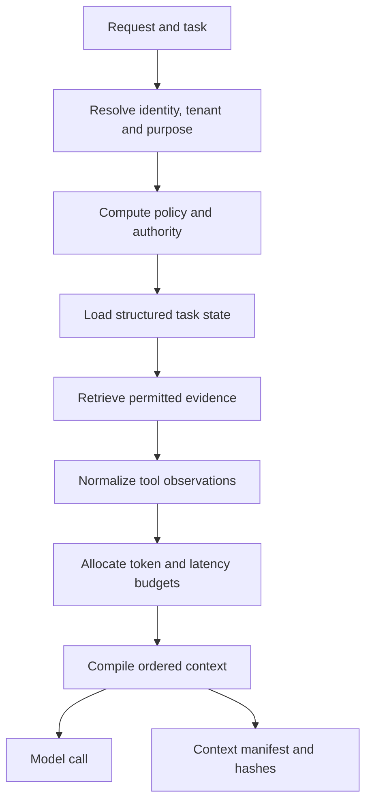

# Production context engineering

> _Last reviewed: 2026-07-25 — see the [freshness policy](../appendix/maintenance.md). Model context limits, cache semantics and pricing change; verify them per provider and model._

## Learning objectives

After this chapter you will be able to:

- design context as a bounded, policy-scoped data product;
- separate stable prefix, task state, evidence, tool results and generated history;
- choose truncation, retrieval, compaction, summarization or isolation;
- reason about prompt/KV-cache reuse without weakening security;
- evaluate context contribution, provenance and degradation.

## Decision in one sentence

**Give each model call the minimum authorized, attributable and task-relevant context needed for the next decision—not the maximum text the model can accept.**

## Context is architecture, not prompt decoration

Context has competing goals: quality, freshness, privacy, latency, cache reuse and cost. Treat it as a compiled artifact with inputs, policy, budget and provenance.

| Context class | Examples | Control |
|---|---|---|
| Stable instructions | role, process, output schema | versioned immutable prefix |
| Identity and policy | tenant, actor, purpose, allowed actions | server-established, never summarized away |
| Task state | goal, plan, completed steps, deadlines | structured durable state |
| Retrieved evidence | policies, records, graph facts | ACL-filtered citations and freshness |
| Tool observations | receipts, errors, large payloads | typed normalization and artifact references |
| Conversation | user and assistant messages | relevance, consent and retention |
| Working notes | hypotheses, pending questions | ephemeral and non-authoritative |

## Context compiler



| Step | Description |
|---:|---|
| 1 | Bind the request to a task and authenticated principal. |
| 2 | Compute access and action policy before retrieval. |
| 3 | Load durable facts separately from conversational prose. |
| 4 | Retrieve only evidence permitted for this actor and purpose. |
| 5 | Convert untrusted tool text into typed, bounded observations. |
| 6 | Reserve budgets for instructions, evidence, state and output. |
| 7 | Order stable content before volatile content where provider caching permits. |
| 8 | Record exactly what the model could see for audit and replay. |

## Budget and degradation policy

Allocate explicit budgets rather than truncating the end of a concatenated prompt. Protect non-negotiable identity, policy and output contracts. Rank evidence by task relevance, authority and freshness. When over budget:

1. drop redundant presentation and duplicate evidence;
2. replace large payloads with typed fields and artifact references;
3. retrieve narrower passages;
4. compact older interaction into a source-linked state summary;
5. isolate a subtask in a fresh context;
6. ask the user to narrow the task or defer work.

Never summarize away approvals, denials, deadlines, unresolved side effects or source identity.

## Cache-aware design

Prefix/KV caching can lower latency and cost when earlier tokens are identical. Keep stable, broadly reusable instructions ahead of request-specific material, but do not share cached material across incompatible tenant, policy or confidentiality boundaries. A cache key needs model, tokenizer/chat template, prefix hash, policy scope and relevant provider controls.

Caching is an optimization, not a reason to place secrets in a stable prefix. Measure hit rate, time-to-first-token and cost alongside leakage tests and invalidation correctness.

## Compaction contract

```yaml
source_range: events-0001..0087
summary_version: context-compact-v3
preserve:
  - verified_facts
  - user_constraints
  - approvals_and_denials
  - pending_effects
  - unresolved_questions
exclude:
  - secrets
  - unsupported_hypotheses
  - duplicated_tool_payloads
source_refs: [carrier-receipt-72, policy-2026-07]
expiry: 2026-08-01T00:00:00Z
```

Evaluate compaction by asking whether downstream tasks preserve decisions and constraints, not by semantic similarity to the old transcript. Keep the raw source under its retention policy when audit requires it; otherwise delete it rather than treating summaries as anonymous.

## Context observability and evaluation

Record context manifest ID, source IDs, token allocation, dropped items, compaction versions, cache outcome and policy decision. Evaluate:

- task success with and without each context class;
- retrieval/support and contradiction;
- stale, cross-tenant or unauthorized inclusion;
- instruction conflict and position sensitivity;
- performance across context length;
- compaction retention and hallucinated summary facts;
- cost and latency per successful task.

## Northstar decision

Northstar’s shipment agent receives a stable process prefix, authenticated tenant/customer tuple, structured case state, two current policy passages and normalized carrier fields. The raw carrier response becomes a restricted artifact. After twenty turns, the system compacts resolved observations but retains an outstanding approval and unknown refund outcome verbatim in task state.

## Practical artifact: context contract

Produce a context-class inventory, authority/provenance rules, budget table, ordering, cache scope, compaction schema, isolation policy, observability fields, deletion behavior and evaluation suite.

## Lab

Compile the same Northstar task under 8k, 32k and 128k token budgets. Inject a stale policy, cross-tenant passage and malicious tool result. Demonstrate safe degradation and measure the marginal value of each context component.

## Further reading

- [12-Factor Agents: own your context window](https://github.com/humanlayer/12-factor-agents)
- [Caching, batching and asynchronous patterns](../04-llm-systems/03-efficiency-patterns.md)
- [Agentic memory systems](04-context-memory.md)
- [Prompt injection and tool abuse](../07-security-governance/01-prompt-injection.md)

