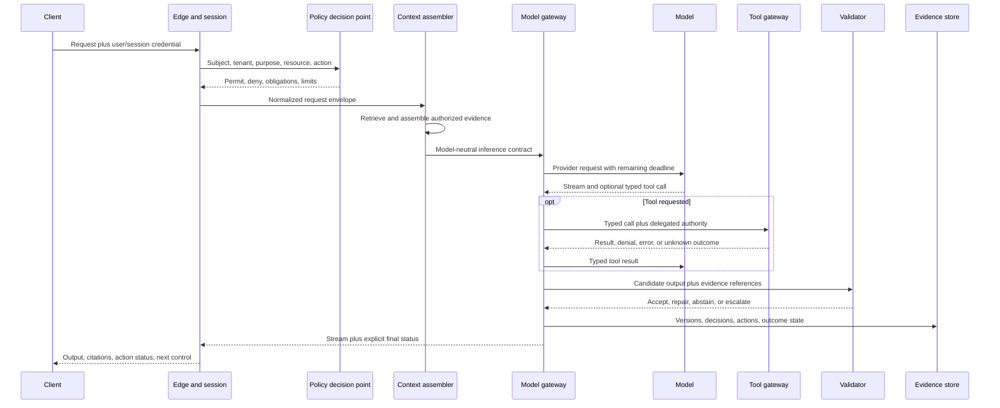

# The inference request path

> _Last reviewed: 2026-07-16 — see the [freshness policy](../appendix/maintenance.md). Product mappings and protocol maturity change; verify them during implementation._

## Learning objectives

After this chapter you will be able to:

- decompose an inference request into independently governed stages;
- propagate identity, policy, deadlines, cancellation and evidence end to end;
- distinguish streamed text from a committed task or business outcome;
- design stage contracts, failure behavior and observability;
- review a request path without depending on one model provider.

## Decision in one sentence

> **Treat inference as a distributed transaction with probabilistic stages—not as one HTTP call to a model.**

A user can receive fluent output even when retrieval crossed a tenant boundary, a tool timed out after committing, a browser disconnected while audio kept playing or the final validation never ran. The architecture must describe the complete path and its authoritative state.

## 1. Reference request path



The stages may run in one process or several services. The important property is that their contracts remain explicit and testable.

## 2. The request envelope

Create one server-owned envelope before retrieval or inference. It should not contain raw credentials or unrestricted user-authored authority.

```ts
interface InferenceEnvelope {
  requestId: string;
  traceId: string;
  sessionId?: string;
  subject: {
    id: string;
    tenantId: string;
    assurance: "anonymous" | "session" | "step-up";
  };
  purpose: string;
  taskClass: string;
  policyVersion: string;
  deadlineAt: string;
  cancellationId: string;
  dataClasses: string[];
  allowedCapabilities: string[];
  routeConstraints: {
    regions: string[];
    providers?: string[];
    maxCostUsd: number;
  };
}
```

The envelope is not a prompt. It is control-plane state used by code, policy and telemetry. Prompt construction receives only the subset required for the model task.

## 3. Stage contracts

| Stage | Must receive | Must produce | Must not decide alone |
| --- | --- | --- | --- |
| Edge and session | transport credential, request, channel state | authenticated subject, tenant, request ID, deadline | business authorization from caller claims |
| Policy | subject, resource, purpose, action, context | permit/deny plus obligations and limits | semantic task success |
| Context assembly | authorized scope, task, budget | bounded evidence pack with provenance | expansion of tenant or resource scope |
| Model gateway | model-neutral task, evidence, route constraints | provider response, usage and route evidence | business-side-effect success |
| Tool gateway | typed call, delegated subject/agent identity | typed result, denial, receipt or unknown state | retries after uncertain commitment |
| Validation | candidate output, evidence, task invariants | accept, bounded repair, abstain or escalate | overriding mandatory policy denial |
| Response | accepted stream/status and evidence | user-visible result and final task state | claiming completion from generated text |

Version schemas and failure semantics. A provider adapter that returns an empty string for a timeout has destroyed information the next stage needs.

## 4. Identity and policy come before context

Authenticate at the edge, but authorize at the resource/action boundary. A signed user session does not automatically permit every document, memory, tool or output channel.

The policy decision should include:

- subject, tenant, delegated agent and service identity;
- requested resource, action and business purpose;
- data sensitivity, region and retention class;
- permitted tools, spend, duration and approval obligations;
- policy version and a decision ID for evidence.

Never ask the model to derive ACL filters from a user prompt. Context services and tool gateways must receive server-established scope.

## 5. Context assembly is a bounded data operation

Context may include system instructions, authenticated user/task state, retrieved sources, memory, conversation history and tool results. Give each item a type, origin, trust, effective time, access scope and token budget.

Assemble the smallest sufficient evidence:

1. normalize the task without losing the original request;
2. derive retrieval filters from authenticated state;
3. retrieve and rerank under latency and candidate limits;
4. exclude expired, conflicting or unauthorized evidence;
5. reserve tokens for instructions, tool schemas and output;
6. label retrieved content as data, not instruction;
7. preserve citation coordinates and retrieval/index versions.

Context overflow is a planning failure, not a reason to truncate the highest-authority instruction or the evidence that changes the decision.

## 6. Propagate one absolute deadline

Each stage receives `deadlineAt`, computes remaining time and refuses work that cannot complete usefully. Independent timeouts without a shared deadline create retry storms and zombie work.

```text
remaining = deadline_at - monotonic_now
stage_budget = min(configured_stage_cap, remaining - reserve_for_response)
```

Reserve time for validation and a usable fallback. A model call that consumes the whole deadline can prevent the system from stating that it failed.

Cancellation is also end to end:

- stop local playback or rendering first when the client controls a buffer;
- propagate cancellation to retrieval, model streams, tools and workers;
- distinguish cancellable computation from an external action already submitted;
- reconcile uncertain actions instead of retrying blindly;
- record which partial output the user actually received.

## 7. Stream with two states

Streaming improves response onset but introduces two different truths:

1. **delivery state:** bytes, tokens or audio already displayed or played;
2. **task state:** proposed, running, validated, committed, failed, cancelled or unknown.

Do not render a success badge because a stream ended normally. Emit a final typed event only after validation and, for actions, authoritative verification.

```json
{
  "type": "task.final",
  "requestId": "req_7F42",
  "status": "verified",
  "outcomeRef": "refund_18492",
  "evidenceRefs": ["trace_91", "policy_12"]
}
```

## 8. Tools create transaction boundaries

Model tool calls are proposals. The tool gateway owns schema validation, authorization, rate limits, secrets, idempotency and result classification.

Use at least these outcome classes:

| Outcome | Meaning | Retry behavior |
| --- | --- | --- |
| Rejected | schema or policy denied before effect | correct request or stop |
| Not started | dependency failed before submission | retry only inside remaining budget |
| Submitted | accepted but final state not yet known | poll/reconcile by durable ID |
| Verified success | system of record confirms intended effect | never repeat with a new identity |
| Verified failure | authoritative system confirms no intended effect | retry only if policy and idempotency allow |
| Unknown | response lost or conflicting evidence | reconcile; do not announce or blindly retry |

## 9. Validate by consequence

Not every request needs the same validator. Compose deterministic and probabilistic checks from the failure consequence:

- JSON/schema and required-field validation;
- citation existence and claim-to-source support;
- tenant, privacy and prohibited-disclosure rules;
- numerical, identifier and business-rule checks;
- tool/action receipt verification;
- calibrated model or human review for semantic quality;
- abstention or escalation when evidence is inadequate.

Bound repair attempts. A validator-model loop is another agent loop and needs a deadline, cost limit and stop condition.

## 10. Evidence and observability

Trace the path as one task with child spans for policy, retrieval, model calls, tools, validation and delivery. Current [OpenTelemetry GenAI semantic conventions](https://opentelemetry.io/docs/specs/semconv/registry/attributes/gen-ai/) provide shared model, operation, token, message, retrieval and tool attributes; pin the convention version and minimize recorded content.

Record:

- request/task/session IDs and stage attempts;
- subject/tenant pseudonymous references and policy decision ID;
- model, prompt, adapter, retrieval, tool and validator versions;
- stage start/end, remaining deadline, cancellation and fallback;
- usage/cost, candidate/action state and authoritative outcome;
- content only when purpose, consent, access and retention permit it.

## 11. Failure containment

| Failure | Containment and fallback |
| --- | --- |
| identity or policy unavailable | deny consequential access; allow only an explicitly public path |
| retrieval stale or unauthorized | block use; return safe non-personalized result or abstain |
| model overloaded | admission control, compatible smaller route or deterministic workflow |
| stream disconnect | cancel computation where safe; retain task ID for reconnect/status |
| tool response lost | reconcile by transaction/idempotency ID |
| validation fails | repair once, stronger route, human review or abstain |
| evidence store unavailable | do not perform actions that require durable audit evidence |

## Northstar worked example

A customer asks whether a delayed order qualifies for a refund.

1. The edge authenticates the app session and creates a five-second request deadline.
2. Policy permits order reads but requires step-up confirmation for a refund action.
3. Context retrieves the current order, shipping event and effective refund policy under the customer's tenant and order scope.
4. The gateway chooses a fast model for explanation; the model proposes `refund.quote` but cannot execute it.
5. The typed tool calculates the permitted amount from authoritative data.
6. Validation checks order ID, amount, policy citation and that no refund has already committed.
7. The response explains eligibility and presents an authenticated approval control.
8. A later action request uses a new envelope, idempotency key and verified transaction result.

The explanatory inference and the consequential refund are separate tasks with different authority and evidence.

## Practical artifact: request-path contract

Submit:

1. end-to-end sequence and trust boundaries;
2. request envelope schema;
3. per-stage input/output/failure contract;
4. deadline, retry and cancellation budget;
5. identity, policy and data-scope propagation;
6. tool outcome and reconciliation model;
7. validation and fallback matrix;
8. trace/evidence schema and content-retention decision.

## Lab

Build a mock Northstar request path with policy, retrieval, two model routes, a refund-quote tool and validator. Inject policy timeout, stale index, model 429/503, slow stream, malformed tool call, disconnect and lost tool response. Demonstrate deadline propagation, cancellation, compatible fallback, action reconciliation and an explicit final status.

## Check yourself

1. Which request fields are control-plane state and must never be trusted from the prompt?
2. Why must every stage receive the same absolute deadline?
3. What is the difference between streamed delivery and committed task state?
4. When can a tool call be retried, and when must it be reconciled?
5. Which evidence is necessary to reconstruct an incorrect answer without retaining raw prompts?

## Further reading

- [OAuth 2.0 Security Best Current Practice, RFC 9700](https://www.rfc-editor.org/rfc/rfc9700.html).
- [OAuth 2.0 Token Exchange, RFC 8693](https://www.rfc-editor.org/rfc/rfc8693.html).
- [OpenTelemetry GenAI semantic-convention registry](https://opentelemetry.io/docs/specs/semconv/registry/attributes/gen-ai/).
- [Production LLM reliability, latency and capacity](02-reliability-latency.md).
- [Agent identity, tools and delegated authorization](../05-agents/01-tools-authorization.md).
