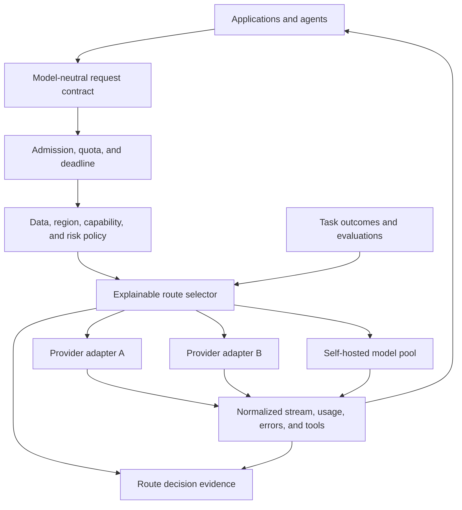

# Model gateways, routing and fallbacks

> _Last reviewed: 2026-07-16 — see the [freshness policy](../appendix/maintenance.md). Provider features, models and protocol extensions are dated; verify them before implementation._

## Learning objectives

After this chapter you will be able to:

- decide which responsibilities belong in a model gateway;
- design explainable policy-first routing and admission control;
- determine whether two routes are safe fallbacks for one another;
- roll out models and adapters without hiding regressions;
- avoid turning the gateway into an opaque organizational bottleneck.

## Decision in one sentence

> **Centralize cross-cutting model access and evidence, but keep task policy, business authorization and outcome truth outside the gateway.**

A gateway is useful when several applications need consistent credentials, quotas, adapters, telemetry and routing. It becomes dangerous when a generic proxy silently rewrites prompts, retries consequential operations, chooses models without task evidence or becomes the only place anyone can understand behavior.

## 1. Reference architecture



The gateway chooses only among routes already eligible for the task. The application or policy service determines what the task may disclose or do.

## 2. Responsibility boundary

| Gateway owns | Application/domain owns | Shared contract |
| --- | --- | --- |
| provider credentials and network endpoints | user experience and task state | request/task/trace identity |
| provider adapters and normalized errors | business authorization | subject/tenant/purpose constraints |
| model inventory and health | tool semantics and side effects | tool schema and outcome classes |
| quotas, admission and concurrency | task-specific validation | deadline and cancellation |
| eligible-route filtering | human approval policy | region/data-class obligations |
| routing, canary and fallback execution | authoritative business outcome | model/prompt/adapter evidence |
| usage/cost and route telemetry | final user-visible completion claim | normalized stream/final events |

Do not centralize prompts merely for convenience. Prompt ownership follows the task team; the gateway may resolve a versioned prompt reference or apply mandatory safety framing, but every transformation must be visible in trace evidence.

## 3. A model-neutral contract

Normalize durable concepts, not every provider feature. Expose extension fields deliberately rather than reducing all providers to the least capable one.

```ts
interface GatewayRequest {
  requestId: string;
  taskClass: string;
  deadlineAt: string;
  input: Array<{
    role: "system" | "user" | "assistant" | "tool";
    parts: Array<TextPart | ImagePart | AudioPart | ToolResultPart>;
  }>;
  tools?: ToolDefinition[];
  responseSchema?: object;
  route: {
    requiredCapabilities: string[];
    allowedRegions: string[];
    allowedProviders?: string[];
    maxInputTokens: number;
    maxOutputTokens: number;
    maxCostUsd: number;
    qualityTier: "economy" | "standard" | "highest";
  };
}
```

The response contract should normalize:

- content deltas and modality;
- tool-call proposals and stable call IDs;
- input, output, cached and reasoning usage where reported;
- finish reason, safety/policy result and provider request ID;
- retriable, terminal, cancelled and unknown errors;
- gateway route decision and fallback attempt lineage;
- explicit final status distinct from the last content delta.

## 4. Routing is a constrained decision

Apply routing in this order:

1. **Eligibility:** policy, region, data class, provider contract, modality and required capability.
2. **Feasibility:** context length, tool/schema support, remaining deadline, route health and available capacity.
3. **Quality:** task- and slice-specific evaluation evidence, not a global model leaderboard.
4. **Economics:** expected cost per successful task, including retries, validation and human escalation.
5. **Preference:** latency, provider diversity, carbon/energy policy where material and organizational strategy.

```yaml
route_policy: refund_explanation_v4
required:
  capabilities: [structured_output, tool_calling]
  regions: [ca, us]
  prohibited_data_classes: [raw_payment_card]
gates:
  verified_task_success_min: 0.94
  unauthorized_action_max: 0
  latency_ms_p95_max: 1800
selection:
  objective: lowest_expected_cost_per_success
  exploration_percent: 2
fallback:
  max_attempts: 1
  require_compatibility_profile: refund_explanation_v4
```

Log which candidates were excluded and why. An unexplained route decision is difficult to debug, govern or contest.

## 5. Route compatibility before fallback

Availability is not the only fallback property.

| Dimension | Compatibility question |
| --- | --- |
| task quality | Does the fallback clear the same minimum slices and harmful-failure ceiling? |
| context | Can it accept the assembled evidence and instruction hierarchy without destructive truncation? |
| tools | Are names, schemas, parallel-call semantics, errors and result ordering compatible? |
| structured output | Does it enforce or reliably produce the required schema? |
| modality | Are image/audio/video formats, limits and timing semantics equivalent enough? |
| safety/policy | Does the route satisfy the same data, region, logging and content obligations? |
| state | Can conversation, cache and provider-specific item state be reconstructed safely? |
| economics | Can the fallback operate within remaining cost and capacity budgets during an outage? |

If compatibility is incomplete, degrade the task: remove actions, switch to read-only search, ask the user to continue later or transfer to a human. Do not silently provide a lower-assurance answer under the same interface promise.

## 6. Admission control before provider throttling

Provider rate limits are not a capacity plan. The gateway should know workload classes, token/media distributions, active streams, tool fan-out and reserved capacity.

Admission decisions can:

- accept immediately under a per-class concurrency/token budget;
- queue within a deadline and queue-depth limit;
- route to an eligible capacity pool;
- degrade output length, reasoning budget or nonessential enrichment;
- defer asynchronous work with a durable task ID;
- reject with a retry-after or safe alternative.

Use weighted units rather than request count alone. A 100-token classification and a 100,000-token document task do not consume equivalent capacity.

## 7. Retries, hedging and fallback

Retry only transient operations that remain useful and safe inside the absolute deadline. Use jittered backoff and a shared attempt budget.

Hedged model calls can reduce tail latency but double cost and load when used indiscriminately. Restrict hedging to:

- read-only inference without external side effects;
- requests whose remaining deadline supports a delayed second attempt;
- different failure domains when resilience is the objective;
- cancellation of the losing stream;
- accounting that includes abandoned tokens and capacity.

Never hedge or automatically retry a tool action whose commitment state is unknown.

## 8. Semantic and cascade routing

Useful routing patterns include:

| Pattern | Use | Main risk |
| --- | --- | --- |
| rules/policy route | deterministic eligibility and compliance | policy drift or duplicated logic |
| task classifier | select specialist by intent/modality | misrouting and new attack surface |
| small-then-large cascade | let economical route answer easy cases | unreliable confidence or repair amplification |
| verifier escalation | upgrade when evidence/validation fails | correlated evaluator errors |
| ensemble | improve selected high-value decisions | latency, cost and disagreement handling |
| user-selected tier | expose cost/quality trade-off | confusing or unfair experience |

Do not use self-reported model confidence as the sole escalation signal. Calibrate on task outcomes, validation failures and slices.

## 9. Caches are policy-scoped

The gateway may implement exact-response, prompt-prefix or provider cache controls, but the cache key must include every property that can change correctness or authorization:

- tenant and subject scope where personalized;
- prompt, model, adapter, tool and policy versions;
- retrieval/index or source revision;
- locale, modality and response schema;
- safety and region route;
- expiry and deletion lineage.

Do not cache consequential tool execution. Cache read-only evidence or inference only when reuse cannot cross an authority boundary.

## 10. Security and privacy

- Authenticate applications and use workload identity rather than shared gateway keys.
- Keep provider secrets in the gateway/adapter boundary and rotate them independently.
- Enforce region and data-use policy before route selection.
- Prevent user/model content from setting provider, endpoint, credentials or log level.
- Validate outbound destinations and private endpoints to prevent SSRF.
- Treat provider errors and tool results as untrusted data before returning them to a model.
- Minimize prompt/response logging; use hashes, classifications and sampled protected traces.
- Rate-limit by subject, tenant, application, task and economic budget.

## 11. Rollout and evidence

Promote routes through offline evaluation, shadow, canary and bounded expansion. A shadow request must not duplicate a real tool action; remove tools or substitute a simulator.

Track by route and slice:

- verified task success and harmful failures;
- validation/repair and escalation rate;
- p50/p95/p99 response onset and completion;
- throttling, queue time, cancellations and fallback success;
- input/output/cache/tool usage and cost per success;
- provider/model/prompt/adapter versions;
- drift in input length, language, modality and task mix.

## 12. Gateway implementation choices

A gateway can be an application library, dedicated service, service-mesh extension, managed product or Kubernetes data-plane/control-plane combination. Choose from ownership, latency, scale, failure containment and portability—not feature count.

The current [Kubernetes Gateway API Inference Extension](https://gateway-api-inference-extension.sigs.k8s.io/) defines inference-aware routing concepts for self-hosted model serving, including model endpoints and scheduling signals. Treat its lifecycle and supported implementations as dated. It does not replace application authorization, evaluation or tool governance.

## Northstar worked decision

Northstar has summarization, policy Q&A, refund explanation and offline document processing.

- deterministic code handles authorization and refund calculation;
- a small fast model handles bounded summarization after clearing slice gates;
- a stronger route handles conflicting policy evidence;
- offline jobs use a separate queue and capacity pool;
- restricted tenants allow only approved regional providers;
- fallback from explanation to search-only citations is permitted;
- refund actions are outside the model gateway and never retried by it.

The route decision record contains eligible candidates, exclusions, evaluation version, estimated cost, chosen adapter and fallback compatibility profile.

## Practical artifact: gateway and routing ADR

Submit:

1. gateway responsibility and non-responsibility map;
2. model-neutral request/response/error contract;
3. route eligibility and selection policy;
4. task-by-route evaluation matrix;
5. fallback compatibility profiles;
6. quota, admission, retry and cancellation budgets;
7. cache scope and invalidation rules;
8. rollout, observability and exit plan.

## Lab

Implement a mock gateway with two model adapters and one self-hosted route. Inject 429, 503, slow response, context overflow, unsupported tool schema and a regional-policy exclusion. Demonstrate explainable routing, admission control, one compatible fallback, safe degradation for an incompatible fallback and route-level cost/success reporting.

## Check yourself

1. Which responsibilities should never move into a generic model gateway?
2. Why can two healthy text models still be unsafe fallbacks for one another?
3. In what order should eligibility, feasibility, quality and economics be applied?
4. When does hedging reduce user latency but worsen system reliability?
5. Which fields must be part of a safe response-cache key?

## Further reading

- [Kubernetes Gateway API Inference Extension](https://gateway-api-inference-extension.sigs.k8s.io/).
- [OAuth 2.0 Security Best Current Practice, RFC 9700](https://www.rfc-editor.org/rfc/rfc9700.html).
- [OpenTelemetry GenAI semantic-convention registry](https://opentelemetry.io/docs/specs/semconv/registry/attributes/gen-ai/).
- [The inference request path](00-request-path.md).
- [Production LLM reliability, latency and capacity](02-reliability-latency.md).
