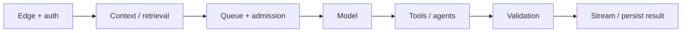

# Production LLM reliability, latency and capacity

> _Last reviewed: 2026-07-16 — see the [freshness policy](../appendix/maintenance.md)._

## Learning objectives

After this chapter you will be able to:

- define user-centered SLOs for probabilistic systems;
- allocate time, failure, token, and cost budgets across the request path;
- design retries, admission control, circuit breakers, fallbacks, and cancellation;
- plan capacity for tokens, concurrency, tools, and long-running agents;
- test graceful degradation and recover safely from partial effects.

## Decision in one sentence

> **Engineer the service around a bounded successful outcome—not around a model endpoint returning HTTP 200.**

An answer can be available but wrong, correct but too late, or retried after its side effect already committed. LLM reliability combines ordinary distributed-systems failure with probabilistic output, variable token demand, provider quotas, and multi-step tools.

## Define the service-level outcome

Use a small set of user-centered indicators:

| SLI | Example definition |
| --- | --- |
| Valid response | schema-valid, policy-allowed result or typed safe abstention |
| Task success | verified desired state within the task deadline |
| Grounded quality | critical claims supported above an evaluated threshold |
| Harmful failure | unsafe, unauthorized, or materially misleading outcome |
| TTFT | request accepted to first useful streamed token |
| Completion latency | request to usable answer or verified task result |
| Cost per success | total model, retrieval, tool, compute, review, and retry cost / successes |

The current [Google Cloud AI/ML reliability guidance](https://docs.cloud.google.com/architecture/framework/perspectives/ai-ml/reliability) likewise recommends business-aligned SLOs, end-to-end observability, fault isolation, fallbacks, and graceful degradation.

## Budget the entire path



| Step | Diagram stage | Detailed description |
| ---: | --- | --- |
| 1 | Edge + auth | Authenticate the caller, establish tenant and policy context, validate request shape, rate-limit abuse, and create the end-to-end deadline and trace. |
| 2 | Context / retrieval | Assemble only authorized, fresh, task-relevant context within token, latency, and cost budgets; retain evidence identity for later verification. |
| 3 | Queue + admission | Admit, defer, shed, or route work from current capacity, priority, remaining deadline, and graceful-degradation policy. |
| 4 | Model | Invoke the selected model with bounded output, cancellation, versioned configuration, and a failure policy that distinguishes transient service errors from bad results. |
| 5 | Tools / agents | Execute typed reads or actions with least authority, timeouts, idempotency, concurrency limits, and reconciliation for unknown outcomes. |
| 6 | Validation | Enforce schema, citation, safety, policy, and task-specific invariants before a result or action claim becomes externally visible. |
| 7 | Stream / persist result | Stream useful output only while monitoring disconnect/cancellation, then persist an explicit final status and outcome evidence distinct from partial text. |

For each stage assign deadline, retry budget, concurrency limit, failure policy, telemetry, and fallback. Propagate one absolute deadline so a downstream retry cannot outlive the user's request or task lease.

Track time to first useful token separately from completion. Streaming improves perceived latency but creates obligations: cancellation, moderation of partial output, disconnect handling, and a final committed status distinct from text already displayed.

## Failure classes and responses

| Failure | Retry? | Preferred response |
| --- | --- | --- |
| Invalid input/schema | No | correct or reject deterministically |
| Authentication/authorization denial | No | typed denial; never route around policy |
| Throttling/temporary unavailable | Bounded | jittered backoff, capacity/fallback decision |
| Timeout before any effect | Sometimes | retry inside remaining deadline |
| Unknown tool outcome | Not blindly | reconcile by idempotency/transaction ID |
| Context overflow | No blind retry | compact, retrieve less, or choose compatible route |
| Quality/safety validation failure | Bounded and distinct | repair once, stronger route, abstain/escalate |
| Provider or region outage | No same-path loop | circuit breaker and compatible fallback |

Retry only transient, idempotent operations. Use exponential backoff with jitter, a small attempt cap, and a shared retry budget. The current [AWS Bedrock scale and reliability guidance](https://aws.amazon.com/blogs/machine-learning/optimize-your-applications-for-scale-and-reliability-on-amazon-bedrock/) identifies throttling and temporary unavailability as retriable but emphasizes quota and traffic management. Client retries must not amplify an outage.

## Admission control and capacity

Requests consume input tokens, output tokens, concurrent streams, accelerator time, retrieval capacity, tool calls, and human approvals. Requests with equal count can differ by orders of magnitude.

Forecast by workload class:

```text
token demand/min = arrivals/min × (mean input + expected output + retry overhead)
concurrency ≈ arrival rate/sec × mean service time/sec
```

Add burst, growth, failover, and evaluation traffic. Enforce per-tenant and per-workload quotas, maximum context/output, concurrency, tool fan-out, agent depth, wall-clock time, and spend. Use priority queues so offline summarization cannot starve interactive or safety-critical traffic. Reject early with a clear retry or degradation response.

Provisioned throughput can improve predictability for steady critical demand; on-demand capacity is useful for variable demand. Evaluate utilization and failover behavior rather than treating reserved capacity as automatically reliable.

## Circuit breakers and bulkheads

Open a circuit on sustained error, throttling, or latency thresholds; probe recovery with limited traffic. Isolate providers, tenants, workload classes, tools, and long-running agents into separate concurrency pools. A stuck browser agent must not consume all interactive inference slots.

Hedging can reduce tail latency by sending a duplicate after a delay, but it increases cost and load. Use it only for idempotent reads, cancel the loser, exclude overloaded periods, and prove a net SLO benefit.

## Model routing and fallback compatibility

A fallback must satisfy the same contract or visibly degrade. Test schema, tool calling, context length, safety policy, language, modality, grounding, and regional/data constraints. Do not silently route governed data to a provider or region that lacks approval.

Define levels such as:

1. primary model with full retrieval and verification;
2. compatible secondary model;
3. simpler model for low-risk classifications;
4. cached verified response with freshness label;
5. search-only or deterministic workflow;
6. typed abstention and human handoff.

The safest fallback is sometimes no generated answer.

## State and side effects

Give each request and task a stable ID. Persist step status, model/tool versions, approvals, transaction IDs, and final outcome. Make writes idempotent and reconcile unknown outcomes before retrying. Use sagas or compensating actions for multi-step workflows; compensation is a governed business operation, not an automatic inverse.

Cancellation must propagate to queued calls, streams, tools, delegated agents, credentials, and leases. Mark whether a cancellation occurred before, during, or after a committed effect.

## Quality reliability

Transport success is not semantic success. Run lightweight online checks for schema, citation resolution, policy, prohibited content, tool preconditions, and final-state confirmation. Route uncertainty or disagreement by consequence. Monitor task success and harmful failure on delayed labels, not only real-time proxies.

If five required stages each succeed independently 95% of the time, idealized end-to-end success is `0.95^5 ≈ 77%`. Measure complete tasks across repeated trials; local component dashboards can look green while the workflow fails.

## Observability and incident response

Trace request/task ID, tenant-safe workload class, route, model/version, prompt and policy versions, token counts, queue/model/tool latency, attempts, breaker state, fallbacks, validation, approvals, outcome, and cost. Avoid raw sensitive prompts by default.

Alert on user SLO burn, harmful outcomes, fallback rate, retry amplification, queue age, quota saturation, tool unknown outcomes, and cost per success. Incident runbooks need kill switches for routes/tools, safe degradation, replay/reconciliation, affected-task identification, and evaluation cases created from the incident.

## Test the failure modes

Load-test token distributions and long contexts, not just request count. Inject throttling, slow streams, malformed model output, retrieval outage, partial tool commit, expired approval, provider failure, client disconnect, and cancellation. Verify deadlines, breaker behavior, idempotency, compensation, audit evidence, and recovery.

## Northstar worked decision

Northstar assigns separate pools to interactive chat and shipment investigation. The request has an eight-second interactive deadline; longer investigations become resumable tasks. One bounded model repair is allowed for malformed output. Refund execution is never retried without reconciliation. When generation is unavailable, users receive policy search results and task status; the system does not improvise from model memory.

## Practical artifact: reliability envelope

Document SLIs/SLOs, dependency and latency budget, workload classes, capacity model, quota/admission rules, retry matrix, circuit-breaker thresholds, fallback compatibility tests, state/idempotency design, cancellation, degradation ladder, telemetry, incident runbooks, and chaos scenarios.

## Lab

Build a small inference gateway around a mock model and refund tool. Inject 429, 503, slow response, malformed JSON, disconnect, and “commit succeeded but response lost.” Demonstrate bounded jittered retries, admission control, circuit breaking, deadline propagation, idempotency reconciliation, and a safe non-model fallback. Report p50/p95/p99, success, retry amplification, and cost per success.

## Check yourself

1. Why is HTTP availability an insufficient AI SLI?
2. Which errors must never be blindly retried?
3. How do token distributions change capacity planning?
4. What makes a fallback compatible?
5. What must cancellation revoke or stop?

## Further reading

- [Google Cloud AI/ML reliability perspective](https://docs.cloud.google.com/architecture/framework/perspectives/ai-ml/reliability).
- [Model gateways, routing and fallbacks](01-gateways-routing.md).
- [Caching, batching and asynchronous patterns](03-efficiency-patterns.md).
- [Incident response and graceful degradation](../08-platform-operations/04-incidents-degradation.md).
