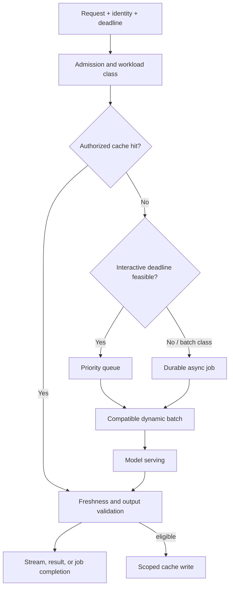

# Caching, batching & asynchronous patterns

> Last reviewed: 2026-07-16. See the [freshness policy](../appendix/maintenance.md).

## Learning objectives

After this chapter you will be able to:

- optimize latency and throughput without changing application semantics;
- distinguish response, retrieval, prefix, and KV-cache reuse;
- design batching and queues around deadlines and fairness;
- measure efficiency as qualified outcomes per constrained resource.

## First preserve semantics

Optimization changes when, where, or whether work executes. Every technique needs a correctness boundary: which inputs are equivalent, how long reuse is valid, which identity scope applies, whether order matters, and what happens after cancellation.

| Pattern | Primary benefit | Dominant correctness risk |
|---|---|---|
| Exact response cache | Avoid full request path | Serving stale or cross-user output |
| Semantic response cache | Reuse similar answers | False equivalence between intents |
| Retrieval cache | Avoid query/index work | Stale corpus or authorization scope |
| Prefix/prompt cache | Reuse shared prefill | Data leakage and cache invalidation |
| KV cache | Reuse attention state in a sequence | Memory exhaustion and tenant isolation |
| Dynamic batching | Increase accelerator utilization | Queue delay and head-of-line blocking |
| Asynchronous job | Smooth load and survive long work | Duplicate execution and unclear UX |
| Model cascade | Avoid expensive model calls | Quality loss on misrouted cases |

## Workload-aware execution path



## Establish a measurement baseline

Measure quality plus:

- admission delay, queue delay, time to first token, inter-token latency, and total latency;
- input/output tokens, active sequences, batch size, and tokens per second;
- KV-cache occupancy, eviction, prefix hit rate, and model-load time;
- requests and qualified tasks per accelerator-hour;
- deadline miss, cancellation, retry, and fallback rates;
- cost and energy per successful qualified task.

Segment by model, input/output length, priority, tenant, region, route, and cache status. Averages hide long-prompt starvation and noisy tenants.

## Response caching

Exact caching is safe only when the normalized request, model/prompt/policy/index versions, identity scope, locale, tool state, and freshness window are equivalent. A robust cache key resembles:

```text
H(tenant, subject_scope, normalized_input, model_tuple,
  prompt_version, policy_version, corpus_snapshot, tool_state_class)
```

Do not cache consequential action decisions, personalized sensitive responses, or outputs whose sources changed faster than invalidation. Cache the evidence envelope separately when reuse rules differ from generated prose.

Semantic caches add an equivalence decision. Set thresholds per intent class, apply authorization before lookup, and validate returned sources. “How do I close an account?” and “Close my account” are semantically close but have different requested effects.

Use explicit TTL plus event-driven invalidation for policy, source, permission, deletion, and model changes. Track stale-hit incidents, not only hit rate.

## Prefix and KV-cache reuse

A prefix cache reuses computation for identical leading tokens such as a stable system prompt or shared document. The KV cache stores attention keys and values for tokens already processed in an active sequence. It grows with sequence length and concurrency, so it is often the limiting memory resource.

Keep reusable prefixes byte/token-identical and place stable content before per-user content. However, do not contort prompts without evaluating quality. Scope shared caches to compatible trust domains, clear memory between incompatible tenants where required, encrypt or isolate offloaded cache state, and invalidate on tokenizer/model/template changes.

Paged allocation can reduce fragmentation and permit flexible KV sharing, but it does not remove capacity limits. Monitor free blocks, eviction, recomputation, and per-class occupancy.

## Dynamic batching and scheduling

Batching amortizes model execution, but waiting to form a batch increases latency. Continuous batching admits new sequences as others finish and is usually better suited to variable output lengths than fixed request batches.

Batch only requests compatible by model tuple, adapter, decoding configuration, and isolation policy. The scheduler should consider:

- deadline and priority, not FIFO alone;
- prompt and expected output length;
- prefill versus decode interference;
- KV-cache availability and maximum context;
- fairness and tenant quotas;
- cancellation and stream backpressure.

Long prefills can block decoding. Use chunked prefill, separate pools, or scheduler reservations where measurements justify them. Reject overload early; an ever-growing queue converts overload into universal timeout.

## Asynchronous work

Use a durable job when the user does not need a live stream, the task is long or bursty, external tools wait, or work can run in an economical batch window. The API should return a job ID, accepted scope, status URL/event, cancellation semantics, expiry, and result location.

```yaml
job_id: job_01J...
state: accepted
idempotency_key: northstar:report:2026-07-16
deadline: 2026-07-16T18:00:00Z
progress: {completed: 0, total: 240}
result_contract: report.v2
```

Queues require deduplication, visibility timeout or lease renewal, poison-message handling, retry budgets, dead-letter ownership, and backpressure. A consumer crash after writing the result but before acknowledging the message must not create duplicate effects.

## Cascades, speculation, and hedging

A model cascade runs the least expensive qualified route and escalates when confidence or validation fails. Evaluate the router and the end-to-end cascade on important slices; self-reported confidence alone is not calibrated evidence.

Speculative decoding uses a smaller draft model to propose tokens that a target model verifies. It can reduce latency without changing target-model output under the algorithm’s acceptance rule, but benefits depend on draft acceptance, hardware, and serving implementation.

Hedging sends a duplicate request after a delay to reduce tail latency. It increases load and cost and can amplify an outage. Use only for idempotent inference calls, cancel losers, cap the hedge rate, and never hedge side-effecting tools.

## Context and output efficiency

The cheapest token is the one the system does not process. Improve retrieval precision, remove repeated instructions, compress tool results with a verifiable schema, cap history, and route long artifacts to structured processing. Set output limits from task requirements and stop generation on validated completion.

Do not truncate evidence blindly. Prioritize sources by relevance, authority, recency, diversity, and contradiction coverage, then preserve citations and omitted-evidence signals.

## Autoscaling and overload

Scale on work: queued tokens, queue age, active sequences, deadline risk, and KV pressure. Model load time makes purely reactive scaling insufficient. Maintain warm capacity for critical routes and use workload forecasts for predictable peaks.

An overload ladder might:

1. disable optional enrichments;
2. reduce maximum output and agent steps for low-priority work;
3. move eligible tasks to asynchronous queues;
4. reject low-priority work with retry guidance;
5. reserve capacity for critical journeys.

Never silently reduce safety validation or authorization to recover throughput.

## Benchmark correctly

Use production-shaped arrival patterns and prompt/output length distributions. Report TTFT, inter-token latency, total latency, throughput, deadline attainment, quality, power/cost, and failure rate together. Warm and cold behavior, cache hit assumptions, concurrency, quantization, and hardware/runtime versions must be disclosed.

MLPerf provides reproducible scenarios and useful comparison discipline, but a published result is not a capacity plan for a different model, prompt mix, network, or quality target.

## Northstar decision

Northstar exact-caches public policy answers by corpus, prompt, model, and policy version; it never response-caches personalized account data. The serving layer groups compatible requests with deadline-aware continuous batching, protects interactive decode from long batch prefills, and moves document reports to durable jobs. Admission uses queued tokens and KV pressure. Optimization releases must pass the same quality and authorization gates as model changes.

## Architecture artifact

Produce a **workload classification and efficiency plan** containing traffic distributions, semantic cache rules, invalidation events, batch compatibility, scheduling priorities, async contract, overload ladder, autoscaling signals, benchmark method, quality gates, and projected qualified-task economics.

## Lab

Replay Northstar traffic with and without exact caching, prefix reuse, dynamic batching, and asynchronous reports. Inject a tenant-scope cache-key bug, long-prompt burst, cancellation, and queue redelivery. Recommend changes using quality, p95 TTFT, deadline attainment, and cost per qualified task.

## Check yourself

1. What inputs belong in a safe response-cache key?
2. Why can higher batch throughput worsen user experience?
3. Which signals should drive inference autoscaling?
4. Why must optimization changes pass quality and security regression gates?

## Further reading

- [Efficient Memory Management for Large Language Model Serving with PagedAttention](https://arxiv.org/abs/2309.06180)
- [Orca: A Distributed Serving System for Transformer-Based Generative Models](https://www.usenix.org/conference/osdi22/presentation/yu)
- [MLPerf Inference benchmark suite](https://docs.mlcommons.org/inference/index_gh/)
- [Google SRE Book: Handling Overload](https://sre.google/sre-book/handling-overload/)
