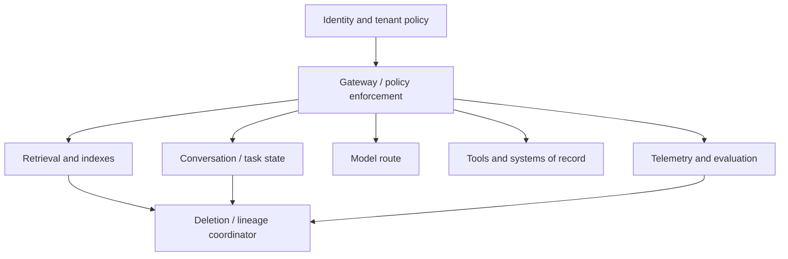

# Multi-tenant AI, privacy and confidential data

> _Last reviewed: 2026-07-16 — see the [freshness policy](../appendix/maintenance.md). This is architecture guidance, not legal advice._

## Learning objectives

After this chapter you will be able to:

- isolate tenant data, state, memory, caches, telemetry and authority;
- design purpose, minimization, retention, deletion, residency and transfer controls;
- choose shared, pooled, partitioned or dedicated deployment patterns;
- protect sensitive content across model providers, tools and human operations;
- test privacy and isolation end to end.

## Decision in one sentence

> **Derive tenant and data authority from authenticated server state, preserve it across every derived artifact and call, and choose isolation proportional to consequence—not convenience.**

Multi-tenancy is not a database column. Tenant context must survive retrieval, prompt assembly, model routing, memory, tools, agents, caches, traces, exports, evaluation and deletion.

## Isolation layers

The server resolves tenant, subject, groups, purpose and permitted regions. Never trust a model, prompt, URL parameter or tool argument to choose a tenant namespace.

## Deployment patterns

| Pattern | Isolation | Tradeoff |
| --- | --- | --- |
| Shared service + logical controls | policy/row/index namespace | efficient; highest control-test burden |
| Shared compute + partitioned data/keys | stronger blast-radius limits | operational complexity |
| Dedicated tenant stack | account/project, network, storage, keys | cost and fleet management |
| Dedicated regulated enclave | strict region/identity/provider boundary | limited features and portability |

Different layers may use different patterns. High-impact tools can be dedicated while low-risk inference is pooled. Document residual side channels such as shared caches, capacity, logs and support access.

## Tenant-scoped contracts

Every durable record and derived artifact needs stable tenant/subject scope, data class, purpose, source/provenance, policy version, created/effective/expiry time, retention rule and deletion lineage. Use tenant-specific encryption keys where risk warrants cryptographic separation. Include tenant in cache and idempotency keys; prohibit global semantic caches for private content.

Test access at the storage/retrieval layer, not only after results are returned. Post-filtering unauthorized vector results can leak or destroy recall. Citations and artifact URLs require the same authorization as source content.

## Privacy engineering lifecycle

The [NIST Privacy Framework](https://www.nist.gov/privacy-framework) treats privacy as enterprise risk management. Translate it into system controls:

1. define purpose and affected people;
2. collect and derive the minimum data needed;
3. establish authority/legal basis and user expectations;
4. constrain use, sharing, model-provider processing and human access;
5. set retention and deletion for source and derivatives;
6. expose notice, access, correction, opt-out/consent and appeal where applicable;
7. evaluate privacy risk and monitor changing use.

Do not store raw conversation “because it may help later.” Separate service state, user memory, security audit, product analytics, evaluation and model improvement purposes.

## Residency and provider routing

Map collection, transit, inference, storage, support, telemetry, backups, content filters and subprocessors by region. A regional endpoint does not prove every control-plane or support path remains regional. Encode eligible providers/models/regions by data class and tenant policy; fail closed or route to an approved fallback.

Review provider terms for input/output retention, training use, abuse monitoring, subprocessors, encryption, deletion, incident notice and model/version changes. Preserve dated evidence.

## Confidential processing

Encryption at rest and in transit does not protect data while ordinary software processes it. For high-risk workloads consider dedicated environments, workload identity, hardware-backed attestation/confidential computing, customer-managed keys and minimized plaintext lifetime. Validate the complete trust boundary: host, accelerator, model service, retrieval, tools and observability.

Privacy-enhancing approaches include tokenization/pseudonymization, field redaction, client-side transformation, aggregation, differential privacy for statistics and federated approaches. Each changes utility and threat assumptions; evaluate re-identification and linkage risk.

## Deletion and correction

Maintain lineage from source to chunks, embeddings, graph nodes, summaries, memory, caches, evaluation copies, exports and backups. Deletion SLOs specify serving removal, physical expiry and verification. Some audit records may retain that an action occurred without retaining the deleted content; resolve requirements with privacy/legal stakeholders.

Corrected facts must supersede prior claims by valid time. A conversational “forget” request invokes an auditable workflow; it is not a prompt instruction to ignore stored data.

## Telemetry and human access

Prompts, outputs, retrieval queries and tool arguments can contain sensitive data. Default to identifiers, counts, policy outcomes and hashes. Use field redaction, sampling, restricted break-glass access, purpose/retention controls and regional stores. Support and labeling interfaces need tenant isolation, least privilege and audit.

## Isolation and privacy tests

- two tenants with near-identical documents and identifiers;
- changed group membership and revoked user;
- cache, memory, trace, citation and export cross-tenant attempts;
- model/provider route forbidden by region or data class;
- prompt injection that asks to change tenant or reveal system context;
- deletion/correction propagation across every derivative;
- backup restore that must not resurrect deleted serving data;
- support/operator misuse and break-glass review.

Unauthorized success threshold is zero. Track false denials separately so isolation controls remain usable.

## Northstar decision

Northstar derives customer and tenant from the authenticated session. Order tools enforce row policy; policy retrieval filters before ranking; conversation, task, cache and trace IDs include tenant scope; persistent memory is opt-in by class. Restricted tenants route only to approved regions. A deletion coordinator removes conversation, memory, embeddings and evaluation copies and records completion without retaining deleted text.

## Practical artifact: tenancy and privacy boundary record

Include tenant model, data inventory/purpose, identity flow, isolation by layer, encryption/key design, provider/region matrix, retention/deletion lineage, user rights, operator access, telemetry policy, failure behavior, tests, residual risk and owners.

## Lab

Design pooled and dedicated Northstar variants. Attempt cross-tenant retrieval, cache reuse, memory access, citation fetch, trace lookup and tool execution. Simulate residency route failure and deletion across six derived stores. Defend the selected isolation tier with consequence and cost evidence.

## Check yourself

1. Where is tenant identity derived and enforced?
2. Which derived artifacts survive source deletion?
3. Does a regional model endpoint cover telemetry and support access?
4. When is dedicated deployment justified?
5. How is a corrected memory propagated?

## Further reading

- [NIST Privacy Framework](https://www.nist.gov/privacy-framework).
- [Privacy, residency and confidential data](../07-security-governance/03-privacy-residency.md).
- [Production memory governance](../03-data-context/07-production-memory.md).
