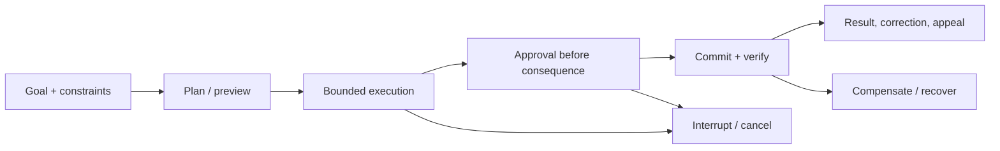

# Human-agent interaction, control and oversight

> _Last reviewed: 2026-07-16 — see the [freshness policy](../appendix/maintenance.md)._

## Learning objectives

After this chapter you will be able to:

- design meaningful preview, approval, correction, cancellation, and recovery;
- place human involvement by consequence, uncertainty, reversibility, and accountability;
- prevent automation bias, approval fatigue, deceptive anthropomorphism, and dark patterns;
- make agent state, evidence, uncertainty, and responsibility understandable;
- evaluate reviewer and end-user outcomes—not only model quality.

## Decision in one sentence

> **Give people sufficient understanding, authority, time, and recovery options at the moment their judgment can still change the outcome.**

“Human in the loop” is not a control if the person sees no evidence, cannot refuse, is interrupted constantly, or reviews after the effect. The objective is calibrated human control, not maximum confirmation dialogs.

## Control across the task lifecycle



| Step | Diagram stage or branch | Detailed description |
| ---: | --- | --- |
| 1 | Goal + constraints | Establish the user's intended outcome, affected resources, authority, limits, prohibited effects, duration/cost expectations, and escalation path. |
| 2 | Plan / preview | Show the material proposed steps, data disclosures, tool targets, uncertainties, and expected consequences before execution removes meaningful choice. |
| 3 | Bounded execution | Run only reversible or pre-approved work inside explicit resource, authority, time, and scope limits while exposing progress and material changes. |
| 4 | Approval before consequence | Present the exact action, target, parameters, evidence, consequence, reversibility, and expiry to the authorized approver before commit. |
| 5 | Commit + verify | Execute with idempotency and durable identity, then read authoritative state rather than trusting the model or transport response alone. |
| 6 | Result, correction, appeal | Distinguish proposed, attempted, and verified effects; provide evidence and a usable path to correct, contest, or escalate the outcome. |
| 7 | Interrupt / cancel branch | Allow the user or policy layer to stop bounded execution or a pending approval; separately reconcile any effect that may already have committed. |
| 8 | Compensate / recover branch | When a committed action cannot be cancelled, invoke an authorized compensating workflow and preserve both the original and recovery evidence. |

At initiation, show capabilities, limits, data/tools involved, likely duration/cost, and whether actions can occur. During execution, expose progress, material plan changes, blocked states, approvals, and a working stop control. At completion, distinguish proposed from attempted and confirmed effects, show evidence, and provide correction or appeal.

## Choose the control mode

| Mode | Use when | Human role |
| --- | --- | --- |
| Observe | low consequence, reversible, well evaluated | inspect and correct after result |
| Confirm intent | ambiguity changes goal or affected resources | resolve material uncertainty |
| Approve action | consequential or externally visible effect | authorize exact preview before commit |
| Review output | specialist judgment is needed | assess evidence and quality |
| Dual control | fraud, safety, legal, or separation-of-duty need | two independent authorities |
| Human execution | automation risk exceeds benefit | AI advises; person acts in system of record |
| Escalation | unsupported, conflicting, or policy exception | accept responsibility and decide |

Use consequence, uncertainty, reversibility, scope, detectability, novelty, and legal/accountability requirements. High model confidence does not remove a mandatory approval; low confidence should not create endless review for trivial reversible actions.

## Design a valid approval

An approval view states:

- who/what will act and on whose behalf;
- action, target, material parameters, destination, and data disclosed;
- evidence, source date, uncertainty, policy and exceptions;
- expected consequence, reversibility, and expiry;
- alternatives including deny, edit, defer, or escalate;
- what changed since any earlier preview.

Bind the receipt to this exact action. If amount, recipient, scope, data, policy, or plan changes materially, ask again. Never bundle unrelated actions into one “Allow” choice.

## Avoid approval fatigue

Ask once at a meaningful boundary, not at every internal step. Let users set narrow standing permissions for low-risk operations with visible scope, duration, revocation, and activity history. Aggregate identical read actions where policy allows. Escalate anomalies rather than normal traffic.

Measure review volume, time, denial and edit rates, missed-error rate, override outcome, and reviewer workload. A near-100% approval rate can signal either excellent previews or rubber-stamping; sample and investigate.

## Communicate uncertainty and evidence

Prefer concrete limits over a decorative confidence percentage:

```text
Found: current shipment scan and policy P-17, effective 2026-06-01.
Missing: carrier damage report.
Conflict: customer photo suggests damage; carrier status says delivered.
Proposed: open an investigation; no refund yet.
```

Show citations and relevant counterevidence near the decision. Explain why review is required and what the reviewer must check. Separate model-generated rationale from verified policy or system-of-record facts.

## Preserve accurate mental models

Tell users they are interacting with AI, what it can access, whether it remembers, and when a human is involved. Avoid implying emotions, consciousness, professional authority, or certainty the system does not have. The [Google People + AI Guidebook](https://pair.withgoogle.com/guidebook/) emphasizes user needs, mental models, explainability, feedback, and graceful failure as product design concerns.

Anthropic's 2026 [trustworthy-agents guidance](https://www.anthropic.com/research/trustworthy-agents) frames human control, values, secure interaction, transparency, and privacy as connected principles and gives tool permissions—allow, approve, or block—as a practical control pattern. Treat this as vendor guidance, then validate the interaction with your own users and risks.

## Cancellation, correction and recovery

A stop button must propagate to queues, model streams, tools, delegated agents, task leases, and credentials. The interface reports whether effects are pending, cancelled, committed, unknown, or compensated. It must not claim “stopped” while a downstream task continues.

Users need to correct source data, task state, and persistent memory—not merely edit the final prose. Provide an appeal or accountable escalation path for high-impact decisions. Preserve the original, correction, decision owner, and resulting action under appropriate audit and privacy policy.

## Accessibility and inclusion

Support keyboard and assistive technology, readable focus/order, non-color-only status, plain language, adequate time, localization, and alternative modalities. Do not rely on streaming motion or rapid approval expiry that excludes users. Evaluate distinct user groups and high-impact slices; aggregate satisfaction can hide exclusion.

## Organizational reality

Name who is accountable for the system, policy, data, deployment, and each consequential decision. Train reviewers on common failure modes and provide time, tools, and authority. Separate productivity targets from pressure to approve. Human oversight transfers work and risk; include it in staffing, latency, cost, and incident plans.

## Evaluate the joint system

Measure user task success, comprehension of capability/limits, appropriate reliance, error detection, harmful action, approval quality, interruption success, correction/appeal outcome, accessibility, review burden, time, and cost. Compare AI+human with both AI-only and existing human workflow.

Test over-reliance (plausible wrong recommendation), under-reliance (correct unfamiliar recommendation), anchoring, time pressure, conflicting evidence, alert fatigue, changed preview, malicious content, inaccessible interaction, and unknown execution result.

## Northstar worked decision

Northstar lets the agent read shipment state and draft options without approval. Before a refund, the customer or authorized employee sees order, amount, destination, policy evidence, uncertainty, and reversibility. Approval is single-use and amount-bound. The task view offers cancel; after commit it changes to “refund confirmed” with transaction ID and correction/escalation routes. Policy exceptions remain human decisions.

## Practical artifact: human-control specification

Include user groups and needs, system disclosure, control-mode matrix, approval payload and binding, standing permissions, progress/cancel semantics, uncertainty/evidence design, correction/appeal/recovery, accessibility, reviewer staffing and training, audit/privacy, evaluation plan, and accountable owners.

## Lab

Prototype Northstar's plan, progress, approval, cancellation, unknown-outcome, and completion states. Test with an unchanged action, materially changed amount, injected evidence, delayed tool result, expired approval, and keyboard-only reviewer. Measure whether participants correctly identify what will happen, what happened, and how to stop or recover.

## Check yourself

1. What makes approval meaningful rather than ceremonial?
2. Which material changes invalidate approval?
3. How does cancellation prove downstream work stopped?
4. Why can high approval rate be a warning?
5. What outcome shows calibrated reliance?

## Further reading

- [Anthropic: Trustworthy agents in practice](https://www.anthropic.com/research/trustworthy-agents).
- [Google People + AI Guidebook](https://pair.withgoogle.com/guidebook/).
- [Approvals, compensating actions and recovery](../05-agents/04-approvals-recovery.md).
- [Responsible AI and risk classification](../07-security-governance/04-responsible-ai.md).
