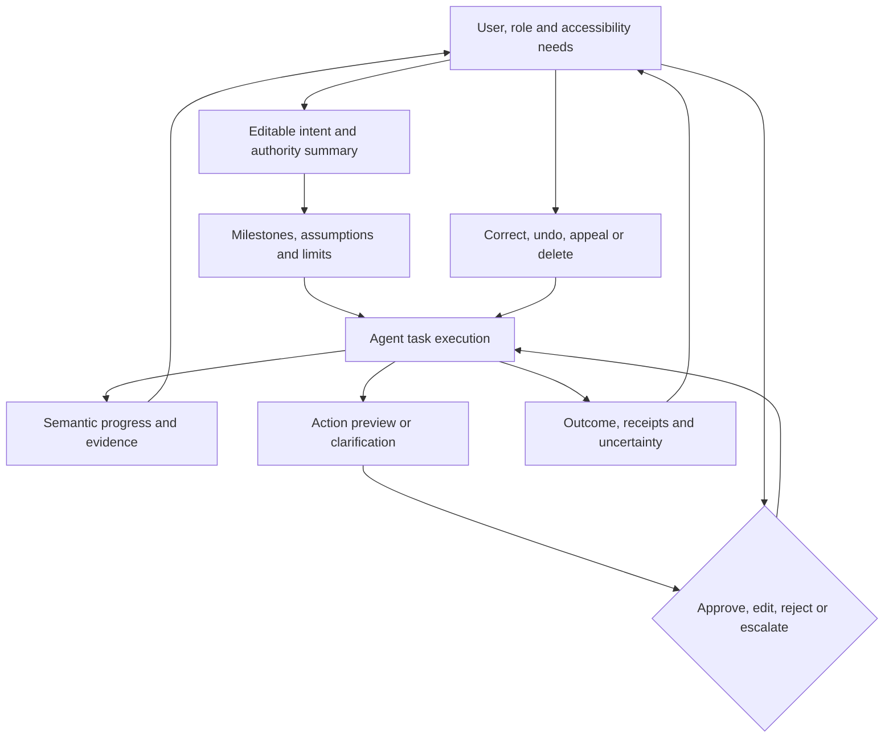

# Agent product UX and trust calibration

> _Last reviewed: 2026-07-25 — see the [freshness policy](../appendix/maintenance.md). Human-AI interaction guidance must be validated with target users, accessibility needs and consequences._

## Learning objectives

After this chapter you will be able to:

- design agent interaction across intent, plan, execution, interruption and recovery;
- communicate capability, uncertainty, evidence and effects accurately;
- prevent approval fatigue and notification overload;
- support correction, cancellation, undo and accessible alternatives;
- evaluate the combined human-agent system.

## Decision in one sentence

**Expose the information and controls a person needs for the next consequential decision—without making them supervise every token or trust an unexplained confidence score.**

## UX across the task lifecycle

| Moment | User need | Design response |
|---|---|---|
| Before use | understand capability and limits | examples, boundaries and data notice |
| Intent capture | correct goal, scope and authority | editable task summary and assumptions |
| Planning | know meaningful approach and risks | milestones, not hidden chain of thought |
| Execution | progress and control | semantic status, stop/pause and cost/time |
| Interruption | make an informed decision | evidence, options, consequence and expiry |
| Completion | know what happened | outcome, receipts, sources and remaining uncertainty |
| Failure | recover without blame | plain-language state, safe alternatives and escalation |
| Later correction | change or remove effects/data | history, correction, undo/compensation and deletion |

Microsoft’s research-backed [Guidelines for Human-AI Interaction](https://www.microsoft.com/en-us/research/project/guidelines-for-human-ai-interaction/) provide a useful lifecycle lens: set expectations, support efficient invocation, handle correction and adapt over time. They are design guidance, not a substitute for user research.

## Reference interaction architecture

| Step | Description |
|---:|---|
| 1 | Resolve role, locale, channel and accessibility preferences. |
| 2 | Reflect the requested outcome, constraints, data and authority for correction. |
| 3 | Show reviewable milestones and limits, not internal hidden reasoning. |
| 4 | Stream semantic task changes rather than raw technical logs. |
| 5 | Present evidence beside the claim or action it supports. |
| 6 | Preview sensitive target, values, consequence, reversibility and expiry. |
| 7 | Bind the user decision to the exact current task state. |
| 8 | Return authoritative receipts and explain unresolved state. |
| 9 | Preserve routes for correction, appeal, compensation and deletion. |

## Accurate trust, not maximum trust

Do not anthropomorphize accountability or claim the agent “knows” a fact without evidence. Avoid global confidence percentages unless calibrated for the exact decision. Prefer specific status: source age, missing evidence, unresolved conflict, permission denial or action not yet confirmed.

Show why the agent needs data or permission and what happens if the user declines. Separate recommendation, preview and completed effect visually and semantically. Never use celebratory completion language before a receipt.

## Progress, interruption and notification

Progress events should describe completed milestone, current activity, expected wait and whether user action is needed. Offer cancel/pause where semantically valid. Explain when cancellation cannot reverse a committed external effect.

Risk-tier interruptions. Low-consequence clarification can be conversational; high-consequence approval needs structured values, evidence and alternatives. Batch related decisions, use defaults only when safe and expire stale approvals. Notifications need recipient policy, urgency, quiet hours, deduplication and escalation.

## Accessibility and inclusion

Support keyboard and screen-reader operation, focus management, sufficient contrast, captions/transcripts, text alternatives, adjustable timing and non-voice fallback. Do not encode status only by color or animation. Evaluate across language, literacy, disability, device, connectivity and domain expertise; aggregate success can hide exclusion.

## Evaluation

Measure task success, correction success, appropriate reliance, severe-error detection, time/effort, abandonment, approval quality, notification burden, accessibility success and recovery. Use observation, usability studies and controlled experiments—not satisfaction alone. Include confident wrong answers, slow tasks, changed plans, partial effects and disagreement with the user.

## Northstar decision

Northstar shows “investigating,” “waiting for carrier” and “recommendation ready,” not token streams. A refund screen displays customer/order, amount, policy basis and reversibility. “Submitted” appears only after a receipt. An unknown outcome offers reconciliation and human support instead of a retry button.

## Practical artifact: agent experience contract

Document users, channels, mental model, intent summary, progress vocabulary, evidence, uncertainty, interruption/approval patterns, notifications, completion/failure states, correction/appeal/deletion, accessibility and joint-system evaluation.

## Lab

Prototype ordinary success, denial, unknown outcome and cancellation for Northstar. Test with keyboard-only and screen-reader flows. Ask participants what changed in the system and compare their answer with actual state.

## Further reading

- [Guidelines for Human-AI Interaction](https://www.microsoft.com/en-us/research/project/guidelines-for-human-ai-interaction/)
- [Human-agent interaction, control and oversight](05-human-oversight.md)
- [Human-in-the-loop and HILOps](../06-evaluation/08-hitl-hilops.md)
- [Agent run API](../05-agents/12-agent-run-api.md)

