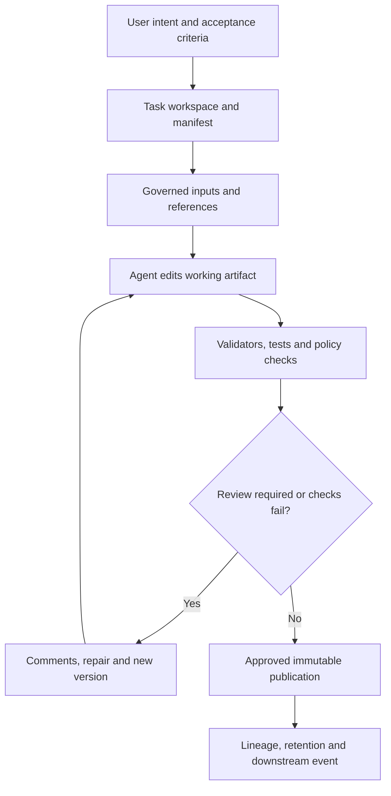

# Artifact-centric agents and workspaces

> _Architecture pattern — last reviewed: 2026-07-25._

## Learning objectives

- make durable artifacts—not chat transcripts—the system of record;
- design safe workspaces for long-running, collaborative agent tasks;
- add provenance, review, merge, and retention to generated work.

## The decision in one sentence

Use conversation to express intent, but make versioned, typed, reviewable artifacts the durable output and coordination surface.

## From chat to work product

A transcript mixes instructions, intermediate reasoning, tool results, and final output. It is difficult to diff, approve, resume, or govern. An artifact-centric system creates first-class objects such as a report, plan, code patch, spreadsheet, diagram, case file, or decision record. Each artifact has identity, schema, versions, provenance, status, permissions, and acceptance criteria.

| Component | Purpose | Required metadata |
|---|---|---|
| Workspace | isolates task files, tools, and secrets | task, owner, tenant, expiry |
| Manifest | states goal and acceptance contract | schemas, checks, budgets, authority |
| Working artifact | supports incremental edits and diffs | type, version, parent, author |
| Validator | tests form and domain constraints | tool version and result |
| Review | captures accountable approval | reviewer, scope, decision, timestamp |
| Publication | creates trusted downstream input | hash, provenance, retention |

## Design rules

Separate source inputs, scratch material, candidate artifacts, and published artifacts. Default the workspace to no ambient credentials and deny network/tool access unless the task manifest grants it. Scan uploads and generated files; constrain executable formats; enforce tenant and case boundaries.

Use append-only events for mutations and content hashes for versions. An agent should propose a patch against a known parent, not overwrite a shared document. Resolve concurrent work through optimistic locking, branches, or domain-specific merge rules. Never use an LLM to silently merge consequential conflicts.

The final artifact should be readable without the transcript. Preserve citations to source objects and exact versions. Store necessary action summaries and tool evidence, not private chain-of-thought. Retain scratch data only as long as needed.

## Northstar example

A Northstar research task creates a case workspace. The manifest specifies a decision brief schema, mandatory policy citations, PII handling, and human sign-off. A research agent builds an evidence table; a drafting agent proposes the brief; validators check citation reachability and required fields. An adjudicator comments on one unsupported claim. The repaired version is signed and published; scratch notes expire after seven days.

## Practical artifact: workspace manifest

Include task and owner, accepted artifact types, input allowlist, tool scopes, secret bindings, resource/time/token budgets, validators, review policy, publication destination, retention, export, and incident trace ID.

See also the [agent run and artifact contracts](../05-agents/12-agent-run-api.md) and [legal, licensing, and IP architecture](../07-security-governance/09-legal-licensing-ip.md).

## Check yourself

1. Can the work product be reviewed without reading the entire chat?
2. What prevents stale-parent overwrite or cross-tenant leakage?
3. Which validations are deterministic?
4. What is retained for audit, and what expires?

## Further reading

- [C2PA specifications](https://spec.c2pa.org/specifications/)
- [SPDX specifications](https://spdx.dev/use/specifications/)
