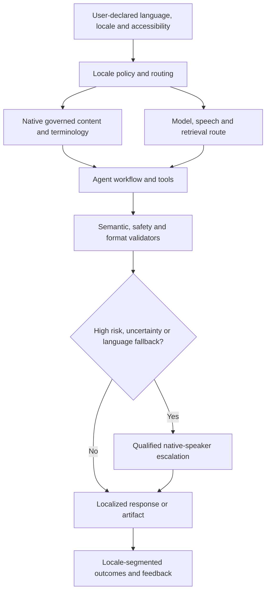

# Multilingual and cross-cultural agents

> _Global architecture guide — last reviewed: 2026-07-25._

## Learning objectives

- design language, locale, culture, and jurisdiction as separate concerns;
- avoid translation-only evaluation and English-centric safety assumptions;
- build native-speaker quality and escalation into operations.

## The decision in one sentence

Treat each high-impact language-locale-task combination as a production variant with its own evidence, content, safety tests, and accountable owner.

## Language is not locale

A locale also affects names, addresses, dates, currency, units, politeness, accessibility, institutions, legal terms, and user expectations. One language spans cultures and jurisdictions; one market may use several languages. Do not infer protected attributes, citizenship, or legal regime from language alone.

| Layer | Design requirement | Failure to test |
|---|---|---|
| Input | code-switching, script, speech, transliteration | wrong language detection |
| Knowledge | native authoritative sources and dates | translated stale policy |
| Retrieval | language-aware indexes and cross-lingual recall | evidence loss |
| Generation | terminology, tone, honorifics, reading level | literal but inappropriate text |
| Tools | canonical internal values and localized display | date/amount/address corruption |
| Safety | native adversarial and refusal cases | English-only guardrail |
| Operations | native support and outcome segmentation | silent low-resource degradation |

## Build native evidence

Start with user journeys written by local domain experts, not translated English prompts. Use professional translation only as one process stage, with terminology management, back-checking where useful, and native review. Evaluate semantic task success, evidence fidelity, harmful error, refusal parity, cultural appropriateness, tool argument correctness, accessibility, speech quality, and user outcomes by locale.

Translated benchmarks can introduce “translationese” and miss culture-specific tasks. Research such as [Global MMLU](https://aclanthology.org/2025.acl-long.919/) and [All Languages Matter](https://openaccess.thecvf.com/content/CVPR2025/html/Vayani_All_Languages_Matter_Evaluating_LMMs_on_Culturally_Diverse_100_Languages_CVPR_2025_paper.html) documents multilingual and cultural evaluation challenges. Keep native-authored, jurisdiction-aware cases and human calibration.

Store canonical structured values for tools; localize at the boundary. Never let translation alter identifiers, monetary amounts, citations, or authorization intent. When a language is unsupported, disclose the fallback and avoid consequential action unless equivalent quality is proven.

## Northstar example

Northstar launches Canadian English and French separately. Policy sources are authoritative in each language, and citations remain in the source language with optional translation. Address and date tools accept canonical schemas. Bilingual adjudicators calibrate rubrics; quality dashboards segment by language, province, and channel without inferring identity.

## Practical artifact: locale readiness card

Record language/script, market/jurisdiction, users, tasks, source authority, terminology, model/routes, retrieval, tools, speech, safety cases, native evaluation, support/escalation, accessibility, outcome parity, known limitations, owner, and launch tier.

Extend the card for spoken channels with the [voice-agent architecture](../10-reference-architectures/06-voice-agent.md) and use [HILOps](../06-evaluation/08-hitl-hilops.md) for native-speaker review.

## Check yourself

1. Why is language not locale? Give two consequences for a Canadian French launch.
2. A translated English benchmark shows parity for a new language. Why is that insufficient, and what would you add?
3. A French-speaking user writes '1 250,00 $' and the agent submits 1.25 to a refund tool. Where is the design failure, and what is the rule?
4. A large customer asks for a language your team does not speak, next week. What may and may not be launched?

What a strong answer covers

<ol>
<li>A locale also governs names, addresses, dates, currency, units, politeness, institutions, and legal terms, and one language spans jurisdictions. Northstar launches Canadian English and French separately, with authoritative sources in each language, and does not infer legal regime or protected attributes from language.</li>
<li>Translated benchmarks introduce 'translationese' and miss culture-specific tasks. Add native-authored, jurisdiction-aware cases, refusal-parity and safety tests, tool-argument correctness, and locale-segmented outcomes, with human calibration.</li>
<li>Localized number formats were passed through instead of canonical values. Store canonical structured values for tools and localize only at the boundary; never let translation alter identifiers, amounts, citations, or authorization intent, and test date, amount, and address corruption.</li>
<li>Treat it as its own variant with an owner, evidence, and a locale readiness card. Disclose the fallback, and avoid consequential action unless equivalent quality is proven; provide native-speaker escalation and a launch tier that reflects the evidence.</li>
</ol>

## Further reading

- [W3C Internationalization](https://www.w3.org/International/)
- [GIMMICK cultural benchmark](https://aclanthology.org/2025.findings-acl.500/)
