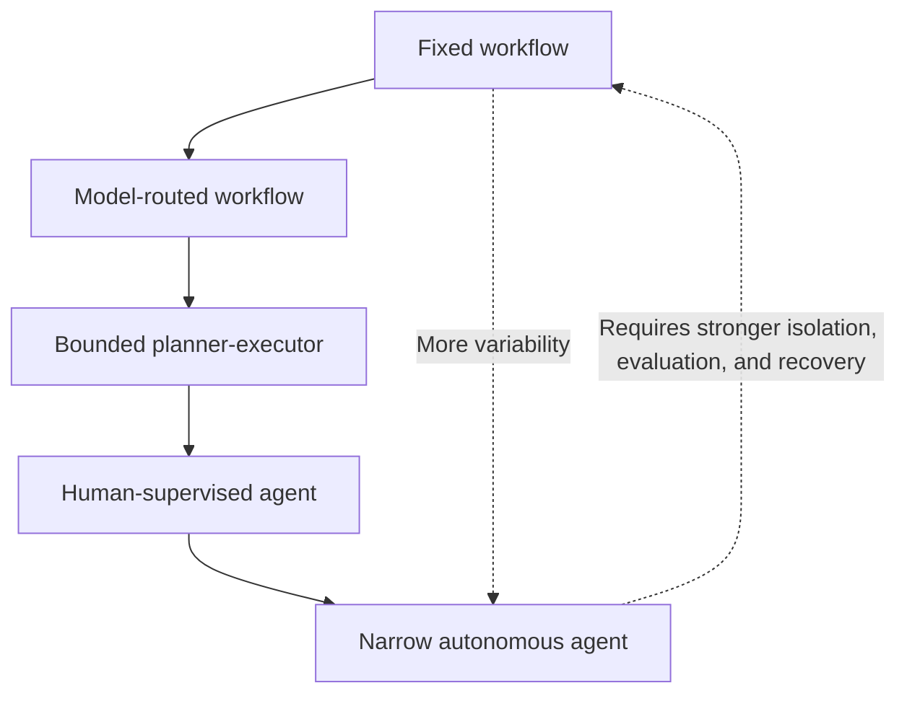
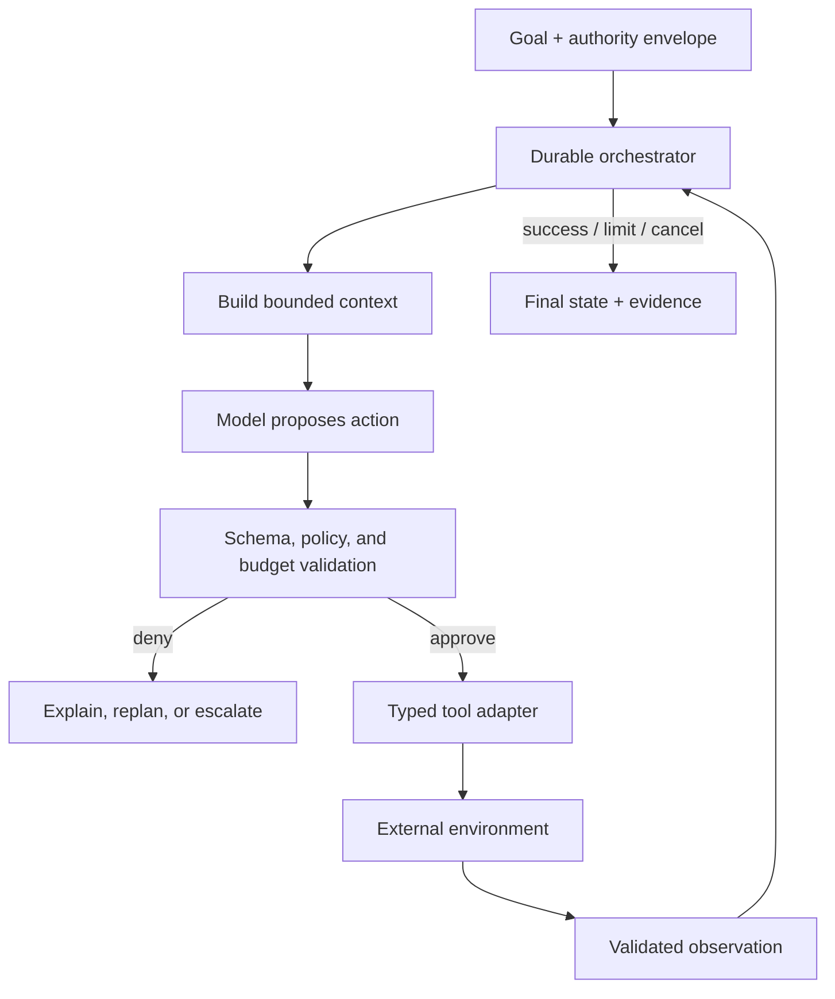

# From workflows to agents

> Last reviewed: 2026-07-16. See the [freshness policy](../appendix/maintenance.md).

## Learning objectives

After this chapter you will be able to:

- decide where deterministic workflow ends and model-directed choice begins;
- assign an autonomy level from business consequence and uncertainty;
- separate durable control state from model context;
- define budgets, termination conditions, and escalation behavior.

## Default to the least autonomy that works

A workflow follows a graph designed in advance. An agent selects the next action at runtime from observations. Both may call models, tools, and people. The difference is **who controls the transition**.

Use deterministic code for known rules, compliance invariants, irreversible actions, and reliable recovery. Add model-directed choice only where the input or path is too varied to encode economically and evaluation shows material value.

| Pattern | Model chooses | Appropriate when |
|---|---|---|
| Deterministic workflow | Content inside a fixed step | Path and failure handling are known |
| Routed workflow | One route from an allowlist | Input classes vary but routes are bounded |
| Planner-executor | A bounded plan; runtime validates each step | Tasks require variable decomposition |
| Supervised agent | Next tool action, with approval at risk boundaries | Path is open-ended but consequences are controllable |
| Autonomous agent | Next action within a narrow capability sandbox | Environment is reversible and continuously evaluated |

## The autonomy ladder



The ladder is not a maturity model. Higher is not better. A payroll approval should remain a workflow even if a model could improvise it.

## Decide from consequence and uncertainty

Classify a use case on two axes:

- **decision uncertainty:** how unpredictable are the valid next steps?
- **action consequence:** how costly, irreversible, or externally visible is a wrong action?

| | Low consequence | High consequence |
|---|---|---|
| Low uncertainty | Deterministic workflow | Workflow plus approval and dual controls |
| High uncertainty | Bounded agent in a sandbox | Agent proposes; workflow validates and a human authorizes |

Also test whether the environment is observable, the task has a verifiable end state, tools have typed contracts, failures are reversible, and representative evaluation is possible. If not, reduce autonomy.

## Reference control loop



The orchestrator—not the conversation transcript—is the system of record. It owns the run status, action ledger, retry count, deadlines, approvals, and terminal state.

## The agent run contract

```yaml
run_id: run_01J...
goal:
  type: resolve_support_case
  success: "case is answered or escalated with evidence"
authority:
  tenant: northstar
  allowed_tools: [search_knowledge, read_order, draft_reply]
  forbidden_effects: [issue_refund, change_order, send_reply]
budgets:
  wall_clock_seconds: 90
  model_calls: 8
  tool_calls: 12
  cost_usd: 0.35
termination:
  max_replans: 2
  no_progress_steps: 3
  on_ambiguity: escalate
```

Separate the goal from the authority envelope. A legitimate goal does not grant a new capability. The planner cannot expand `allowed_tools` or reinterpret a forbidden effect.

## Compose deterministic and model-directed steps

Use code to:

- authenticate identity and enforce tenant boundaries;
- validate tool arguments and business invariants;
- calculate money, dates, permissions, and thresholds;
- persist state and implement retries, timeouts, and compensation;
- decide whether an approval is still valid;
- verify terminal conditions.

Use models to:

- classify ambiguous input;
- propose decompositions and select among allowed tools;
- extract structured candidates from unstructured evidence;
- summarize results and generate explanations;
- identify when available evidence is insufficient.

Do not ask a model to “remember” a critical workflow invariant. Encode it in the transition system.

## Planning patterns

### Route, then execute

For a small number of stable paths, ask the model for a route label and confidence. Validate the label against an enum. Low confidence enters a deterministic fallback.

### Plan, validate, execute

For variable tasks, request a typed plan with prerequisites and expected outputs. Validate the whole plan, then validate again before each action because state and authorization may have changed.

### ReAct-style loop

Interleaving action with observation is useful when later steps depend on retrieved results. Bound the loop. Store user-safe rationales or action justifications rather than depending on private model reasoning as an audit artifact.

### Multi-agent decomposition

Multiple agents increase coordination states, authority propagation, latency, and evaluation cost. Use them only when roles have distinct tools or contexts and parallelism or isolation creates measurable value. A single orchestrator with typed workers is usually easier to govern.

## Context, memory, and state are different

| Store | Purpose | Durability |
|---|---|---|
| Model context | Inputs for one decision | Ephemeral and minimized |
| Working memory | Intermediate task facts | Run-scoped, validated, expiring |
| Durable workflow state | Authoritative transitions and effects | Transactional and recoverable |
| Long-term memory | Cross-run preferences or learned facts | Explicit consent, provenance, correction, deletion |

Never reconstruct committed side effects from chat history after a crash. Replay the durable action ledger and query the target system with an idempotency key.

## Stop conditions and no-progress detection

An agent without explicit termination is an unbounded retry mechanism. Stop on success, deadline, cost limit, action limit, policy denial, cancellation, repeated observation, repeated plan, or inability to verify progress.

Define progress as a state change toward a measurable terminal condition—not the production of more text. Detect cycles using normalized action signatures and observation hashes.

## Failure containment

| Failure | Control |
|---|---|
| Hallucinated tool or argument | Tool allowlist and schema validation |
| Prompt injection in observation | Treat tool output as untrusted data; keep policy out of retrieved text |
| Looping or thrashing | Step, cost, replan, time, and no-progress limits |
| Stale approval | Bind approval to action hash and revalidate before commit |
| Partial side effect | Idempotency record, reconciliation, compensation |
| Model/provider outage | Resume from durable checkpoint or use a deterministic fallback |
| Privilege accumulation | Per-run, least-privilege delegated credentials |

## Evaluation and rollout

Evaluate terminal task success, invalid action rate, policy-denial rate, tool error recovery, unnecessary steps, escalation quality, p95 duration, and cost. Run fault campaigns: duplicate delivery, stale observations, tool timeout, policy change, model change, cancellation, and crash after the external effect but before acknowledgement.

Roll out as shadow recommendation, read-only assistant, supervised action, and only then narrow autonomous execution. Each step needs an explicit promotion and rollback gate.

## Northstar decision

Northstar customer support uses a routed workflow for common cases and a bounded planner-executor for unusual investigations. The agent can search knowledge and read order state but only drafts replies. Sending, refunds, and order changes remain deterministic workflows with approval. The durable orchestrator enforces eight model calls, twelve tool calls, a 90-second deadline, and no-progress termination.

## Architecture artifact

Produce an **autonomy ADR** containing the consequence/uncertainty assessment, selected ladder level, run contract, state model, allowed tools, approval boundaries, termination rules, evaluation gates, and evidence that would justify increasing or decreasing autonomy.

## Lab

Design Northstar’s “resolve delayed order” flow twice: a deterministic workflow and a bounded agent. Inject ambiguous identity, a tool timeout, duplicate execution, and an unavailable model. Compare success, latency, recovery, and reviewability.

## Check yourself

1. Which control decisions must never be delegated to the model?
2. What measurable evidence would justify an agent over a routed workflow?
3. Why is a transcript not durable workflow state?
4. When does multi-agent decomposition add value rather than ceremony?

## Further reading

- [ReAct: Synergizing Reasoning and Acting in Language Models](https://arxiv.org/abs/2210.03629)
- [Google Research: ReAct overview](https://research.google/blog/react-synergizing-reasoning-and-acting-in-language-models/)
- [NIST AI Risk Management Framework](https://www.nist.gov/itl/ai-risk-management-framework)
- [OWASP Top 10 for Agentic Applications 2026](https://genai.owasp.org/resource/owasp-top-10-for-agentic-applications-for-2026/)
