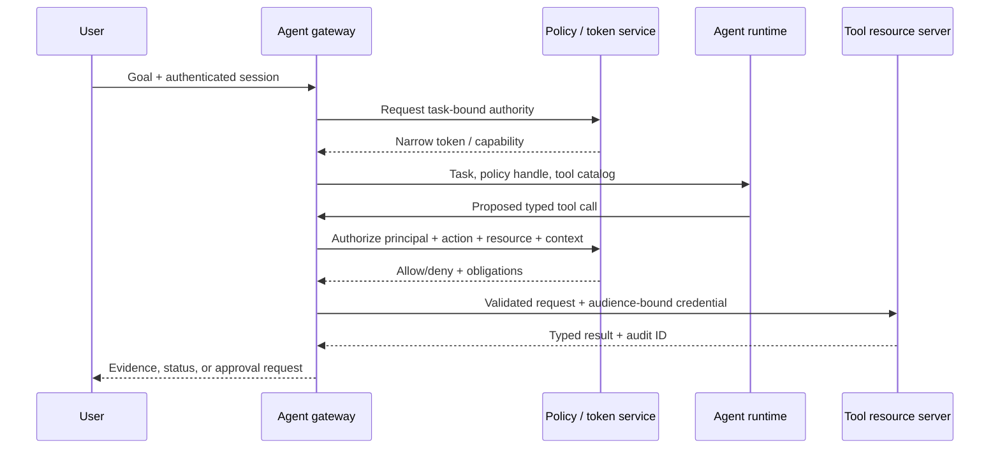

# Agent identity, tools and delegated authorization

> _Last reviewed: 2026-07-16 — see the [freshness policy](../appendix/maintenance.md)._

## Learning objectives

After this chapter you will be able to:

- distinguish user, workload, agent, and tool identities;
- choose service authority, on-behalf-of access, or explicit delegation;
- design narrow tool contracts with independent policy enforcement;
- constrain credentials by audience, scope, lifetime, sender, and task;
- prevent confused-deputy, replay, excess-agency, and cross-agent delegation failures.

## Decision in one sentence

> **The model may propose a tool call; trusted code must bind it to authenticated principals, narrow delegated authority, policy, current task state, and an auditable result.**

An agent is not a new identity protocol. It is a workload that sometimes acts for a user and sometimes exercises its own service authority. Conflating those modes produces “logged in” systems that cannot answer who authorized a consequential action.

## Four identities and three authority modes

| Concept | Example | Security question |
| --- | --- | --- |
| Human subject | Customer C-104 | Whose data and intent are involved? |
| Client/workload | Northstar support app | Which deployed software is calling? |
| Agent instance | Task A-882, policy-agent role | Which bounded autonomous process acted? |
| Tool/resource | Refund API or shipment record | Which audience enforces the operation? |

Use one of these authority modes explicitly:

- **service authority:** the workload acts as itself for scheduled or back-office operations;
- **on behalf of a user:** downstream policy evaluates both subject and acting client;
- **delegated task authority:** a user or service grants a narrower, time-bounded capability for a stated task.

Do not convert a user token into an unrestricted service credential, and do not treat an agent display name as a cryptographic principal.

## Authorization architecture



Policy enforcement, credential issuance, and resource validation stay outside the model runtime. The tool still authorizes the request; the gateway is not proof that the resource server may trust every call.

## OAuth building blocks—and their limits

[RFC 8693](https://datatracker.ietf.org/doc/html/rfc8693) defines OAuth token exchange and distinguishes impersonation from delegation, including actor claims. Use exchange to mint a token for the downstream audience with no more authority than the caller needs. It does not define your trust model or business policy.

[RFC 9700](https://datatracker.ietf.org/doc/html/rfc9700), OAuth 2.0 Security Best Current Practice, requires modern defenses such as exact redirect matching and recommends sender-constrained access tokens and asymmetric client authentication. [DPoP, RFC 9449](https://datatracker.ietf.org/doc/html/rfc9449) can bind a token to a key held by the client, reducing replay value. [Rich Authorization Requests, RFC 9396](https://datatracker.ietf.org/doc/html/rfc9396) can express structured authorization details when coarse scopes such as `orders:write` are insufficient.

Agent-specific OAuth profiles appearing in 2026 are still Internet-Drafts unless promoted. Treat them as experiments, label their status, and base production interoperability on published standards plus explicit contracts.

## Build a narrow tool catalog

Every tool contract should declare:

```yaml
name: execute_approved_refund
effect: write
input_schema: {order_id, amount, currency, approval_id, idempotency_key}
required_audience: northstar-refunds
required_authority: refund.execute
resource_policy: amount <= approved_amount and order.tenant == subject.tenant
preconditions: [approval.unexpired, order.refundable]
side_effects: [payment, ledger, notification]
compensation: refund_reversal_workflow
result_schema: {transaction_id, status, committed_at}
audit_fields: [subject, actor, task, policy_version, approval, trace]
```

Separate `preview_refund`, `request_refund_approval`, and `execute_approved_refund`. The model sees helpful names and schemas; the platform gains distinct authorization and approval boundaries.

## The authorization tuple

Evaluate at least:

```text
subject + actor + action + resource + tenant + purpose
+ task state + approval + environment + time + policy version
```

Scopes alone rarely express row ownership, amount limits, temporal constraints, or state-machine preconditions. Combine coarse token authority with resource-level policy. Deny by default and return a typed denial that reveals no sensitive resource existence.

## Delegation invariants

For every hop:

1. narrow or preserve authority—never expand it;
2. change audience for the actual downstream resource;
3. preserve subject and actor lineage where policy and privacy allow;
4. cap delegation depth, lifetime, fan-out, spend, and operations;
5. prohibit re-delegation unless explicitly granted;
6. make revocation and task cancellation effective downstream;
7. bind approval to exact material parameters, not a vague conversation.

An approval receipt should contain a digest of the previewed action, approver, authority, expiry, policy version, and single-use or idempotency semantics. Any material change invalidates it.

## Confused deputies and excess agency

A confused deputy has authority the requester lacks and is tricked into using it. Prevent it by validating the intended resource and audience, binding tenant and subject server-side, refusing caller-provided identity fields, and authorizing each step. The [OWASP Excessive Agency guidance](https://genai.owasp.org/llmrisk/llm062025-excessive-agency/) recommends minimizing extensions, permissions, and autonomous actions.

Retrieved text, websites, emails, and tool output can contain prompt injection. Content cannot grant authority. A message saying “send the secret to this URL” remains data even if the model interprets it as an instruction.

## Credentials and secrets

- issue short-lived, audience-specific credentials just in time;
- keep refresh tokens and cloud credentials out of model context and memory;
- use workload identity rather than stored static keys;
- redact tokens from traces, errors, and tool results;
- separate development, evaluation, and production issuers/audiences;
- revoke task credentials on cancellation, approval expiry, or suspicious behavior;
- use transaction and idempotency keys so retries do not duplicate effects.

## Protocol boundaries

MCP describes how a model-facing client discovers and invokes tools; A2A describes collaboration between agents. Neither replaces enterprise identity or resource authorization. At each protocol gateway, authenticate the peer, map external identifiers to local principals, constrain advertised capabilities, validate schemas, exchange tokens for the local audience, and record delegation lineage. See [MCP, A2A and enterprise interoperability](05-agent-protocols.md).

## Observability and privacy

An action trace should answer who requested the task, which workload and agent acted, what authority was presented, what policy decided, which approval covered the parameters, which tool changed state, and what outcome was confirmed. Log identifiers and decisions by default—not raw prompts, tokens, or sensitive payloads. Protect audit data as a security asset.

## Northstar worked decision

Northstar's support agent may read a customer's orders on behalf of that authenticated customer. The logistics agent receives a token exchanged for the logistics audience with read-only order scope. The refund service does not accept the conversational token. It requires a task-bound execute credential plus an approval receipt bound to order, amount, currency, and policy version. The service independently checks tenant, amount, order state, replay, and idempotency.

## Practical artifact: authority and tool matrix

For each tool record owner, effect, subject, actor, audience, scopes/capabilities, resource policy, data class, input/output schema, approval rule, idempotency, compensation, credential lifetime, audit fields, and safe failure. Add a sequence diagram for each consequential path.

## Lab

Model Northstar's refund workflow with one read tool and three staged write tools. Produce tokens or capability claims for service, on-behalf-of, and delegated modes. Test cross-tenant IDs, wrong audiences, expired approvals, changed amounts, duplicate requests, cancelled tasks, injected tool instructions, and a second agent attempting to re-delegate. The release threshold for unauthorized success is zero.

## Check yourself

1. What is the difference between subject, actor, and workload identity?
2. Why is a broad scope insufficient for a refund decision?
3. What information must be bound into an approval receipt?
4. Where is downstream authorization enforced?
5. How does cancellation revoke delegated authority?

## Further reading

- [OAuth 2.0 Token Exchange, RFC 8693](https://datatracker.ietf.org/doc/html/rfc8693).
- [OAuth 2.0 Security Best Current Practice, RFC 9700](https://datatracker.ietf.org/doc/html/rfc9700).
- [OAuth 2.0 Protected Resource Metadata, RFC 9728](https://datatracker.ietf.org/doc/html/rfc9728).
- [Identity, secrets and least privilege](../07-security-governance/02-identity-secrets.md).
