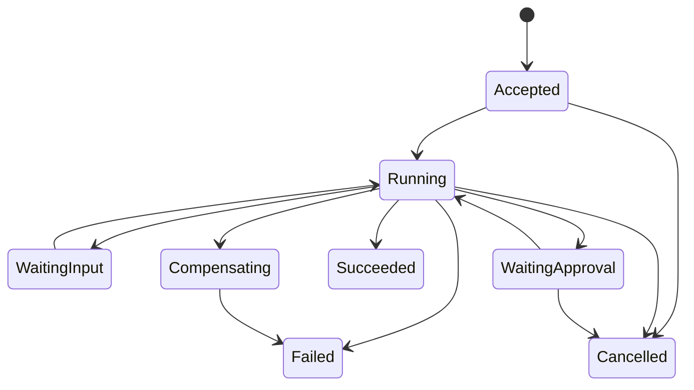

# Durable agent orchestration, state and recovery

> _Last reviewed: 2026-07-16 — see the [freshness policy](../appendix/maintenance.md)._

## Learning objectives

After this chapter you will be able to:

- choose deterministic workflow, dynamic agent loop or a bounded hybrid;
- model tasks as durable state machines with checkpoints and leases;
- design idempotent tools, retries, reconciliation and compensation;
- control fan-out, loops, cancellation, migration and human pauses;
- evaluate complete trajectories and failure recovery.

## Decision in one sentence

> **Persist business state outside the model and let code control every transition whose correctness, authority or recovery can be specified.**

Conversation history is not a workflow engine. A long-running task must survive process loss, model change, user disconnect, approval delay and unknown tool outcome without guessing what happened.

## Select the control pattern

| Pattern | Next step chosen by | Use when |
| --- | --- | --- |
| Deterministic sequence/graph | code/configuration | states, branches and invariants are known |
| Model within workflow | code around bounded model judgments | ambiguity exists inside a stable business process |
| Dynamic agent loop | model | path and observations cannot be enumerated economically |
| Human-controlled task | person | exceptions or consequences require accountable judgment |

Current [Google agentic design guidance](https://docs.cloud.google.com/architecture/choose-design-pattern-agentic-ai-system) similarly distinguishes deterministic sequential/parallel patterns from dynamic coordinator, hierarchy, swarm, ReAct, review and human patterns. Choose by task uncertainty, latency, cost and human involvement—not fashion.

## Durable task model

```text
Task: id, tenant, subject, actor, goal, manifest_version
Status: accepted | running | waiting_input | waiting_approval
        | compensating | succeeded | failed | cancelled | unknown
Budgets: deadline, steps, fanout, tokens, tools, spend
State: current_node, attempt, checkpoint_version, lease
Evidence: observations and artifacts by immutable reference
Effects: idempotency_key, transaction_id, outcome, reconciliation
Control: approvals, policy decisions, cancellation, escalation
```

Use optimistic versioning or serialized ownership so two workers cannot commit incompatible transitions. Workers acquire time-bounded leases and renew them; expired work can resume from a checkpoint. Event sourcing improves replay/audit but adds ordering, schema and projection complexity.

## State machine



Define allowed transitions, actor, preconditions, durable writes, emitted events, timeout and recovery. “Unknown” is a real state for a request whose effect may have committed but whose response was lost.

## Step contract

Every step declares inputs/outputs, owner, side-effect class, authority, idempotency, timeout, retryable errors, maximum attempts, checkpoint, compensation, telemetry and terminal conditions. Model output is proposed data that must pass schema, policy and state validation before transition.

Keep plans advisory. The controller may reject, reorder or stop a model plan when it violates permissions, budgets, dependency constraints or approval policy.

## Retry, reconcile, compensate

- Retry reads and explicitly idempotent operations on transient failures with bounded jittered backoff.
- For unknown write outcome, query by transaction/idempotency key before retry.
- Use an outbox/inbox or equivalent atomic handoff so state and events do not diverge.
- Compensating actions are domain operations with their own authorization and failure modes; they are not database rollback.
- Dead-letter tasks only after preserving state, reason, owner and a safe resume/escalation path.

## Parallelism and coordination

Parallelize independent work only. Set maximum breadth, depth, concurrency, tokens and tool calls. Gather results through a typed reducer that handles missing, duplicate, late and conflicting outputs. Cancellation propagates to every child, queue, lease, credential and tool; late results cannot mutate a cancelled task.

Multi-agent decomposition is justified by distinct authority, tools, context or useful parallelism. Each extra stochastic stage reduces end-to-end consistency unless evaluation and recovery compensate.

## Human pauses

Persist an approval request containing exact material parameters, evidence, policy version, expiry and resume token. Release compute while waiting. On resume, recheck task version, authority, preconditions and changed evidence. Never apply an approval to a materially changed action.

## State and version migration

Bind tasks to a system manifest. During deployment, choose: finish on old version, migrate through a tested transformation, or stop safely. Schema migrations need backward/forward compatibility, replay tests and rollback. A new model or prompt must not reinterpret historical state without an explicit adapter.

## Observability and evaluation

Trace transitions, decisions, model calls, tools, policy, approvals, budgets, attempts, effects and stop reason. Measure task success, steps/success, recovery success, duplicate-effect rate, unknown-outcome age, cancellation latency, stuck tasks, cost/success and critical policy violations.

Test crashes before/after each durable write, duplicate delivery, reordered events, lease loss, timeout, expired approval, partial child failure, provider outage, cancellation and state migration.

## Northstar flow

Northstar persists the shipment investigation independently of chat. A carrier inquiry may run asynchronously. Refund execution uses an idempotency key and transaction ID. If the response is lost, the controller reconciles rather than retries blindly. Cancellation revokes the task credential and child lease; a committed refund moves to confirmed outcome or a separately approved compensation workflow.

## Practical artifact: orchestration contract

Include state diagram, durable schema, step contracts, event ordering/deduplication, lease/checkpoint design, retry matrix, side-effect/idempotency ledger, approval/resume, cancellation, compensation, migration, budgets, SLOs and failure-injection plan.

## Lab

Implement a resumable Northstar investigation with one parallel read, one approval pause and one idempotent write. Kill workers at five points, duplicate and reorder messages, expire approval, lose a write response and cancel mid-flight. Prove no unauthorized or duplicate refund occurs.

## Check yourself

1. Which state is authoritative after a process restart?
2. How is an unknown write outcome resolved?
3. What prevents a late child from changing a cancelled task?
4. Which version resumes an old task?
5. When is compensation required?

## Further reading

- [Agent system design](06-agent-system-design.md).
- [Approvals, compensating actions and recovery](04-approvals-recovery.md).
- [Production reliability](../04-llm-systems/02-reliability-latency.md).
