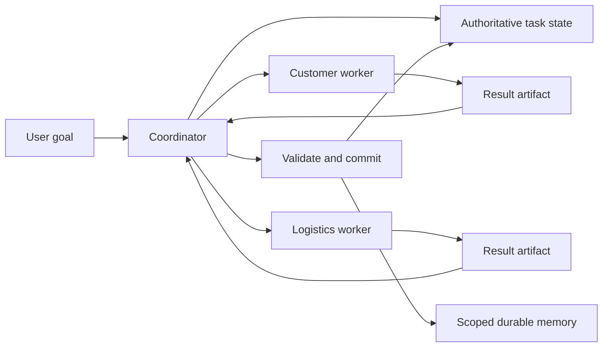

# Memory and multi-agent patterns

> _Last reviewed: 2026-07-16 — see the [freshness policy](../appendix/maintenance.md)._

## Learning objectives

After this chapter you will be able to:

- decide whether an agent needs durable memory, another agent, both, or neither;
- distinguish task handoff from shared-memory coordination;
- select blackboard, coordinator-owned, event-sourced, or federated memory patterns;
- constrain scope, authority, context, and write behavior across agents;
- evaluate whether decomposition improves outcomes enough to justify its complexity.

## Decision in one sentence

> **Add memory or another agent only when persistent context, authority separation, expertise, ownership, or parallel work creates a measurable benefit.**

The detailed memory lifecycle is covered in [Agentic memory systems](../03-data-context/04-context-memory.md), temporal and graph retrieval in [GraphRAG and temporal knowledge](../03-data-context/06-graphrag-temporal.md), and production controls in [Production memory](../03-data-context/07-production-memory.md). This chapter focuses on their use in agent composition.

## Four different problems

| Need | First pattern to try | Do not assume |
| --- | --- | --- |
| Continue one long task | Typed task state and checkpoints | Long-term personal memory |
| Reuse a confirmed fact later | Scoped memory contract | Another agent |
| Isolate tools, authority, or specialist context | Delegation to a bounded agent | Shared writable memory |
| Explore independent subtasks concurrently | Parallel workers with result artifacts | A persistent agent society |

Many designs confuse these needs. A second agent cannot repair missing state discipline, and a vector database cannot create a safe delegation boundary.

## Memory ownership before sharing

Every record has one authoritative owner even when many actors can read it.



Workers return evidence and proposed changes. The coordinator or a policy service validates and commits shared state. This makes retry, audit, and conflict behavior observable.

## Coordination patterns

| Pattern | Write model | Strength | Main risk |
| --- | --- | --- | --- |
| Result handoff | Worker returns an immutable artifact | Simple authority and replay | Coordinator context bottleneck |
| Coordinator-owned state | One writer commits shared state | Fewer conflicts | Availability and throughput bottleneck |
| Blackboard | Agents collaborate through typed shared records | Flexible coordination | Race conditions and contaminated context |
| Event-sourced | Agents append events; reducers build views | Audit, replay, temporal history | Ordering and schema complexity |
| Federated | Each agent owns state behind an interface | Strong ownership boundaries | Discovery and cross-agent latency |

Default to result handoff or coordinator-owned state. Adopt multi-writer memory only when its measured coordination benefit exceeds its consistency and security burden.

## The handoff contract

A delegation should contain:

```yaml
task_id: shipment-investigation-184
objective: identify_verified_delay_causes
requesting_principal: customer-agent
delegated_to: logistics-agent
allowed_context_refs: [shipment:184, case:991]
allowed_tools: [read_carrier_events, read_facility_incidents]
prohibited_data: [other_customer_profiles]
budget: {model_calls: 6, wall_clock_seconds: 30}
return_schema: investigation_result_v2
required_evidence: source_event_ids
write_authority: none
expiry: 2026-07-16T22:00:00Z
```

Passing an entire conversation is usually excessive. Send the minimum goal, constraints, permitted references, and expected artifact. Stable policy and identity are supplied by the receiving system, not copied from untrusted conversation text.

## Shared-memory controls

- derive tenant, user, and task scopes from authenticated identity;
- give each memory class an owner and permitted writers;
- use optimistic concurrency or idempotency keys for updates;
- separate observed evidence, model inference, and approved fact;
- retain provenance and validity time;
- validate promotion from task memory to durable memory;
- prevent retrieved instructions from writing procedural memory;
- support correction, deletion, and rollback across derived indexes.

An agent should never gain more authority by remembering a previously successful action.

## Failure modes

### Context laundering

One agent summarizes untrusted content and another treats the summary as trusted instruction. Preserve source trust and keep data separate from control instructions across every handoff.

### False consensus

Several agents repeat the same unsupported claim because they share the same source or model. Count independent evidence, not agent votes.

### Memory race

Two workers update the same fact. Use versions, compare-and-swap, deterministic reducers, or a single committer. Never let last-write-wins silently decide consequential truth.

### Circular memory

An agent stores its generated answer, retrieves it later, and mistakes repetition for external corroboration. Record derivation and reject circular support.

### Orphaned work

A worker finishes after its task was cancelled and writes stale results. Expiring delegation tokens and commit-time task checks prevent late writes.

## Reliability and cost

If five required stochastic stages each succeed 95% of the time, an idealized end-to-end success rate is `0.95^5`, or about 77%. Additional agents can improve parallel exploration or independent verification, but also add model calls, failure boundaries, tokens, and synthesis work.

Measure:

- end-to-end task success and repeated-trial reliability;
- quality gain attributable to each extra agent;
- handoff and synthesis errors;
- p95 latency and rate-limit pressure;
- model, retrieval, and tool cost per successful task;
- operator time to identify the responsible stage;
- leakage and unauthorized-write rates.

## Northstar decision

Northstar's customer agent does not need direct write access to logistics memory.

1. The customer agent creates a bounded investigation task.
2. The logistics agent reads only permitted shipment and facility data.
3. It returns a source-linked artifact, not a durable customer fact.
4. The coordinator verifies task freshness and evidence.
5. Current status comes from the shipment system of record.
6. Only a confirmed presentation preference may be promoted to user memory.
7. Refund policy remains versioned organizational knowledge, not learned procedure.

This design separates expertise and authority without creating an uncontrolled shared mind.

## Practical artifact: memory and agent decomposition ADR

Record:

- the problem that task state alone cannot solve;
- the problem that one agent cannot solve within context, authority, or latency limits;
- memory scopes, owners, readers, writers, and promotion rules;
- delegation and result schemas;
- consistency and conflict policy;
- context and cost budgets;
- cancellation, retry, expiry, and late-result behavior;
- evaluation baseline using fewer agents and no durable memory;
- rejection criteria for each added component.

## Lab

Implement the Northstar shipment investigation twice:

1. one agent with typed task state and no durable memory;
2. a customer coordinator plus logistics worker with scoped preference memory.

Inject a poisoned carrier notice, a task cancellation, two similar users in different tenants, a late worker result, and a corrected preference. Compare task success, leakage, unauthorized writes, latency, cost, and debugging time. Keep the multi-agent design only if it provides a measurable advantage on its target dimension.

## Check yourself

1. When is task state sufficient without long-term memory?
2. Why is a result artifact safer than letting every worker write shared memory?
3. How does false consensus differ from independent verification?
4. What prevents a late worker from committing obsolete results?
5. Which measurement would justify adding a specialist agent?

## Further reading

- Anthropic, [*Building effective agents*](https://www.anthropic.com/engineering/building-effective-agents).
- Anthropic, [*Effective context engineering for AI agents*](https://www.anthropic.com/engineering/effective-context-engineering-for-ai-agents).
- Google Cloud Architecture Center, [*Choose a design pattern for your agentic AI system*](https://docs.cloud.google.com/architecture/choose-design-pattern-agentic-ai-system).
- Park et al., [*Generative Agents: Interactive Simulacra of Human Behavior*](https://doi.org/10.1145/3586183.3606763), UIST 2023.
- Wu et al., [*LongMemEval*](https://proceedings.iclr.cc/paper_files/paper/2025/hash/d813d324dbf0598bbdc9c8e79740ed01-Abstract-Conference.html), ICLR 2025.
