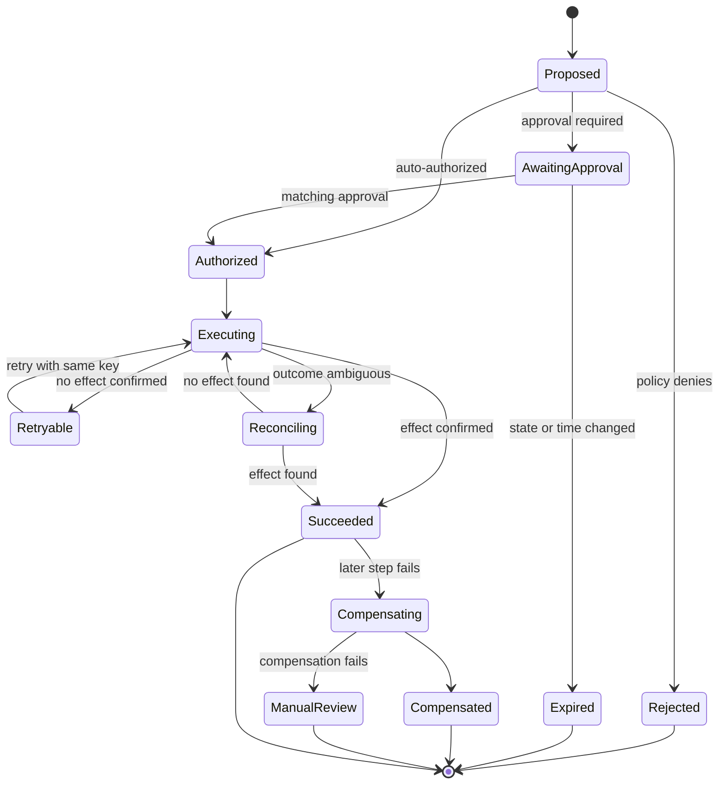
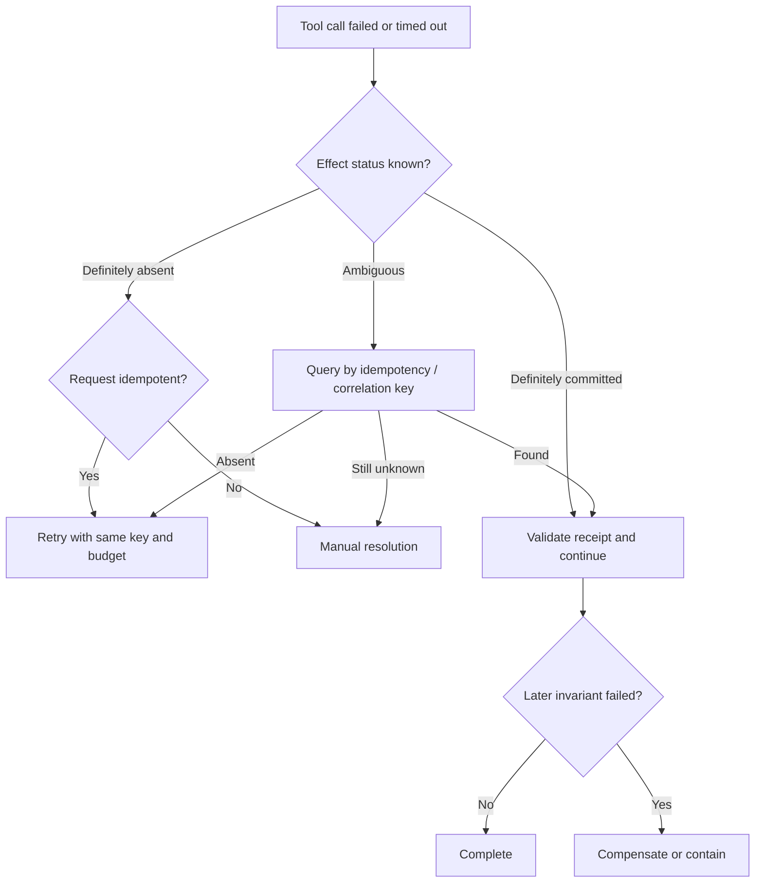

# Approvals, compensating actions & recovery

> Last reviewed: 2026-07-16. See the [freshness policy](../appendix/maintenance.md).

## Learning objectives

After this chapter you will be able to:

- bind human approval to the exact action and current state;
- make tool execution idempotent across retries and crashes;
- distinguish retry, compensation, reconciliation, and escalation;
- design an agent run that can pause, resume, cancel, and recover safely.

## The failure that matters

An agent submits a refund. The payment API succeeds, but the network response is lost. The orchestrator retries, and a second refund is issued. A human “approved a refund,” yet the system cannot prove which amount, account, or state they reviewed.

Reliable agentic systems assume this ambiguous boundary will occur: the external effect may commit while the caller believes it failed. Recovery must be designed before autonomy.

## Durable action lifecycle



Persist each transition transactionally. A process restart should load the current state, not infer it from a model conversation.

## Risk-tier the tools

| Tier | Example | Required control |
|---|---|---|
| 0: read | Search policy | Tenant scope, rate limit, audit |
| 1: reversible local write | Add draft note | Idempotency, validation, undo |
| 2: external or customer-visible | Send message | Preview, approval or policy gate, receipt |
| 3: financial/legal/security | Refund, entitlement, access grant | Strong authentication, separation of duties, exact approval binding, reconciliation |
| 4: irreversible or catastrophic | Destructive infrastructure or safety action | Keep outside general-purpose agent authority |

Risk depends on parameters and context. A $5 credit and a $500,000 transfer are not the same tool tier. The policy input must include amount, target, environment, data class, reversibility, and accumulated effects in the run.

## Approval is a cryptographic-quality control decision

An approval record should bind:

```json
{
  "approval_id": "apr_01J...",
  "run_id": "run_01J...",
  "action_hash": "sha256:...",
  "action_type": "issue_refund",
  "resource_version": "order:18431:v17",
  "principal": "approver-9",
  "scope": {"max_amount": 85, "currency": "USD"},
  "reason": "duplicate shipment",
  "issued_at": "2026-07-16T17:02:00Z",
  "expires_at": "2026-07-16T17:12:00Z",
  "authentication_context": "phishing-resistant-mfa"
}
```

Before execution, recompute the canonical action hash and re-read the resource version. Any change in target, amount, recipient, state, authority, or expiry invalidates the approval. “Approve everything in this chat” is not an acceptable capability grant.

Design the review screen to show the proposed effect, source evidence, uncertainty, policy result, alternatives, and consequence of approval. Prevent model-generated text from obscuring fields or changing the review UI.

## Idempotent execution

Generate the idempotency key from the logical action, not from an attempt:

```text
idempotency_key = H(tenant, action_type, target_id, intent_id)
```

The tool adapter stores an action record before calling the external system. Every retry reuses the same key. The target service should atomically return the original result for duplicate keys. If it cannot, add a broker that records intent and reconciles target state.

Do not mark an action successful merely because the call returned HTTP 200. Validate the business receipt: resource ID, final state, amount, version, and correlation key.

## Retry, reconcile, compensate, or escalate



- **Retry** repeats the same intended effect after a transient failure.
- **Reconciliation** discovers what actually happened.
- **Compensation** creates a new business action that semantically offsets a committed action.
- **Rollback** is reserved for a true atomic transaction; most external effects cannot be rolled back.
- **Escalation** is correct when state is ambiguous or compensation would create more risk.

## Sagas and compensating actions

A multi-system action is usually a saga: local transactions with forward recovery or compensation. For each step, define the idempotency key, receipt, retry policy, compensation, compensation preconditions, and owner.

| Forward step | Receipt | Compensation | Limitation |
|---|---|---|---|
| Reserve inventory | reservation ID | Release reservation | May expire independently |
| Capture payment | payment ID | Refund payment | Fees and timing may not reverse |
| Create shipment | shipment ID | Cancel shipment | Impossible after carrier pickup |
| Notify customer | message ID | Correction message | Original message remains visible |

Compensation is not erasure. Preserve both actions in the audit trail and explain residual effects. Where compensation is impossible, favor prevention, staged commitment, or human authority.

## Cancellation and deadlines

Cancellation is a durable state transition. Stop starting new work, propagate cancellation to cancellable calls, and allow already-committed actions to reach reconciliation. Never abandon an ambiguous effect.

Use separate timeouts for queue wait, tool execution, approval, and whole run. An approval that arrives after the resource or policy changed must expire, even if the overall run remains open.

## Recovery runbook

For any run in `Reconciling` or `ManualReview`:

1. freeze new actions for the affected intent;
2. load the durable action ledger and correlation IDs;
3. query the target system through an authoritative read path;
4. compare the observed state to business invariants;
5. accept, retry, compensate, or contain using a documented decision;
6. notify affected operators or users without overstating certainty;
7. attach receipts and the decision to the run;
8. convert the failure into an automated recovery test.

Operators need a safe console to search by run, resource, and idempotency key, see pending effects, and perform allowlisted recovery actions. Editing database rows is not a recovery interface.

## Concurrency and stale state

Sagas lack transaction isolation across services. Use optimistic version checks, semantic locks for scarce resources, and precondition headers where available. Revalidate policy and resource state immediately before commit. If two agents act on the same case, one should observe a version conflict and replan or stop.

## Observability and evidence

Record run ID, action ID, idempotency key, attempt, approval ID, policy version, tool schema version, target receipt, resource version, timestamps, and transition reason. Do not log secrets or full sensitive payloads. Metrics should distinguish tool errors, policy denials, retries, duplicate suppression, reconciliation duration, compensation success, expired approvals, and manual backlog.

## Evaluation

Test crash points before and after every durable write and external call. Inject lost responses, duplicate delivery, delayed approval, stale resource versions, partial downstream outages, failed compensation, cancellation, and operator retry. The acceptance criterion is invariant preservation and recoverability—not merely a successful final response.

## Northstar decision

Northstar’s support agent may propose a refund but cannot execute it. A workflow validates policy and creates an action hash. A strongly authenticated supervisor approves the exact order, currency, and maximum amount. The payment adapter uses a stable idempotency key, verifies the receipt, and enters reconciliation after an ambiguous timeout. Refunds above the delegated threshold require a second approver.

## Architecture artifact

Produce an **action-risk matrix and recovery runbook** with tool tiers, approval policy, canonical action fields, state machine, idempotency strategy, receipts, retry classifications, compensation limits, cancellation behavior, operator procedures, SLOs, and fault tests.

## Lab

Model a three-step Northstar replacement order. Simulate a crash after payment capture but before acknowledgement, a stale approval, a duplicate event, and a failed shipment cancellation. Demonstrate that the final state is explainable and no effect is duplicated.

## Check yourself

1. Why must an approval bind a resource version and action hash?
2. What is the safe response to an ambiguous non-idempotent action?
3. Why is compensation not rollback?
4. Which state must survive a model or orchestrator restart?

## Further reading

- [AWS Prescriptive Guidance: Saga orchestration pattern](https://docs.aws.amazon.com/prescriptive-guidance/latest/cloud-design-patterns/saga-orchestration.html)
- [Microsoft Azure Architecture Center: Compensating Transaction pattern](https://learn.microsoft.com/azure/architecture/patterns/compensating-transaction)
- [RFC 9110: HTTP semantics and idempotent methods](https://www.rfc-editor.org/rfc/rfc9110)
- [Temporal: Durable execution](https://docs.temporal.io/temporal)
