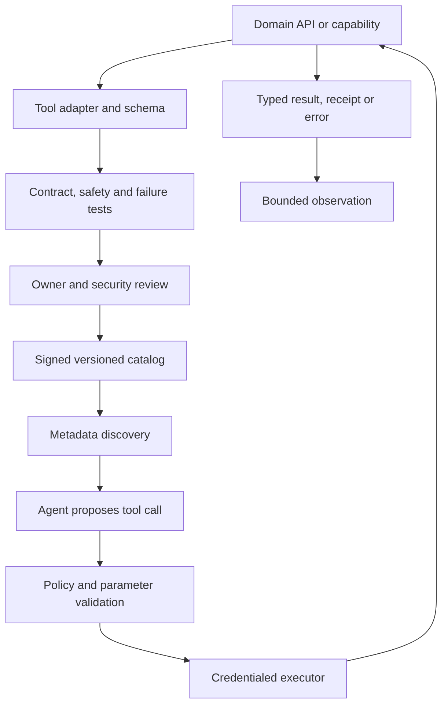

# Production tool engineering for agents

> _Last reviewed: 2026-07-25 — see the [freshness policy](../appendix/maintenance.md). Tool-calling APIs, MCP schemas and registries evolve; pin protocol and server versions._

## Learning objectives

After this chapter you will be able to:

- turn business capabilities into narrow, typed and governable agent tools;
- design discovery, selection, validation, errors, versioning and deprecation;
- separate tool metadata from authorization and runtime credentials;
- evaluate tool-choice and parameter fidelity;
- produce a tool lifecycle record and catalog design.

## Decision in one sentence

**Expose the smallest capability that has a stable business contract, validate it outside the model, and discover metadata without granting authority.**

## Tool is not permission

A tool description tells a model what may exist. The policy engine decides whether this actor, task and moment may use it. The executor holds short-lived credentials and enforces limits. Never embed secrets or treat possession of an MCP connection as authorization.

| Concern | Owner |
|---|---|
| Semantic name and description | domain/product team |
| Input/output/error schema | API and tool team |
| Authentication and authorization | identity/policy platform |
| Side effects and idempotency | system-of-record owner |
| Discovery/catalog metadata | agent platform |
| Runtime isolation and quotas | execution platform |
| Evaluation and release | product, risk and quality owners |

## Tool lifecycle architecture



| Step | Description |
|---:|---|
| 1 | Start from an owned business capability, not arbitrary code. |
| 2 | Create a model-usable schema without weakening the API contract. |
| 3 | Test ordinary, invalid, denied, timeout and unknown-outcome paths. |
| 4 | Approve owner, risk tier, data class and operational support. |
| 5 | Publish immutable metadata and compatibility information. |
| 6 | Discover only name, purpose and safe selection metadata initially. |
| 7 | Treat the model output as an untrusted proposal. |
| 8 | Resolve authority, validate parameters and bind an idempotency key. |
| 9 | Invoke using task-scoped credentials and resource limits. |
| 10 | Return typed, size-bounded observations and durable receipts. |

## Contract design

Prefer outcome-oriented tools such as `refund.preview` and `refund.commit` over a generic database or HTTP tool. Split read, preview and commit. Use domain identifiers, units and enumerations. Reject unknown fields and impossible combinations.

```json
{
  "name": "refund.preview",
  "version": "2.1.0",
  "effect": "none",
  "input": {
    "order_id": "ord_...",
    "reason_code": "carrier_lost",
    "amount": {"currency": "CAD", "minor_units": 2599}
  },
  "output": {
    "preview_id": "rp_...",
    "expires_at": "2026-07-25T21:00:00Z",
    "policy_basis": ["refund-policy-42"]
  }
}
```

Descriptions should state purpose, prerequisites, non-goals, effect and important constraints. Do not encode authorization policy only in prose. Return machine-actionable errors: `invalid`, `denied`, `conflict`, `rate_limited`, `timeout_before_commit`, `unknown_outcome` and `dependency_unavailable`.

## Discovery and large catalogs

Large catalogs reduce tool-selection quality and inflate context. Use hierarchical discovery:

1. retrieve candidate tool metadata from task, domain and policy;
2. rank candidates using descriptions and negative examples;
3. expose full schemas only for the small permitted set;
4. require explicit policy before execution.

The [MCP Registry](https://modelcontextprotocol.io/registry/remote-servers) distributes server metadata. Registry presence does not attest that a server is safe, authorized, compatible or operated by an approved party. Enterprises need curation, signing, ownership, vulnerability response and removal.

## Versioning and operations

Use semantic compatibility rules for schemas but treat changed effect, authorization or error semantics as breaking. Support overlapping versions during migration, record the selected version in traces, and publish deprecation dates. Circuit-break unhealthy tools and remove them from discovery while preserving explicit degradation behavior.

Evaluate tool selection precision/recall, argument validity, unnecessary calls, denied-call rate, duplicate effects, unknown-outcome recovery, latency, cost and task success. Run tests with similar names, misleading descriptions, oversized output and hostile tool content.

## Northstar decision

Northstar replaces a generic order-service REST tool with `order.read_summary`, `refund.preview` and `refund.commit`. Only the preview schema is visible until policy confirms eligibility. Commit requires a current preview, approval and idempotency key; an unknown outcome triggers reconciliation.

## Practical artifact: tool lifecycle record

Document owner, purpose, schemas, effect class, data class, identity, authorization, credentials, errors, retries, idempotency, discovery metadata, versions, SLOs, evaluation, incident route and deprecation.

## Lab

Design five Northstar tools, including two intentionally overlapping ones. Measure selection accuracy before and after hierarchical discovery, then inject denial, timeout and lost-response failures.

## Further reading

- [MCP specification and registry](https://modelcontextprotocol.io/)
- [Agent identity, tools and delegated authorization](01-tools-authorization.md)
- [Agent Skills](07-agent-skills.md)
- [Approvals, compensating actions and recovery](04-approvals-recovery.md)

