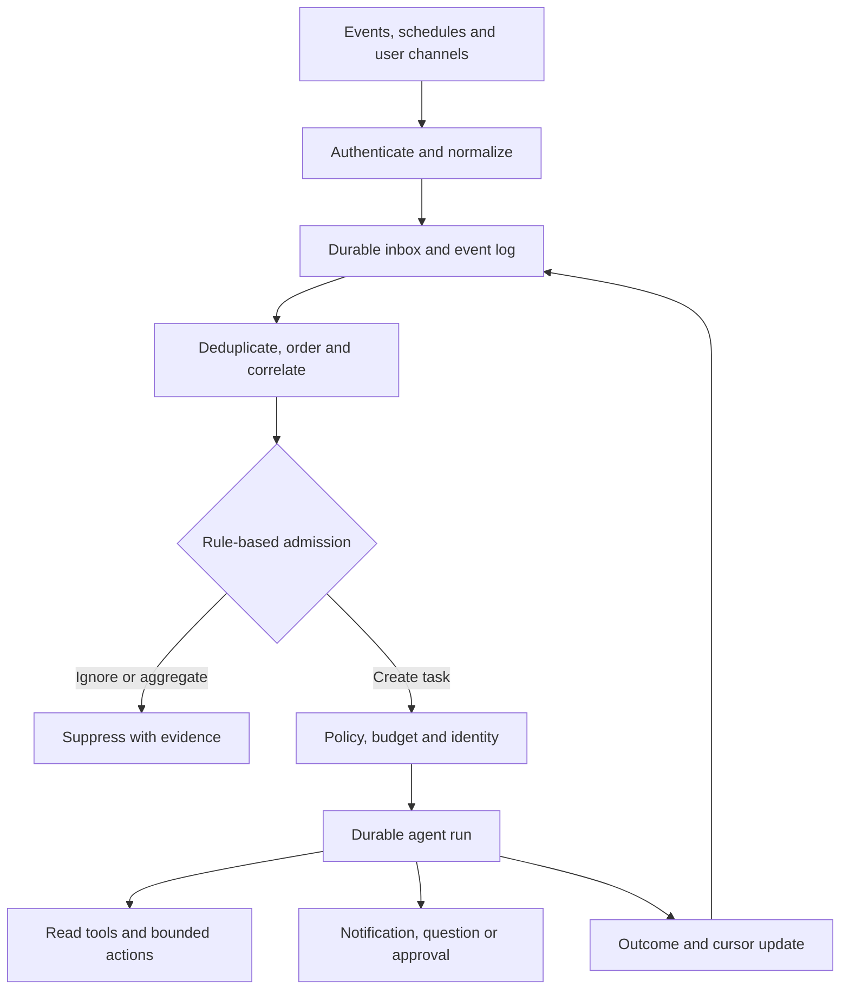

# Event-driven, ambient and background agents

> _Last reviewed: 2026-07-25 — see the [freshness policy](../appendix/maintenance.md). Broker, workflow and event specifications evolve; verify current delivery and retention semantics._

## Learning objectives

After this chapter you will be able to:

- decide when an event should trigger a rule, workflow, agent or human;
- design deduplication, cursoring, debounce, scheduling and durable execution;
- separate durable task state from streaming user transport;
- control ambient monitoring, notifications and autonomous effects;
- define SLOs and cost controls for background agents.

## Decision in one sentence

**Use deterministic event admission to decide whether an agent should wake; do not spend model tokens or create side effects merely because an event arrived.**

## Trigger patterns

| Trigger | Example | Key control |
|---|---|---|
| Domain event | shipment delayed | event identity and schema version |
| Webhook | carrier status callback | signature, replay window and deduplication |
| Schedule | daily policy drift scan | cursor, overlap and missed-run handling |
| Queue/task | analyze uploaded claim | lease, visibility timeout and retry |
| Telemetry | error budget burn | aggregation, hysteresis and incident ownership |
| User channel | email or chat mention | authenticated sender and conversation binding |

## Reference architecture



| Step | Description |
|---:|---|
| 1 | Verify webhook signatures, broker identity or scheduler ownership. |
| 2 | Persist the original event before acknowledging when delivery guarantees require it. |
| 3 | Apply idempotency, correlation, ordering and bounded lateness. |
| 4 | Use rules to suppress noise and decide whether agent reasoning adds value. |
| 5 | Issue a task identity and per-run budgets. |
| 6 | Checkpoint the run across crashes and long waits. |
| 7 | Contact people through governed channels with context and expiry. |
| 8 | Commit outcome and next cursor atomically or reconcile. |

Use [CloudEvents](https://github.com/cloudevents/spec) for portable event metadata where appropriate and [AsyncAPI](https://www.asyncapi.com/docs/reference/specification/v3.0.0) to describe message-driven interfaces. Neither defines business deduplication, authorization or agent behavior.

## Admission and noise control

Ambient agents can create infinite cost and notification fatigue. Gate by tenant, source, event type, materiality, confidence, cooldown, open-task correlation and remaining budget. Aggregate related events into a case before reasoning. Use watermarks/cursors for polling sources and record why an event was suppressed.

```yaml
monitor: delayed-shipment-v3
source: carrier-events
dedup_key: "${tenant}:${shipment}:${status_version}"
debounce: 10m
admission:
  status: [exception, lost]
  minimum_customer_impact: 2
budget:
  tasks_per_hour: 200
  tokens_per_task: 12000
  notifications_per_case: 2
```

## Durable run versus live transport

A background task may survive for hours while a WebSocket or browser tab does not. Persist semantic events and task state independently of the delivery channel. Clients reconnect with a cursor and receive snapshots plus subsequent events. Cancellation must revoke leases and credentials; a disconnected client does not automatically cancel an authorized business task.

Durable workflow systems such as Temporal can preserve progress and human pauses, but the SA must still define history growth, activity idempotency, version migration and recovery. The event broker is not the task state store.

## Notifications and human contact

Specify recipient selection, channel, quiet hours, localization, sensitive-data rules, acknowledgement, escalation, expiry and deduplication. A message should state why the agent woke, what it observed, what it did, what it needs and how to stop it. Never let untrusted event text choose recipients or approval scope.

## Evaluation and operations

Measure admitted-event precision/recall, duplicate-task rate, detection delay, stale cursor age, cost per useful outcome, notification acceptance, missed material events, task completion, cancellation latency and unauthorized effects. Test replay, reordering, event storms, poison messages, clock skew, missed schedules, worker crash and downstream outage.

## Northstar decision

Carrier events are normalized into a durable inbox. Rules aggregate repeated scans and wake the agent only for a material exception. The agent reads policy and case state, drafts a customer update and requests approval for compensation. A nightly reconciliation schedule finds shipments whose webhook was lost.

## Practical artifact: event-to-agent contract

Include event schemas, trust, delivery semantics, deduplication, ordering, admission, budgets, durable state, notification policy, effects, observability, SLOs and replay/failure tests.

## Lab

Simulate duplicates, reordering and a 10,000-event storm. Demonstrate deterministic suppression, one durable case, reconnectable progress and a reconciliation schedule.

## Further reading

- [CloudEvents specification](https://github.com/cloudevents/spec)
- [AsyncAPI specification](https://www.asyncapi.com/docs/reference/specification/v3.0.0)
- [12-Factor Agents](https://github.com/humanlayer/12-factor-agents)
- [Durable agent orchestration](02-orchestration-state.md)

