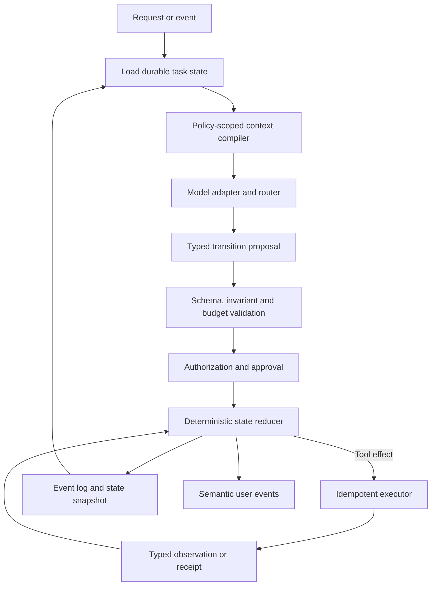

# Agent harness engineering

> _Last reviewed: 2026-07-25 — see the [freshness policy](../appendix/maintenance.md). “Harness engineering” is a practitioner term, not a formal standard; evaluate principles independently of frameworks._

## Learning objectives

After this chapter you will be able to:

- define the deterministic software surrounding a probabilistic model;
- separate reducer, context compiler, policy, executor and durable state;
- decide which control flow belongs in code and which may be model-directed;
- design framework-neutral ports and release tuples;
- review a harness for reliability, security and observability.

## Decision in one sentence

**Keep authority, state transitions and side effects in deterministic code; let the model propose bounded next actions inside that harness.**

## The harness boundary

The model is one component. The harness makes it a product by owning:

- request and task contracts;
- context compilation;
- model routing and structured-output validation;
- durable state and event history;
- policy and approval;
- tool execution and reconciliation;
- budgets, deadlines and stop rules;
- telemetry, evaluation and user transport.

This reflects the core lesson of [12-Factor Agents](https://github.com/humanlayer/12-factor-agents): own context and control flow, use structured outputs, compact errors and keep agents focused. Treat that project as practitioner guidance, not a universal standard.

## Reference harness



| Step | Description |
|---:|---|
| 1 | Normalize user, event or API input into a task command. |
| 2 | Load versioned state independently of chat history. |
| 3 | Compile only authorized, relevant context. |
| 4 | Route to a compatible model through a stable adapter. |
| 5 | Require a typed proposal such as call, ask, finish or escalate. |
| 6 | Validate schema, freshness, limits and state-machine legality. |
| 7 | Compute effective authority and required approval. |
| 8 | Apply a pure reducer before/after isolated effects as the protocol defines. |
| 9 | Store events and snapshots for replay, migration and incident analysis. |
| 10 | Stream product-level events without coupling durability to a socket. |

## Transition contract

```json
{
  "task_version": 18,
  "expected_state_version": 41,
  "proposal": "call_tool",
  "tool": "carrier.read_status@2",
  "arguments": {"shipment_id": "shp_2841"},
  "reason_code": "need_current_status",
  "observation_refs": ["order-2841-v7"],
  "remaining_budget": {"steps": 8, "tokens": 9200}
}
```

The harness rejects stale versions, unknown tools, impossible transitions and budget violations. The model’s reason may aid debugging, but it is not authorization evidence.

## Own control flow selectively

Encode known sequences, compliance rules, approvals and transaction recovery in code. Use model-directed routing where the path is genuinely variable and low enough consequence. A common design is deterministic outer workflow, bounded agentic inner loop, deterministic commit.

Keep ports for model, retrieval, memory, policy, tools, state, events and telemetry. Framework adapters implement those ports; business logic should not depend on opaque framework message classes. Version the release tuple across model, prompt, schemas, reducer, tools, policy and migrations.

## Error compaction and no-progress control

Normalize exceptions into safe codes, retryability, effect certainty and bounded diagnostic details. Do not append megabytes of stack traces to context. Track repeated tool/argument pairs, unchanged state, circular handoffs and diminishing budget. Stop, ask or escalate with evidence.

## Test and operate

Test reducer transitions as ordinary software. Add contract tests for adapters, failure injection for tools, replay tests for workflow versions, adversarial tests for context and end-to-end task environments. Trace task/run/step IDs, state versions, context manifests, model route, proposals, policy decisions, effects, receipts and stop reason.

Review build versus framework by durability, control, portability, operational skills and total lifecycle cost—not lines of code in the first prototype.

## Northstar decision

Northstar uses a deterministic case state machine and refund saga. The model can choose read-only investigation tools and propose an outcome. Policy and reducer decide whether approval is required; the executor commits with an idempotency key. Switching model providers does not change task state or refund semantics.

## Practical artifact: harness architecture record

Include component boundaries, ports, transition schema, state/event model, control allocation, context, policy, executor semantics, budgets, transport, telemetry, versioning, tests, framework decision and exit plan.

## Lab

Implement a pure reducer for `investigating → waiting_for_approval → executing → completed/unknown`. Feed valid and adversarial model proposals and prove that no proposal bypasses policy or commits twice.

## Further reading

- [12-Factor Agents](https://github.com/humanlayer/12-factor-agents)
- [Agent system design](06-agent-system-design.md)
- [Durable orchestration](02-orchestration-state.md)
- [Production tool engineering](08-production-tool-engineering.md)

