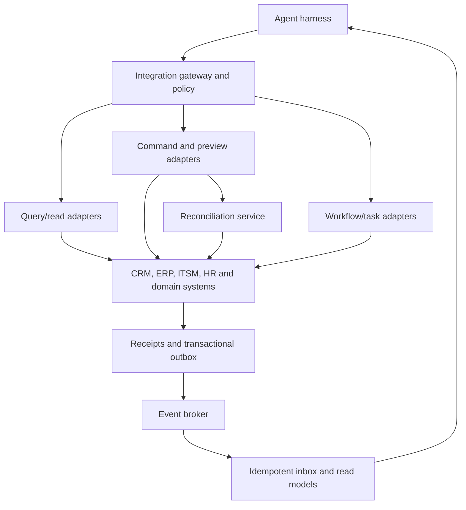

# Enterprise integration and systems-of-record architecture

> _Last reviewed: 2026-07-25 — see the [freshness policy](../appendix/maintenance.md). SaaS APIs, connector products and platform limits change; verify supported operations, licenses and delivery semantics._

## Learning objectives

After this chapter you will be able to:

- choose API, event, data, workflow or UI integration for an agent;
- preserve system-of-record ownership and transaction semantics;
- use inbox/outbox, idempotency, reconciliation and sagas;
- isolate enterprise credentials, schemas and failure domains;
- produce an integration matrix and effect-control design.

## Decision in one sentence

**An agent may coordinate enterprise work, but each authoritative state change remains owned, validated and receipted by the system of record.**

## Integration choices

| Pattern | Best fit | Main concern |
|---|---|---|
| Synchronous API/tool | query, preview or short command | deadlines, idempotency and unknown outcomes |
| Domain event | react to business change | ordering, duplicate delivery and schema evolution |
| Workflow/task API | long-running business process | durable state, cancellation and human tasks |
| Data/CDC feed | read models and analytics | freshness, lineage and purpose limitation |
| Batch/file exchange | legacy or regulated transfer | integrity, malware, reconciliation and delay |
| Browser/RPA | no supported interface | fragility, credential exposure and UI effects |

Use UI automation only after assessing supported APIs, integration platforms and workflow products. A “universal” browser connector usually transfers operational risk to the agent team.

## Reference architecture

| Step | Description |
|---:|---|
| 1 | Agent proposes a business operation through a stable domain contract. |
| 2 | Gateway resolves actor, task, purpose, tenant and effective authority. |
| 3 | Queries use permission-scoped read models and bounded fields. |
| 4 | Commands distinguish preview, validation and commit. |
| 5 | Long-running work returns a task identity instead of holding a request open. |
| 6 | The system of record validates invariants and owns the transaction. |
| 7 | A receipt/outbox communicates committed state reliably. |
| 8 | Consumers deduplicate events and update derived context. |
| 9 | Unknown command outcomes are queried and reconciled before retry. |

## Contract before connector

Define domain commands such as `case.open`, `refund.preview` and `shipment.note.add`; do not expose raw database tables or a generic “execute CRM request” tool. The contract includes:

- authenticated actor and delegated user;
- purpose, tenant and case;
- expected resource version;
- business fields with units and classifications;
- idempotency key and deadline;
- effect class and approval reference;
- success receipt and typed failure semantics.

Generated prose never becomes an authoritative identifier, amount or approval. Resolve and validate those fields deterministically.

## Consistency and effects

Agents operate across systems that do not share one transaction. Use local transactions plus durable messages, orchestration and compensation. A saga coordinates multiple committed steps, but compensation is a new business action, not time travel. Define which failures retry, reconcile, compensate or require a human.

The transactional outbox prevents “database committed but event lost” within one service boundary; an idempotent inbox prevents duplicate handling. They do not create exactly-once business outcomes across every dependency.

## Identity and data boundaries

Use workload identity for adapters and delegated user/task authority for business operations. Keep SaaS refresh tokens and administrative credentials outside model context. Minimize fields, preserve source/permission metadata, and apply residency and deletion to derived agent state. Separate production, evaluation and development tenants.

## Schema and lifecycle

Publish OpenAPI for request/response interfaces and AsyncAPI where message-driven contracts benefit. Version events for additive evolution, consumer lag and replay. Maintain owner, SLO, quota, support path, sandbox, certification tests and deprecation plan for every connector.

## Failure and evaluation

Test timeouts before and after commit, rate limits, stale versions, duplicate events, reordered messages, poison records, expired tokens, schema drift and regional outages. Measure task success, connector availability, unknown-outcome age, duplicate-effect rate, reconciliation backlog, stale read-model age and cost per completed business outcome.

## Northstar decision

Northstar reads CRM cases and order summaries through permission-scoped APIs. Refunds use preview and commit commands owned by the order platform. The agent cannot update order tables. A lost commit response enters reconciliation; carrier webhook events update a read model through an idempotent inbox.

## Practical artifact: enterprise integration matrix

For every system capture owner, interface, data/effects, identity, authority, schema/version, consistency, idempotency, retries, receipts, reconciliation, quotas, SLO, observability, environment and exit plan.

## Lab

Design a CRM–order–carrier flow. Inject “commit succeeded but response was lost” and a duplicate carrier event. Show that the system neither repeats the refund nor loses the status.

## Further reading

- [AsyncAPI specification](https://www.asyncapi.com/docs/reference/specification/v3.0.0)
- [Saga pattern](https://microservices.io/patterns/data/saga.html)
- [Production tool engineering](08-production-tool-engineering.md)
- [Approvals and recovery](04-approvals-recovery.md)

