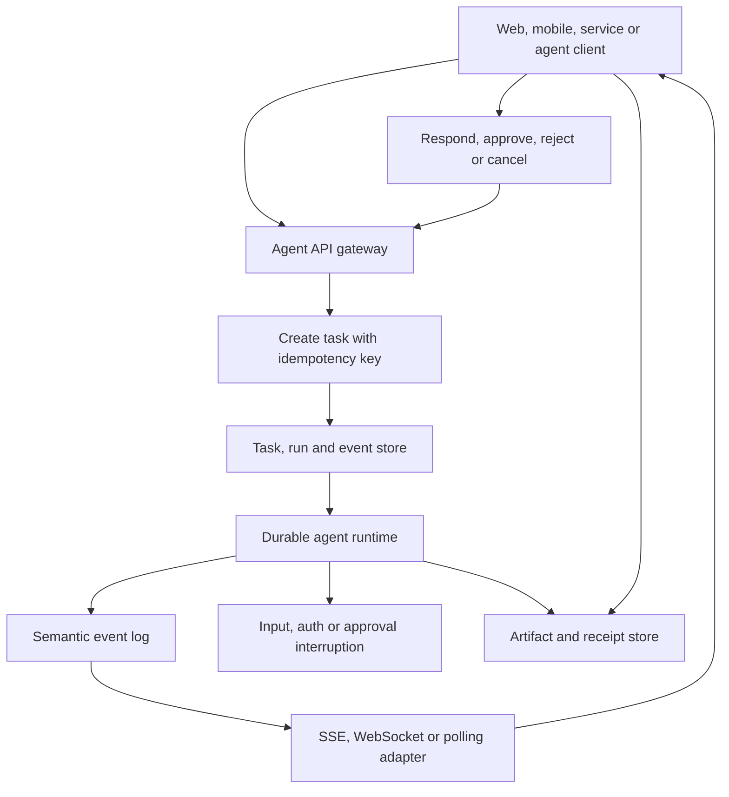

# Agent run API, streaming and artifact contracts

> _Last reviewed: 2026-07-25 — see the [freshness policy](../appendix/maintenance.md). Agent SDK and interoperability protocols change; keep the enterprise API independent of one framework._

## Learning objectives

After this chapter you will be able to:

- distinguish conversation, task, run, step, message and artifact identities;
- design synchronous, streaming and asynchronous agent interfaces;
- specify pause, resume, approval, cancellation and callbacks;
- make semantic event streams reconnectable and effects idempotent;
- define a portable external contract over framework-specific runtimes.

## Decision in one sentence

**Expose durable tasks and semantic events as the product contract; treat tokens, sockets and framework message objects as implementation details.**

## Resource model

| Resource | Meaning |
|---|---|
| Conversation/context | related user interaction, not necessarily one job |
| Task | durable goal and lifecycle visible to clients |
| Run/attempt | one execution attempt under a release tuple |
| Step | model, tool, approval or deterministic transition |
| Message | human/agent communication item |
| Artifact | versioned file or structured output |
| Interruption | input, authentication or approval required |
| Receipt | evidence of an external effect or authoritative outcome |

Avoid using one `session_id` for all meanings. A client may retry a request, a task may have several attempts, and a conversation may contain several tasks.

## Reference API flow



| Step | Description |
|---:|---|
| 1 | Authenticate client and bind user, tenant, purpose and requested use profile. |
| 2 | Create once using a client idempotency key. |
| 3 | Return task ID, context ID, current state and event cursor. |
| 4 | Execute independently of the request connection. |
| 5 | Append semantic events with monotonically comparable cursors. |
| 6 | Let clients reconnect and resume after the last acknowledged cursor. |
| 7 | Represent required input/approval as an expiring interruption. |
| 8 | Validate response against task version and approval scope. |
| 9 | Store large outputs and effects as governed artifacts/receipts. |

The A2A task lifecycle similarly distinguishes stateless messages from stateful tasks, interruptions and terminal states; see [Life of a Task](https://a2aproject.github.io/A2A/latest/topics/life-of-a-task/). Use its concepts where interoperability matters without copying protocol-specific objects into the internal domain.

## Lifecycle and methods

Recommended states:

`queued → running → input_required | auth_required | approval_required → running → completed | failed | cancelled | rejected | expired`

Useful methods:

```text
POST   /v1/tasks
GET    /v1/tasks/{task_id}
GET    /v1/tasks/{task_id}/events?after={cursor}
POST   /v1/tasks/{task_id}/inputs
POST   /v1/tasks/{task_id}/approvals
POST   /v1/tasks/{task_id}/cancel
GET    /v1/tasks/{task_id}/artifacts
GET    /v1/artifacts/{artifact_id}/versions/{version}
```

Create and effect endpoints accept idempotency keys. Mutation requests include an expected task/state version to reject stale approvals and cancellation races.

## Streaming contract

Stream semantic events such as `task.started`, `message.delta`, `tool.started`, `approval.required`, `artifact.updated`, `task.completed` and `task.failed`. Token deltas are optional presentation events; they must not be the only record of progress. Persist resumable events before exposing a cursor and bound retention.

SSE is simple for server-to-client progress; WebSocket supports bidirectional real-time interaction; polling is robust for enterprise integration. Choose independently from runtime durability. Backpressure should coalesce progress, never drop terminal state, approval or effect receipts.

## Artifacts and callbacks

Artifacts include content type, schema, size, hash, version, producer, sources, data classification, access policy, retention and scan status. Use short-lived download URLs or authenticated streaming. A callback/webhook carries task ID and new state, not the full sensitive report; sign it, deduplicate it and let the client fetch authoritative state.

## Errors and compatibility

Separate protocol errors from task failures. Return structured codes for invalid input, unauthorized, conflict/stale version, quota, unavailable, expired interruption and unsupported capability. Publish API versions and capability discovery. Keep framework types behind adapters so LangGraph, Microsoft Agent Framework, OpenAI Agents SDK or a custom harness can implement the same contract.

## Northstar decision

Northstar’s portal creates a task and reconnects by cursor. A refund approval is a version-bound interruption, while the customer report is an artifact. If the browser closes, the task continues; if the user cancels, the runtime revokes credentials and emits a terminal event after reconciling any in-flight effect.

## Practical artifact: agent API specification

Deliver resource schemas, lifecycle, methods, idempotency, concurrency, semantic events, backpressure, interruptions, artifacts, callbacks, authentication/authorization, errors, quotas, retention and compatibility.

## Lab

Model a task that disconnects during streaming, pauses for approval and loses the first callback. Demonstrate replay by cursor, one approval decision and one terminal outcome.

## Further reading

- [A2A task lifecycle](https://a2aproject.github.io/A2A/latest/topics/life-of-a-task/)
- [OpenAI Agents SDK run lifecycle](https://openai.github.io/openai-agents-python/running_agents/)
- [Agent harness engineering](10-agent-harness-engineering.md)
- [Reference architecture method and artifact contracts](../10-reference-architectures/00-method.md)
