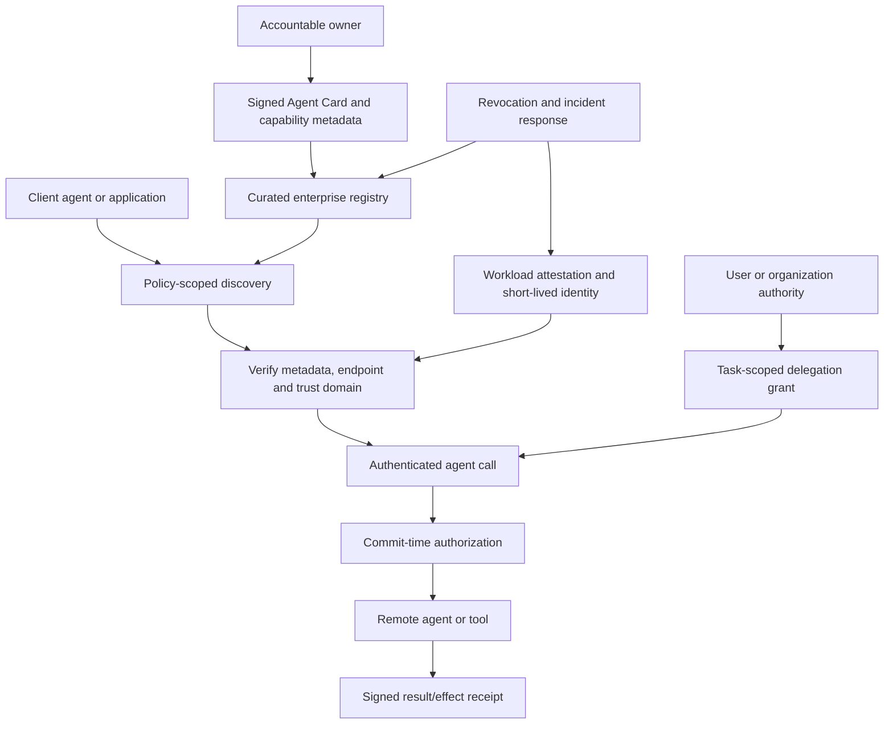

# Agent identity, discovery, registry and reputation

> _Last reviewed: 2026-07-25 — see the [freshness policy](../appendix/maintenance.md). Agent discovery and identity specifications are evolving; pin versions and verify current protocol security guidance._

## Learning objectives

After this chapter you will be able to:

- distinguish agent description, workload identity, user delegation and task authority;
- design private discovery and registry governance;
- bind Agent Cards and capabilities to verified operators and endpoints;
- use short-lived credentials, attestation, revocation and audit;
- treat reputation as evidence rather than authorization.

## Decision in one sentence

**Discover capabilities from signed metadata, authenticate the running workload, authorize the delegated task separately, and revalidate authority at every consequential effect.**

## Four identity layers

| Layer | Question | Example evidence |
|---|---|---|
| Operator/owner | Who is accountable for this agent service? | enterprise catalog ownership |
| Workload/service | What running software is calling? | cloud workload identity or SPIFFE SVID |
| User/organization | On whose behalf is it acting? | OAuth subject and delegation |
| Task/run | What may it do now, for what purpose? | short-lived task grant/capability |

An agent name, prompt persona or A2A Agent Card is not cryptographic identity. Workload authentication does not prove user consent. User authentication does not authorize every tool.

## Trust and discovery architecture

| Step | Description |
|---:|---|
| 1 | Owner publishes immutable versioned metadata and support contacts. |
| 2 | Registry verifies ownership, signatures, policy and review status. |
| 3 | Client discovers only agents permitted for its tenant and task. |
| 4 | Verify endpoint binding, metadata version and trust domain. |
| 5 | Authenticate the live workload with short-lived attested identity. |
| 6 | Obtain user/organization delegation restricted to purpose and capability. |
| 7 | Authorize every call and sensitive effect against current state. |
| 8 | Return evidence tied to task, workload and artifact versions. |
| 9 | Revoke compromised identities/cards and quarantine dependent tasks. |

## Agent Cards and catalogs

The [A2A specification](https://a2a-protocol.org/latest/specification/) uses an Agent Card to describe identity, endpoint, skills, capabilities and authentication requirements. Discovery may use a well-known URI, registry or direct configuration. Treat the card as metadata to verify, not a trust decision by itself.

An enterprise registry adds:

- accountable owner and business purpose;
- environments, regions and data classifications;
- approved capabilities and consequence tiers;
- endpoint/certificate/signature binding;
- protocol/schema versions and compatibility;
- security/evaluation evidence and expiry;
- incident, revocation and deprecation status.

Search and semantic matching can suggest candidates. Policy filters by tenant, jurisdiction, risk, cost and current health before the model sees them.

## Workload and delegated identity

[SPIFFE](https://spiffe.io/docs/latest/spiffe-specs/) defines portable workload identities and short-lived verifiable identity documents. Cloud managed workload identities can provide equivalent platform-native assurance. Bind identity to code/image, environment and trust domain where feasible.

Carry actor, delegator, task, purpose, scopes, resource constraints, expiry and unique token ID through downstream calls. Use token exchange or capability-style grants rather than sharing a user’s bearer token among subagents. Re-check resource version and approval at commit time because authority may have changed since planning.

## Reputation and trust evidence

Reputation may summarize availability, verified task outcomes, policy incidents or consumer feedback. It is vulnerable to gaming, selection bias and identity resets. Keep source, window, sample size and uncertainty; never let a high score bypass hard policy. Prefer attestations and task-specific evaluations for consequential selection.

## Threats and operations

Test card spoofing, endpoint takeover, stale metadata, malicious skill descriptions, registry poisoning, confused deputy, delegation laundering, replay, compromised workload, recursive discovery and reputation gaming. Log discovery query, candidates, selection reason, card/hash, workload identity, delegation chain, policy and receipt while minimizing personal data.

## Northstar decision

Northstar exposes a read-only carrier-research agent through a private registry. Its card names capability and endpoint; workload identity proves the deployed service. A Northstar task grant limits it to one tenant and case. Its reliability score influences routing but cannot grant refund authority.

## Practical artifact: agent trust record

Document owner, card/schema, registry, signatures, workload identity, trust domains, delegation, task grants, discovery policy, authorization, receipts, reputation evidence, revocation, incident handling and interoperability tests.

## Lab

Create three Agent Cards, including one spoofed high-reputation agent. Design discovery filters and prove that verified identity plus task authority—not name or score—controls selection and effects.

## Check yourself

1. Name the four identity layers and say which answers 'may it do this, now?'
2. A new agent has a five-star reputation and a card claiming refund capability. Why is that not enough to route a refund to it?
3. Why should subagents not share a user's bearer token, and what should travel downstream instead?
4. Name three registry threats you would test and a control for each.

What a strong answer covers

<ol>
<li>Operator/owner (who is accountable), workload/service (what software is calling), user/organization (on whose behalf), and task/run (what it may do now, for what purpose). The task grant answers the question. An agent name, persona, or Agent Card is not cryptographic identity, and workload authentication does not prove user consent.</li>
<li>A card is metadata to verify, and reputation is gameable evidence, not authorization. Routing needs a verified operator and endpoint binding, a workload identity, a task grant limited to the tenant and case, and policy at the effect. Northstar's reliability score may influence routing but can never grant refund authority.</li>
<li>A shared token launders the user's full authority. Carry the actor, delegator, task, purpose, scopes, resource constraints, expiry, and a unique token ID via token exchange or capability-style grants, and re-check the resource version and approval at commit time.</li>
<li>Card spoofing (signature and endpoint binding); registry poisoning (curation, signing, accountable owners); delegation laundering or confused deputy (task-scoped grants and policy at every effect); stale metadata (expiry and revalidation); reputation gaming (attestations and task-specific evaluations).</li>
</ol>

## Further reading

- [A2A specification](https://a2a-protocol.org/latest/specification/)
- [SPIFFE specifications](https://spiffe.io/docs/latest/spiffe-specs/)
- [MCP Registry](https://modelcontextprotocol.io/registry/)
- [MCP, A2A and enterprise interoperability](05-agent-protocols.md)
- [Agent identity and delegated authorization](01-tools-authorization.md)

