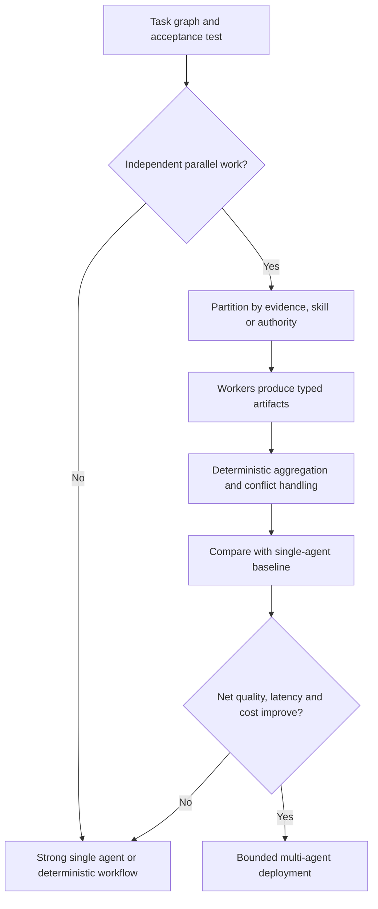

# Multi-agent scaling science

> _Architecture and measurement guide — last reviewed: 2026-07-25._

## Learning objectives

- determine whether decomposition benefits from multiple agents;
- model coordination overhead and correlated failure;
- benchmark a multi-agent design against a strong single-agent baseline.

## The decision in one sentence

Scale agents only when task parallelism or specialized context creates more value than coordination, contention, and correlated error.

## More agents is not a strategy

Recent controlled research from Google on [scaling agent systems](https://research.google/blog/towards-a-science-of-scaling-agent-systems-when-and-why-agent-systems-work/) found that architecture benefit depends strongly on task structure: parallelizable work can benefit, while sequential dependencies can degrade. Treat this as a hypothesis to test on your tasks.

| Factor | Benefit signal | Warning signal |
|---|---|---|
| Parallelism | independent subtasks dominate | long dependency chain |
| Specialization | distinct tools/evidence/permissions | only different personas |
| Diversity | uncorrelated methods and evidence | same model, context, and bias |
| Aggregation | objective merge or verifier | subjective majority vote |
| Coordination | small typed messages | transcript broadcasting |
| Economics | lower wall time or better success | token/tool amplification |

## Quantify the system

Represent work as a dependency graph. Estimate parallel fraction, critical path, per-node success, communication latency, token/tool cost, and merge risk. End-to-end success for a strict chain can fall as stages multiply. Redundant agents help only if errors are sufficiently independent and aggregation can identify the correct result.

Prefer a coordinator that manages tasks and state, not one that rewrites every message. Workers receive least-privilege scopes and return typed artifacts with provenance. Use explicit terminal states, deadlines, cancellation, backpressure, concurrency caps, idempotency, and conflict rules. Shared memory should be partitioned; broadcasting all context increases cost and prompt-injection spread.

Benchmark at least: strong single agent, single agent with more test-time compute, deterministic parallel workflow, and proposed multi-agent topology. Measure success, harmful error, variance, p95 wall time, total compute, tool calls, coordination failures, and recovery.

## Northstar example

Policy, medical-document, and calculation reviews can run in parallel because they use different evidence and validators. They return typed findings to a deterministic case assembler. A fourth “manager persona” adds no unique evidence and is removed. Conflicts between policy and calculation results route to a human; agents do not debate until one sounds persuasive.

## Practical artifact: scaling experiment card

Capture task DAG, baseline, topology, specialization rationale, shared-state design, independence assumption, aggregation rule, concurrency/budget, failure injection, metrics, confidence intervals, and rollback threshold.

Pair the experiment with [durable orchestration](02-orchestration-state.md) and [agent evaluation environments](../06-evaluation/09-agent-evaluation-environments.md).

## Further reading

- [Scaling Large Language Model-based Multi-Agent Collaboration, ICLR 2025](https://proceedings.iclr.cc/paper_files/paper/2025/hash/66a026c0d17040889b50f0dfa650e5e0-Abstract-Conference.html)
- [Scaling LLM Agents Requires Asymptotic Analysis, ICML 2025](https://proceedings.mlr.press/v267/meyerson25a.html)
