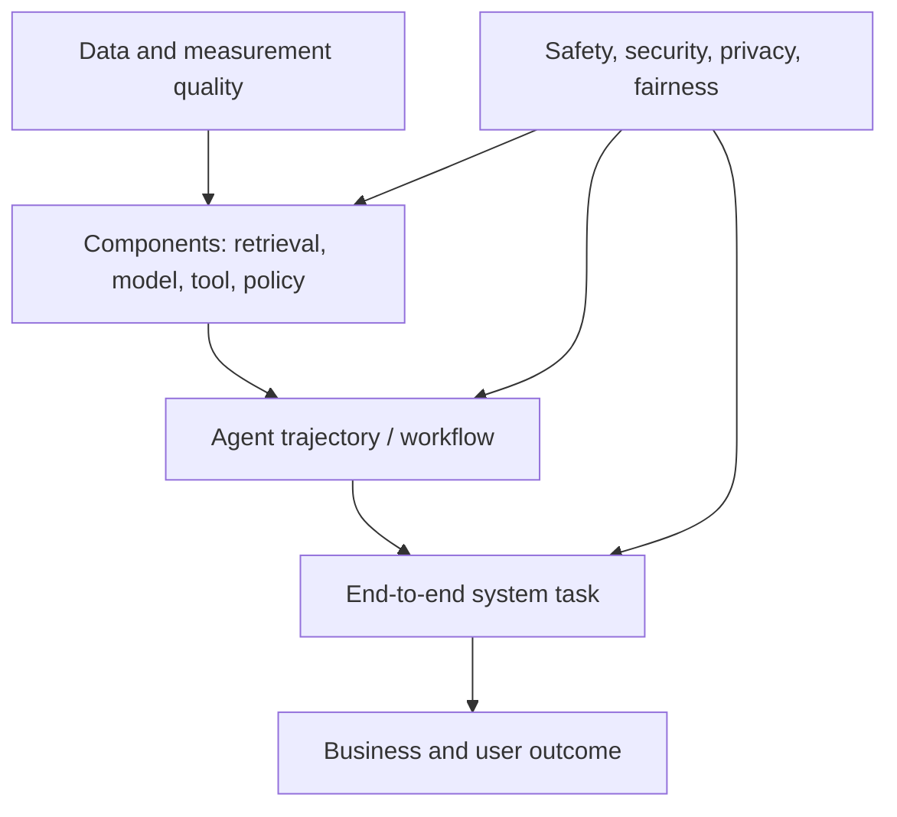

# Evaluation-driven development

> _Last reviewed: 2026-07-16 — see the [freshness policy](../appendix/maintenance.md)._

## Learning objectives

After this chapter you will be able to:

- write a quality contract before selecting a model;
- build representative datasets, slices, rubrics, and executable checks;
- separate component, trajectory, system, safety, and outcome evaluation;
- calibrate model judges and repeated stochastic trials;
- turn evaluations into CI, release, rollout, and incident decisions.

## Decision in one sentence

> **Define success, unacceptable failure, evidence, and release thresholds before optimizing prompts or choosing models.**

An AI demo asks, “Can it work?” Evaluation-driven development asks, “For which population and conditions, how often, compared with what, with what harm and cost, and what happens when it fails?”

## The quality contract

Create this artifact before implementation:

```text
User goal and unit of analysis:
Reference workflow / baseline:
Population and critical slices:
Observable success state:
Acceptable partial success:
Unacceptable outcomes and zero-tolerance invariants:
Quality, latency, cost, safety and accessibility measures:
Offline and online thresholds:
Human escalation and safe fallback:
Evidence owner and release authority:
```

“Accuracy above 90%” is incomplete without a dataset, sampling method, scorer, uncertainty, slice thresholds, and consequence model.

## Evaluation stack



Component scores diagnose; end-to-end outcomes decide. A good model score cannot compensate for stale retrieval, unauthorized tools, or an unusable approval flow.

## Build the dataset from reality

Combine:

- sampled and de-identified production-like tasks;
- domain-expert authored boundary cases;
- policy and safety invariants;
- historical failures and support escalations;
- synthetic variations used to expand—not define—coverage;
- adversarial cases from threat modeling;
- counterfactuals that change one material fact;
- must-abstain, unavailable-dependency, and recovery cases.

Record provenance, consent and use restrictions, collection period, inclusion rules, expected answer or state, scorer, difficulty, slice tags, and last review. Prevent train/test contamination and keep a sequestered release set where practical.

Critical slices might include language, modality, document type, task complexity, new versus returning users, permissions, high-value transactions, poor connectivity, accessibility needs, and temporal changes. Overall averages may hide a catastrophic slice.

## Choose the right oracle

| Oracle | Best for | Principal weakness |
| --- | --- | --- |
| Exact/executable check | schemas, math, state, citations, policy invariants | misses semantic quality |
| Reference answer | bounded questions with stable truth | can punish valid alternatives |
| Domain expert | nuance and consequence | costly, variable, slow |
| User outcome | real usefulness | confounded and delayed |
| Model judge | scalable semantic comparison | bias, drift, prompt sensitivity |
| Pairwise preference | choosing between candidates | does not yield absolute adequacy |

Use deterministic checks first. When using a model judge, define the rubric, blind model identity, randomize order, include an abstain option, and calibrate against multiple qualified humans. Track agreement by slice and revalidate after judge or prompt changes. See [evaluation measurement science](06-measurement-science.md).

## Evaluate agents as trajectories

Final-answer grading misses whether the agent accessed prohibited data, wasted 30 calls, ignored an approval, or accidentally succeeded. Capture tool selection, arguments, policy results, evidence, state transitions, retries, approvals, side effects, compensation, stop reason, tokens, time, and cost.

For stochastic systems, run repeated trials. Report per-task success probability and distributions—not only one lucky run. Distinguish:

- `pass@k`: at least one of k attempts succeeds;
- `pass^k`: all k attempts succeed, a more relevant reliability view for repeated use.

Keep retry policy fixed during comparisons. Unlimited retries can manufacture benchmark success while destroying latency and cost.

## Error taxonomy before prompt tuning

Classify failures by the first controllable cause:

```text
requirements → data/corpus → retrieval/context → model reasoning
→ tool/authorization → orchestration/state → human interface
→ infrastructure → measurement
```

Then record severity, frequency, affected slice, detectability, recovery, and owner. A prompt change is appropriate only when evidence points to model behavior; it cannot repair missing source data or a broken permission boundary.

## Experiment manifest

Every run should capture immutable identifiers for dataset, code, prompt/instruction, tool schemas, model and parameters, retriever/index, policy, environment, graders, seeds where supported, trial count, and cost. Store aggregate metrics plus case-level outputs under appropriate privacy controls.

Compare candidates on a Pareto frontier of outcome quality, critical-risk rate, p95 latency, and cost per successful task. Define tie-breakers before seeing results.

## From offline evaluation to production

1. **Unit and contract tests:** schemas, policy invariants, parsers, tools.
2. **Component evaluations:** retrieval, classifiers, generation, judge calibration.
3. **Scenario and trajectory evaluations:** complete workflows and failures.
4. **Adversarial and abuse testing:** misuse, prompt injection, leakage, unsafe actions.
5. **Shadow:** observe production inputs without affecting users.
6. **Canary:** small, controlled exposure with rollback thresholds.
7. **Online experiment:** measure user outcomes with guardrails and informed governance.
8. **Continuous monitoring:** detect drift, new failures, and feedback loops.

The [NIST Generative AI Profile](https://doi.org/10.6028/NIST.AI.600-1) treats measurement and evaluation, red-teaming, incident disclosure, and production feedback as connected risk-management practices. Evaluation is not a one-time benchmark.

## Release rules

Use three kinds of gates:

- **invariants:** zero unauthorized actions, unresolved critical vulnerabilities, or unapproved irreversible effects;
- **non-regression:** no material decline against the incumbent overall or on critical slices;
- **minimum utility:** quality and outcome must exceed the reference workflow enough to justify new risk and cost.

Specify confidence and minimum sample size. A tiny apparent gain inside measurement noise is not a release reason. Any changed model, prompt, retrieval index, tool schema, policy, workflow, or judge triggers the relevant subset of evaluation.

## Northstar worked example

Northstar defines the unit as one delayed-shipment case, not one model response. Success requires correct diagnosis, policy-grounded options, no unauthorized disclosure or state change, appropriate approval, confirmed transaction, and user-understandable completion within the latency budget. The baseline is the current employee workflow. Slices include cross-tenant lookalikes, policy changes, multilingual users, lost packages, high-value orders, dependency failure, and must-escalate cases.

## Practical artifact: evaluation plan

Submit the quality contract, dataset card, slice matrix, oracle/rubric, judge calibration report, experiment manifest, error taxonomy, release gates, rollout design, monitoring-to-dataset feedback loop, and named decision owner.

## Lab

Create 50 Northstar tasks, including ten critical-risk cases. Evaluate two system variants with at least five trials per stochastic agent task. Calculate task-level success distribution, critical-slice results, p95 latency, cost per success, and human/judge agreement. Triage ten failures by first controllable cause and write a release recommendation that acknowledges uncertainty.

## Check yourself

1. Why does a high component score not prove system quality?
2. When is `pass^k` more informative than `pass@k`?
3. How can synthetic data distort a release decision?
4. What changes require re-evaluation?
5. Who owns the final release decision?

## Further reading

- [NIST AI RMF: Generative AI Profile](https://doi.org/10.6028/NIST.AI.600-1).
- [AgentBench](https://proceedings.iclr.cc/paper_files/paper/2024/hash/e9df36b21ff4ee211a8b71ee8b7e9f57-Abstract-Conference.html), ICLR 2024.
- [τ-bench](https://arxiv.org/abs/2406.12045).
- [Evaluation datasets and rubrics](01-datasets-rubrics.md).
- [Regression gates and release decisions](05-regression-gates.md).
