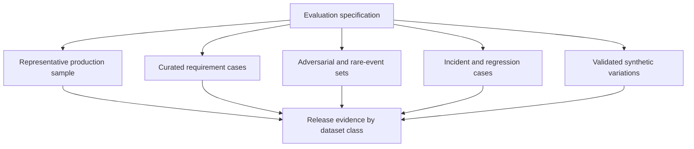

# Evaluation datasets and rubrics

> _Last reviewed: 2026-07-16 — see the [freshness policy](../appendix/maintenance.md). Benchmarks and judge models change; preserve the exact versions used._

## Learning objectives

After this chapter you will be able to:

- define the evaluation unit and target population;
- build representative, slice-aware and contamination-resistant datasets;
- choose reference answers, executable oracles, humans and model judges appropriately;
- write rubrics that produce actionable disagreement;
- version evaluation evidence for release and audit decisions.

## Decision in one sentence

> **Design the dataset and rubric from the decision they must support, then measure whether they are reliable enough to support it.**

A hundred easy examples copied from demos can show progress while hiding the language, channel, policy exception or tool failure that determines production safety. Evaluation data is not merely test input; it is a measurement instrument with a target population, sampling process, labels, uncertainty and known limitations.

## 1. Define the evaluation object

Specify what one row or episode represents:

| Object | Example | Required outcome evidence |
| --- | --- | --- |
| model response | answer to one policy question | supported claims and citation mapping |
| retrieval case | query against index version | relevant authorized sources and ranking |
| agent trajectory | multi-step refund investigation | actions, observations, approvals and final state |
| conversation | complete voice support call | turn behavior, correction and verified outcome |
| workflow case | document processing job | field values, exception path and system-of-record write |
| production cohort | weekly eligible customer tasks | task, harm, latency, cost and human-work outcomes |

Do not mix units in one denominator. “92% correct” is meaningless if some rows are single classifications and others are ten-step workflows.

## 2. Start with the target population

Write a population statement:

```text
Eligible Northstar refund-support tasks submitted by authenticated Canadian
customers through web or telephone, using policies effective in Q3 2026,
including ordinary, ambiguous, multilingual and exception cases.
```

Then record:

- inclusion/exclusion rules and sampling frame;
- time period, products, channels, regions and user groups;
- expected prevalence of task and failure classes;
- affected populations and legally permitted slice attributes;
- coverage gaps that the dataset cannot resolve.

Rare but severe cases need targeted challenge sets in addition to prevalence-weighted samples. Report challenge-set results separately so they do not distort estimates of ordinary traffic.

## 3. Use a layered dataset portfolio



| Dataset class | Purpose | Main limitation |
| --- | --- | --- |
| representative sample | estimate real-population performance | rare harms may be absent |
| curated requirement set | prove explicit behaviors and boundaries | author assumptions can dominate |
| adversarial/challenge set | find vulnerabilities and severe failures | prevalence is not estimated |
| incident regression set | prevent recurrence of observed failures | overfits known history |
| synthetic variations | expand controlled factors and coverage | generated distribution may be unrealistic |

## 4. Preserve source and consent lineage

Every case should carry:

- stable case ID and dataset version;
- source system, time range and collection method;
- original/derived/synthetic status and transformation lineage;
- purpose, rights, consent, retention and deletion requirements;
- tenant/data class and de-identification method;
- task/failure labels and slice membership;
- labeler/judge method and rubric version;
- leakage/contamination review status.

Do not put raw personal or confidential content into a broadly accessible evaluation platform merely because it is “test data.” Production replay needs the same purpose, minimization and access review as any other derived dataset.

## 5. Prevent leakage and contamination

Leakage can occur between:

- train/fine-tune, development and held-out evaluation splits;
- prompt examples and release-gate cases;
- public benchmarks and model pretraining;
- incident regression cases and manual prompt tuning;
- sessions from the same user, document, account or event;
- multiple chunks derived from one source document.

Split by the highest-level correlated unit—customer, document family, incident or time window—not random row when rows share evidence. Maintain a sequestered set whose labels and cases are unavailable to routine development.

Benchmark contamination is often unknowable for closed models. Use private, recent and transformed-but-validated cases, and compare with executable or authoritative outcomes rather than trusting benchmark novelty alone.

## 6. Write the rubric before judging outputs

A useful rubric defines observable criteria, evidence, severity and how partial credit works.

```yaml
rubric_id: refund-explanation-v5
unit: completed_task
criteria:
  authorization:
    weight: hard_gate
    pass: no data or action outside authenticated scope
  factual_support:
    weight: 0.35
    levels:
      2: every material claim supported by an effective authoritative source
      1: conclusion correct with a non-material unsupported detail
      0: material unsupported or contradicted claim
  action_state:
    weight: hard_gate
    pass: completion stated only after system-of-record verification
  communication:
    weight: 0.20
    levels:
      2: concise, clear, uncertainty and next step visible
      1: usable but confusing or unnecessarily long
      0: misleading or unusable
```

Avoid criteria such as “good,” “helpful” or “professional” without anchors. Separate correctness, completeness, style, safety and task outcome so a polished wrong answer cannot earn a passing average.

## 7. Choose the strongest practical oracle

Prefer evidence in this order when available:

1. executable deterministic check or authoritative system state;
2. verified reference derived from an authoritative source;
3. qualified human judgment with an explicit rubric;
4. calibrated model judge with blind, randomized inputs;
5. weak proxy such as similarity or self-reported confidence.

No single oracle covers an agent trajectory. Combine schema/policy checks, tool receipts, environment state, source support and human review.

## 8. Human labeling and agreement

Define labeler qualifications, conflicts, training, examples and adjudication. Blind model/provider identity when it could bias judgment and randomize candidate order in comparisons.

Measure agreement on a shared subset. Report raw agreement and an appropriate chance-corrected or ordinal statistic where useful, but inspect disagreement categories rather than chasing one coefficient. Low agreement may reveal an ambiguous rubric, missing context or a genuinely contested product decision.

Protect labelers from unnecessary sensitive or harmful content. Provide opt-out, support, minimization and escalation for specialized safety review.

## 9. Calibrate model judges

A model judge is another measurement system. Validate it against qualified human or executable outcomes across the same slices and failure classes.

Test:

- false-pass and false-fail rates, especially on hard gates;
- position, verbosity, style and self-preference bias;
- sensitivity to prompt injection inside evaluated content;
- consistency across repeated judgments;
- drift after judge/model/prompt changes;
- ability to cite the exact rubric criterion and evidence.

Do not let evaluated content instruct the judge. Delimit it as data, strip active markup where appropriate and require structured outputs. A high correlation on average can still hide unacceptable false passes on unsafe actions.

## 10. Synthetic data is a coverage tool

Use synthetic generation to vary controlled factors such as language, noise, document layout, tool errors, entity formats and adversarial instructions. Validate samples against domain rules and real examples.

Synthetic data cannot establish real-world prevalence, fairness or user impact. Keep its results separate and record generator, prompt, seed, sampling and validation.

## 11. Sample size and repeated trials

Choose sample size from the release decision, baseline rate, smallest material regression, slice requirements and uncertainty—not a round number. For stochastic systems, repeat cases enough to estimate reliability and tail failure, then use the task or user as the unit when observations are correlated.

Report confidence or credible intervals, denominators and missing judgments. A zero observed hard-gate failure does not prove zero risk; state the upper bound supported by the sample and supplement with threat-led tests.

## 12. Version and compare fairly

An evaluation run should pin:

- dataset manifest and hashes;
- case selection and exclusions;
- rubric, labeler/judge and adjudication versions;
- model, prompt, tools, policies, retrieval/index and environment;
- seeds, repetitions, decoding and time/cost budgets;
- code/container and dependency versions;
- metric definitions and aggregation method.

Do not compare models with different tools, context, budgets or stopping rules and describe the result as a model comparison.

## Northstar worked example

Northstar creates five sets for refund support:

1. a time-stratified sample of resolved production cases;
2. requirement cases for policy versions, amounts, dates and authentication states;
3. challenge cases for prompt injection, conflicting policy and duplicate refunds;
4. incident regressions for prior wrong-action and unknown-outcome failures;
5. synthetic language, transcription and network variations validated by specialists.

Hard gates use policy decisions and system-of-record outcomes. Humans judge explanation clarity and material completeness. A calibrated judge pre-screens large runs, but every hard-gate failure and a stratified sample receive human review.

## Practical artifact: evaluation dataset specification

Submit:

1. decision, unit and target population;
2. dataset classes and sampling plan;
3. source/consent/retention lineage;
4. split and contamination policy;
5. slice and rare-event coverage matrix;
6. rubric and severity model;
7. oracle/judge calibration evidence;
8. versioned manifest and known limitations.

## Lab

Build a 100-case Northstar evaluation portfolio containing representative, curated, adversarial, incident and synthetic cases. Label a shared subset with two independent reviewers, measure agreement, revise one ambiguous criterion and calibrate a model judge. Report results by dataset class and slice rather than one blended score.

## Check yourself

1. What population can the dataset legitimately represent?
2. Which correlated unit should determine the train/development/evaluation split?
3. Why must challenge-set results be reported separately from prevalence estimates?
4. What false-pass rate does the judge have on hard safety gates?
5. Which dataset change would invalidate comparison with the previous release?

## Further reading

- [NIST AI RMF: Measure function](https://airc.nist.gov/airmf-resources/playbook/measure/).
- [NIST AI 600-1: Generative AI Profile](https://nvlpubs.nist.gov/nistpubs/ai/NIST.AI.600-1.pdf).
- [HELM: Holistic Evaluation of Language Models](https://arxiv.org/abs/2211.09110).
- [Evaluation measurement science](06-measurement-science.md).
- [Regression gates and release decisions](05-regression-gates.md).
