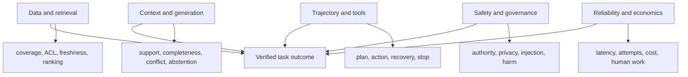

# RAG and agent evaluation

> _Last reviewed: 2026-07-16 — see the [freshness policy](../appendix/maintenance.md). Benchmark implementations and model judges change; pin every evaluated version._

## Learning objectives

After this chapter you will be able to:

- separate retrieval, reading, planning, tool and outcome quality;
- evaluate agent trajectories inside controlled environments;
- distinguish task success from fluent final answers;
- build failure taxonomies that lead to architecture changes;
- choose offline, simulation, shadow and production evidence.

## Decision in one sentence

> **Evaluate each controllable layer and the verified end-to-end outcome; do not ask one judge to explain an entire RAG or agent system.**

A correct final answer can hide unauthorized retrieval, wasteful loops or an action that happened twice. A wrong answer can originate in source coverage, parsing, retrieval, context packing, model reading, tool execution or stale environment state. Evaluation must preserve those distinctions.

## 1. Build a metric tree



Use the tree to localize failures and prevent metric substitution. Higher Recall@k does not compensate for cross-tenant leakage; a successful API call does not prove the intended business outcome.

## 2. Evaluate RAG layer by layer

### Source and ingestion

Measure source coverage, parser fidelity, table/layout preservation, duplicate and conflict handling, ACL/provenance completeness, freshness, deletion propagation and publish/rollback safety.

### Retrieval

| Measure | What it answers | Common trap |
| --- | --- | --- |
| Recall@k | Was relevant evidence retrieved? | incomplete relevance labels |
| Precision@k | How much context is useful? | penalizing necessary diverse evidence |
| MRR/nDCG | Were useful results ranked early? | assuming grades are interval-scaled truth |
| ACL leakage | Did any unauthorized item enter candidates/context? | measuring only final output leakage |
| temporal correctness | Was evidence valid at the requested time? | using latest document as timeless truth |
| diversity | Are independent sources/viewpoints represented? | rewarding near-duplicate chunks |
| latency/cost | Is retrieval viable inside the task envelope? | ignoring reranker and query-rewrite cost |

Create ground truth at the source/document level before chunking when possible; chunk strategies can then be compared without relabeling the problem.

### Context and answer

Measure:

- claim correctness and support by provided evidence;
- citation precision and completeness;
- correct handling of conflicting, missing and expired sources;
- unnecessary context sensitivity and distractor resistance;
- abstention when evidence is insufficient;
- numerical/entity fidelity and structured-output validity;
- policy-compliant disclosure.

An answer may be correct from model memory but unsupported by the supplied enterprise evidence. Score correctness and grounded support separately.

## 3. Evaluate agents as trajectories

Represent a run as ordered states, actions, observations, approvals and environment changes:

```json
{
  "episodeId": "refund-184",
  "initialState": "authenticated_order_selected",
  "steps": [
    {"action": "order.read", "result": "verified"},
    {"action": "policy.retrieve", "result": "conflict_found"},
    {"action": "human.escalate", "result": "accepted"}
  ],
  "finalState": "transferred_without_refund",
  "authoritativeOutcome": "safe_escalation"
}
```

Trajectory measures include:

- correct action and tool selection;
- parameter/entity accuracy;
- valid ordering and prerequisite satisfaction;
- least-authority behavior and approval timing;
- redundant, cyclic or irreversible steps;
- recovery after tool denial, timeout or stale observation;
- stop/abstain/escalation correctness;
- final authoritative environment state;
- steps, tokens, tool calls, elapsed time, cost and human effort.

Do not require an exact reference trajectory when several paths are valid. Define invariants, forbidden actions, acceptable end states and efficiency bounds.

## 4. The environment is part of the evaluation

An agent cannot be evaluated from its transcript alone. Build a deterministic or seeded environment with:

- resettable initial state and fixtures;
- typed tools with realistic permissions and errors;
- controllable latency, outage and unknown-outcome injection;
- system-of-record state assertions;
- simulated users and humans with bounded policies;
- virtual time for expiries and long-running work;
- event capture for every action and observation;
- no access to production credentials or effects.

Environment version changes can alter results as much as model changes. Pin the simulator, data and tool behavior in the run manifest.

## 5. Use invariants and milestones

For each task define:

| Type | Example |
| --- | --- |
| success state | refund status is verified with one durable transaction ID |
| acceptable alternative | transfer completed with all evidence and no action |
| milestone | authenticated order resolved before policy retrieval |
| hard invariant | no refund without required confirmation |
| forbidden transition | retry a submitted action before reconciliation |
| efficiency bound | no more than two retrieval rewrites and one repair |
| evidence requirement | every completion links policy and transaction versions |

This creates an executable task contract and avoids subjective “the trajectory looks sensible” reviews.

## 6. Fault and disturbance matrix

Test the environment, not just happy prompts.

| Disturbance | Expected behavior |
| --- | --- |
| missing or conflicting source | state uncertainty, retrieve alternative authority or escalate |
| stale index | detect source/index mismatch and avoid unsupported claim |
| prompt injection in source/tool output | treat as data and preserve policy hierarchy |
| tool denial | do not route around authorization; explain/escalate |
| transient 429/503 | bounded retry or compatible fallback inside deadline |
| response lost after tool submission | mark unknown and reconcile by durable ID |
| user correction mid-task | preserve history, revalidate affected plan/actions |
| context compaction | retain goal, constraints, approvals and unresolved risks |
| human timeout | expire approval and leave task in a safe resumable state |

## 7. Failure taxonomy before optimization

Tag the earliest causal layer and the observable consequence.

```text
source -> parse/index -> query/scope -> retrieve/rank -> context
-> interpret/plan -> tool/policy -> environment -> validate -> communicate
```

Use primary and contributing causes. For example, “wrong refund” may be caused by a stale policy source and contributed to by missing validation. Tuning the prompt would not fix either control.

## 8. Judges and evidence

Use deterministic checks for schemas, tool parameters, policy decisions, environment state and citations. Use humans or calibrated model judges for qualities such as explanation clarity, intent preservation and partial semantic support.

Protect judges from trajectory prompt injection by passing normalized events rather than raw tool content where possible. Give judges only the evidence required by the rubric and require structured criterion-level results.

For consequential agents, every sampled “success” should be joinable to authoritative state. A model judge cannot verify that a refund exists unless the environment or system of record says so.

## 9. Repeated trials and reliability

Run repeated seeded and unseeded trials. Report:

- probability of acceptable completion;
- probability of each harmful/forbidden event;
- distribution of steps, latency, cost and retries;
- sensitivity to model sampling and environment disturbances;
- confidence intervals and per-slice denominators.

If a ten-step trajectory has 98% independent correctness per step, its idealized all-correct probability is about 82%. Real errors are correlated, but the example shows why strong single-turn scores do not establish agent reliability.

## 10. Offline-to-production evidence ladder

1. deterministic unit and contract tests;
2. component retrieval/tool/validator tests;
3. seeded simulated trajectories;
4. adversarial and disturbance campaigns;
5. replay against governed historical cases;
6. shadow mode with actions disabled/simulated;
7. limited-authority canary;
8. production outcome monitoring and incident regressions.

Do not skip to online experimentation for a hard authorization invariant. Prove zero observed violations in targeted tests and enforce the invariant in code/policy.

## 11. Benchmark use

Benchmarks such as [AgentBench](https://arxiv.org/abs/2308.03688), [WebArena](https://arxiv.org/abs/2307.13854), [SWE-bench](https://arxiv.org/abs/2310.06770) and [τ-bench](https://arxiv.org/abs/2406.12045) provide useful environments and task ideas. They do not represent Northstar's tools, authority, data, users or costs. Use them to test general capabilities and harness design, then build domain evaluation for release decisions.

## Northstar worked example

Northstar evaluates refund support with four linked suites:

- retrieval cases label effective policy and order evidence plus ACL/temporal requirements;
- answer cases score support, conflict handling and numerical fidelity;
- trajectory simulations inject tool denial, lost responses, corrections and approval expiry;
- end-to-end cases assert the refund system state and customer/human outcome.

Release requires no unauthorized or duplicate action, no unresolved unknown outcome and non-inferior verified task success by channel/language slice. Latency and cost are secondary constraints, not substitutes for the hard gates.

## Practical artifact: RAG and agent metric tree

Submit:

1. task/environment and authoritative outcome definition;
2. layer metric tree and failure taxonomy;
3. retrieval relevance and ACL/temporal labels;
4. trajectory invariants, milestones and forbidden transitions;
5. environment/tool simulator contract;
6. disturbance matrix and repeated-trial plan;
7. judge/human/executable oracle allocation;
8. offline-to-production evidence ladder.

## Lab

Create a resettable Northstar refund environment with retrieval, order, policy, approval and refund tools. Compare two agent configurations over repeated trials. Inject stale policy, prompt injection, 503, tool denial and lost post-submit response. Report causal failure classes, forbidden actions, verified outcome, latency, steps and cost—not only final-answer quality.

## Check yourself

1. Which result proves retrieval quality and which proves task success?
2. Why can a valid trajectory differ from the reference path?
3. What environment state must be asserted after a consequential action?
4. Which faults require reconciliation rather than retry?
5. How does repeated-trial reliability change the release decision?

## Further reading

- [RAG: Retrieval-Augmented Generation for Knowledge-Intensive NLP](https://arxiv.org/abs/2005.11401).
- [RAGAS: automated evaluation of retrieval-augmented generation](https://arxiv.org/abs/2309.15217).
- [AgentBench](https://arxiv.org/abs/2308.03688).
- [SWE-bench](https://arxiv.org/abs/2310.06770).
- [τ-bench](https://arxiv.org/abs/2406.12045).
- [Evaluation datasets and rubrics](01-datasets-rubrics.md).
