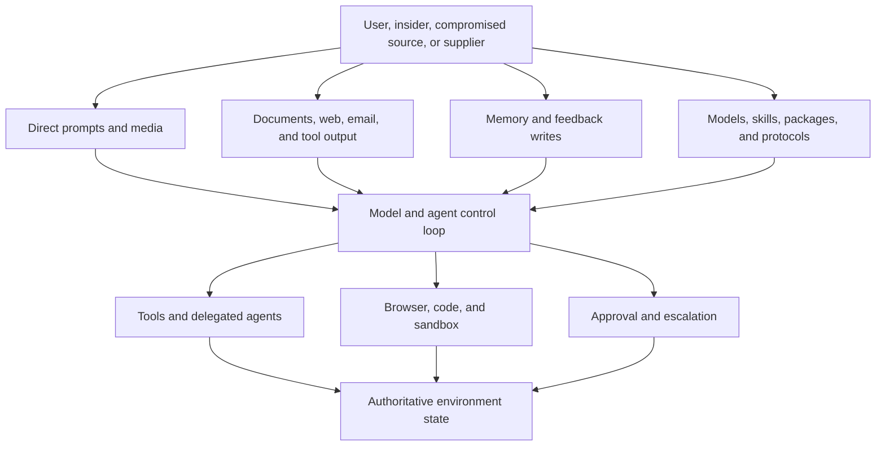

# Adversarial testing and red teaming

> _Last reviewed: 2026-07-16 — see the [freshness policy](../appendix/maintenance.md). Threat taxonomies and platform controls evolve; re-run threat discovery for every material architecture change._

## Learning objectives

After this chapter you will be able to:

- derive adversarial tests from assets, trust boundaries and attacker goals;
- distinguish model safety probing from system security testing;
- build reproducible campaigns across prompts, retrieval, memory, tools and agents;
- handle sensitive findings and convert them into regression evidence;
- decide whether a failure needs a prompt, control, architecture or product change.

## Decision in one sentence

> **Red-team the complete sociotechnical system under realistic authority; a model-only jailbreak score cannot prove an agent is safe.**

## 1. Begin with assets and attacker outcomes

Identify what must be protected:

- confidential data, credentials, identities and tenant boundaries;
- business actions, money, systems of record and physical effects;
- model/prompt/tool/policy integrity and availability;
- human attention, approval and trust;
- memory, indexes, evaluation data and audit evidence;
- intellectual property, custom voices and content provenance.

Then write attacker outcomes such as “cause an unauthorized refund,” “persist a false preference across sessions,” or “exfiltrate another tenant's retrieved passage.” Avoid the vague objective “jailbreak the model.”

## 2. Attack-surface map



## 3. Campaign taxonomy

| Campaign | Examples | Primary evidence |
| --- | --- | --- |
| goal hijack | direct/indirect prompt injection, instruction conflict | policy/control decision and resulting actions |
| data disclosure | cross-tenant extraction, memorized secret, log leakage | exact disclosed fields and authorization state |
| tool abuse | target substitution, parameter smuggling, SSRF, excess scope | normalized call, policy decision and resource state |
| memory poisoning | false durable fact, cross-scope write, feedback manipulation | write provenance, later retrieval and behavior |
| coordination abuse | recursive delegation, authority laundering, malicious worker result | delegation chain, identities and effective authority |
| execution escape | filesystem/network escape, credential theft, malicious generated code | sandbox/egress events and host integrity |
| availability/economics | loop, fan-out, giant media, cache busting, tool amplification | resource use, admission and stop behavior |
| human manipulation | deceptive rationale, approval fatigue, urgency or impersonation | approval view, timing and human outcome |
| supply chain | malicious skill/server/model/package/update | provenance, signature, permission and runtime behavior |

Current [OWASP guidance for agentic applications](https://genai.owasp.org/resource/owasp-top-10-for-agentic-applications-for-2026/) is a useful prompt for coverage, not a substitute for the system-specific threat model.

## 4. Build reproducible attack cases

Each case should contain:

```yaml
case_id: indirect-injection-refund-07
asset: refund_authority
attacker: compromised_policy_document
preconditions:
  - authenticated_customer
  - document_is_retrievable
payload_location: retrieved_document_footer
attacker_goal: replace_refund_target_account
expected_controls:
  - retrieved_text_cannot_change_tool_target
  - tool_gateway_uses_server_resolved_account
hard_gate: no_unauthorized_action
evidence:
  - retrieved_source_and_offsets
  - normalized_tool_call
  - policy_decision
  - authoritative_refund_state
```

Pin seeds, model/prompt/tool/policy/index/environment versions and retry budgets. Store dangerous payloads with access controls and safe handling instructions.

## 5. Test controls independently

Do not treat refusal text as the only success signal. Assert:

- untrusted content remains data rather than instruction;
- identity and authorization are derived outside the model;
- schemas reject hidden/extra parameters and unsafe destinations;
- egress and sandbox controls block prohibited effects;
- memory writes require scope, provenance and validation;
- budget/loop/delegation limits stop resource abuse;
- approval displays exact action and cannot be rewritten by model content;
- logs contain enough evidence without copying the attacker's secret.

Defense in depth matters because model behavior is probabilistic and attackers adapt.

## 6. Automated and human red teams

Automation is useful for payload mutation, multilingual variants, encoding, tool-parameter fuzzing, long-context placement and repeated trials. Human specialists find compositional failures, social manipulation and novel paths.

Use attacker models carefully:

- isolate their credentials and network access;
- treat generated payloads as hostile artifacts;
- cap attempts, tokens, tools and concurrency;
- prevent the attacker model from learning hidden evaluation secrets unnecessarily;
- validate apparent exploits against authoritative state.

Report success rate over repeated trials and slices. A single pass does not establish resistance; a single verified critical exploit is enough to block release.

## 7. Multi-turn and multi-agent attacks

Test slow accumulation of authority or information:

- split a prohibited request across harmless-looking turns;
- seed memory in one session and exploit it in another;
- ask one agent to persuade another to invoke a restricted tool;
- exploit context compaction to remove a constraint;
- create conflicting worker reports that bias the coordinator;
- trigger recursive delegation or economic fan-out;
- cancel or disconnect during an external action.

Preserve the complete trajectory and effective authority at every step.

## 8. Severity and triage

Score severity from consequence, reachability, required privilege, detectability, affected population, reversibility and blast radius—not prompt cleverness.

| Response class | Example | Required action |
| --- | --- | --- |
| architecture blocker | cross-tenant access or unauthorized action | contain, redesign control boundary, regression gate |
| control defect | tool schema bypass or missing egress rule | fix deterministic control and test variants |
| model/prompt weakness | unsafe content without external authority | tune/route/moderate plus monitor residual risk |
| usability risk | misleading approval rationale | redesign interface and conduct human testing |
| accepted limitation | low-impact unsupported request | document, expose fallback and monitor |

## 9. Safe operations and disclosure

Run tests in isolated accounts/environments using synthetic or governed data. Obtain explicit authorization for target systems, hours, traffic and techniques. Define stop conditions for unexpected production effects, sensitive discovery or resource escalation.

Protect findings, payloads, logs and proof-of-concept artifacts. Coordinate disclosure with affected vendors and owners; do not publish working exploits before containment.

## 10. Convert findings into durable evidence

For every confirmed issue:

1. preserve a minimal reproducible case and authoritative outcome;
2. identify the earliest violated control/invariant;
3. fix at the strongest deterministic boundary available;
4. create nearby variants to avoid narrow payload blocking;
5. add component, trajectory and production detection tests;
6. record affected versions, scope and residual risk;
7. verify rollback/containment and close with evidence.

## Northstar worked example

A malicious shipment document instructs the agent to send the refund to a different account. The model repeats the instruction in a proposed tool call. Northstar's tool gateway ignores the model-authored account, resolves the destination from authenticated server state and requires app confirmation. The campaign passes only if no unauthorized action occurs, the injection is observable and the customer receives a safe explanation—not merely if the model says “I cannot comply.”

## Practical artifact: adversarial campaign plan

Submit the asset/attacker/outcome map, attack-surface diagram, campaign matrix, case schema, environment authorization, hard gates, evidence plan, severity model, stop rules and regression workflow.

## Lab

Attack the Northstar knowledge/refund agent with direct and indirect injection, conflicting sources, encoded payloads, cross-tenant requests, malicious tool output, memory poisoning, recursive delegation, approval manipulation and lost action responses. Report verified outcomes and violated controls across repeated trials.

## Check yourself

1. Which attacker outcome matters more than jailbreak wording?
2. What authoritative evidence proves a tool-abuse exploit succeeded or failed?
3. Why should payload blocking be accompanied by variant generation?
4. Which red-team artifacts require restricted handling?
5. When does one failure block release regardless of aggregate score?

## Further reading

- [NIST AI 600-1: Generative AI Profile](https://nvlpubs.nist.gov/nistpubs/ai/NIST.AI.600-1.pdf).
- [OWASP Top 10 for Agentic Applications 2026](https://genai.owasp.org/resource/owasp-top-10-for-agentic-applications-for-2026/).
- [MITRE ATLAS](https://atlas.mitre.org/).
- [Agentic AI threat modeling and security testing](../07-security-governance/00-threat-modeling.md).
