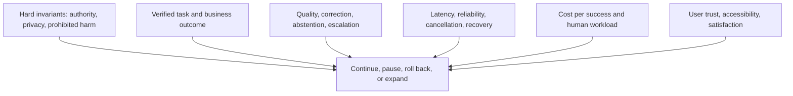

# Online experiments and production feedback

> _Last reviewed: 2026-07-16 — see the [freshness policy](../appendix/maintenance.md). Experiment platforms and legal requirements change; revalidate consent, purpose and exposure controls._

## Learning objectives

After this chapter you will be able to:

- decide which questions require production evidence;
- design canaries and experiments around verified task outcomes;
- protect hard safety constraints while learning online;
- control feedback bias, delayed outcomes and interference;
- convert production failures into governed evaluation data.

## Decision in one sentence

> **Use production to measure real outcomes and distribution shift—not to discover whether a change violates a known safety invariant.**

Offline evaluation cannot fully reproduce user behavior, network conditions, tool state, organizational workflow or long-term outcomes. Online testing adds evidence, but it also exposes people and systems. Begin with the smallest authority and population that can answer the decision.

## 1. Evidence ladder

| Stage | Exposure | Actions | Question answered |
| --- | --- | --- | --- |
| telemetry-only baseline | incumbent traffic | unchanged | what population, failures and costs exist now? |
| replay | historical governed cases | simulated | how would the candidate behave on known traffic? |
| shadow | copied live inputs | disabled/simulated | does candidate behavior/latency differ under live distribution? |
| employee/internal pilot | informed bounded users | read-only or sandboxed | is the workflow usable and operationally observable? |
| customer canary | small eligible cohort | narrow, capped, reversible | do real outcomes remain within hard gates? |
| controlled experiment | randomized eligible units | policy-approved | what causal effect does the change have? |
| progressive rollout | expanding cohorts/authority | governed | does evidence remain stable as scale and diversity grow? |

Shadow systems must not duplicate consequential tools, messages or human work. Replace them with simulators or compare only read-only decisions.

## 2. Define the experiment unit

Randomize and analyze at the unit that receives the treatment and can interfere:

- user/account when experience persists across sessions;
- conversation/task for stateless isolated interactions;
- team/site/region when humans share queues or procedures;
- time window when infrastructure capacity couples treatments.

Do not randomize messages independently if one user's earlier treatment changes memory or expectations. Track assignment consistently and prevent cross-treatment state contamination.

## 3. Metric hierarchy



Separate:

- **hard guardrails:** any verified violation can stop the experiment;
- **primary outcome:** the one measure that resolves the product decision;
- **secondary measures:** explain mechanism and trade-offs;
- **diagnostics:** help localize failures but do not define success.

Clicks, thumbs-up and conversation length are weak proxies. Join task IDs to system-of-record results, corrections, repeat contacts, human review and delayed outcomes.

## 4. Experiment manifest

```yaml
experiment_id: refund-explanation-route-12
unit: customer_account
population: authenticated_refund_inquiries_ca
assignment: stable_random_50_50
candidate: gateway-route-v8
primary_outcome: verified_resolution_without_repeat_contact_7d
hard_guardrails:
  unauthorized_disclosure: 0
  duplicate_refund: 0
  unresolved_unknown_action: 0
secondary:
  - correction_rate
  - human_transfer_completion
  - latency_ms_p95
  - cost_per_verified_resolution
stop_rules:
  - any_hard_guardrail_failure
  - reliability_error_rate_above_2_percent_for_15m
owner: northstar-ai-product
expiry: 2026-09-30
```

Pre-register population, assignment, exclusions, outcome window, minimum detectable effect, analysis, guardrails and stop rules. Prevent optional stopping and metric switching from turning noise into a rollout decision.

## 5. Canary is not an A/B test

A canary primarily detects operational and safety regressions under limited exposure. It may be too small or biased for causal product claims.

Limit independently:

- cohort and percentage;
- geography, language, channel and time;
- data classes and model routes;
- tool/action scope and transaction amount;
- concurrency, cost and human queue load;
- duration and maximum affected tasks.

Maintain a server-side kill switch and safe incumbent/fallback outside the candidate prompt.

## 6. Statistics and uncertainty

Choose sample size from baseline rate, desired effect, variability, unit clustering and guardrail rarity. Report confidence/credible intervals and absolute effects with denominators.

For repeated looks, use a sequential design or adjusted boundaries. For rare critical harms, ordinary experiment power may be infeasible; use deterministic controls, targeted adversarial tests and strict exposure caps instead of waiting for statistical significance.

Analyze by pre-specified slices, but control false discovery and avoid declaring subgroup effects from tiny denominators. Distinguish exploratory findings from confirmatory evidence.

## 7. Delayed outcomes and interference

AI effects may appear after the session:

- repeat contact or appeal days later;
- refund chargeback or fraud review;
- human rework and queue displacement;
- user reliance on an incorrect answer;
- memory pollution affecting future tasks;
- capacity contention affecting untreated users.

Define observation windows and late-arriving joins. Do not declare success at response time when the business outcome occurs later.

## 8. Feedback is selected and manipulable

Explicit feedback comes from a non-random subset and can be gamed. Implicit signals such as acceptance, copy or long conversations are ambiguous.

Capture feedback with:

- task/outcome context and model/config versions;
- whether the user could observe correctness;
- correction, appeal and human adjudication;
- source and trust level;
- protection against duplicates, bots and coordinated poisoning;
- consent, purpose, retention and deletion policy.

Do not send feedback directly into prompts, fine-tuning or memory. Stage it, validate it and preserve counterevidence.

## 9. Production evaluation sampling

Sample for different purposes:

| Sample | Purpose |
| --- | --- |
| random eligible tasks | estimate population quality |
| slice oversample | monitor protected/high-risk cohorts and rare channels |
| anomaly-triggered | diagnose failures, high latency or unusual trajectories |
| action sample | verify consequential tool outcomes |
| disagreement sample | compare judges/humans and improve rubrics |
| incident sample | preserve regression evidence |

Weight estimates back to the population where appropriate. Keep targeted samples separate from prevalence claims.

## 10. Adaptive routing and bandits

Contextual bandits can learn route choices, but use them only when rewards are timely, trustworthy and safe to explore. Constrain eligible routes with policy and offline gates first. Log propensities and context required for unbiased evaluation.

Do not explore authorization, privacy, irreversible actions or legally mandated treatment. Avoid feedback loops that route underserved groups to lower-quality models because historical data is sparse.

## 11. Monitoring and rollback

Join release metadata to traces and authoritative outcomes. Monitor both levels and changes:

- hard violations and unknown action state;
- task success, correction, abstention and escalation;
- p95/p99 latency, disconnects, retries and fallback;
- cost/success, tool fan-out and human workload;
- input/task/slice distribution;
- judge/human disagreement and missing outcome joins.

Rollback should restore compatible prompts, models, tools, policies, indexes and state—not only the model name. Preserve the candidate assignment and evidence for incident analysis.

## Northstar worked example

Northstar tests a new model route for refund explanations. It first shadows read-only inference with tools disabled, then runs an employee pilot. A 2% customer canary permits order and policy reads but no refund execution. After operational gates pass, a customer-account randomized experiment measures verified resolution without repeat contact over seven days. Any unauthorized disclosure or unknown action stops exposure immediately.

## Practical artifact: online evaluation plan

Submit the evidence ladder, experiment unit, population, assignment, primary outcome, hard/secondary metrics, exposure limits, sample-size rationale, delayed-outcome window, feedback controls, monitoring and rollback plan.

## Lab

Simulate a canary and A/B test with clustered users, delayed outcomes and one rare hard-gate event. Show why message-level randomization is invalid, implement a stop rule and compare naive click-rate conclusions with verified task outcomes.

## Check yourself

1. Which question is answered by a canary but not an A/B test?
2. What is the correct randomization unit when memory persists across sessions?
3. Which outcome arrives too late to measure at response time?
4. Why can thumbs-up feedback bias a release decision?
5. Which changes must roll back together with a model route?

## Further reading

- [NIST AI RMF: Measure function](https://airc.nist.gov/airmf-resources/playbook/measure/).
- [Online controlled experiments at large scale](https://ai.stanford.edu/~ronnyk/2013-02KohaviOnlineExperiments.pdf).
- [Evaluation measurement science](06-measurement-science.md).
- [Regression gates and release decisions](05-regression-gates.md).
