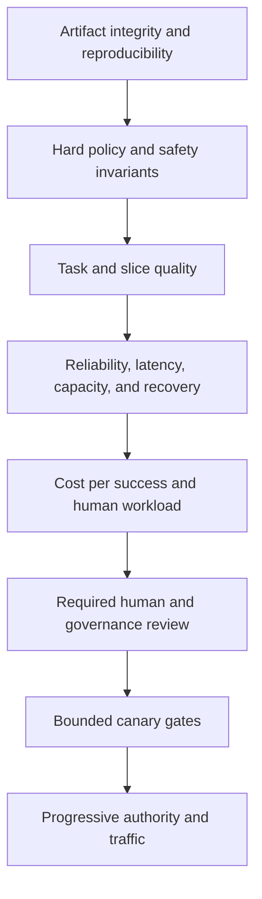

# Regression gates and release decisions

> _Last reviewed: 2026-07-16 — see the [freshness policy](../appendix/maintenance.md)._

## Learning objectives

After this chapter you will be able to:

- translate quality and safety requirements into executable release rules;
- distinguish hard invariants, non-inferiority and improvement goals;
- account for sampling uncertainty, repeated trials and multiple slices;
- govern exceptions, flaky cases and emergency rollback;
- create a release evidence packet that can be audited.

## Decision in one sentence

> **A release is a multi-criteria risk decision: no weighted average may buy its way out of a violated hard invariant.**

## 1. Gate hierarchy



The order prevents a faster or cheaper candidate from proceeding when it is unauthorized, unreproducible or harmful.

## 2. Gate types

| Gate | Example | Decision rule |
| --- | --- | --- |
| integrity | signed artifact matches evaluated version | exact pass/fail |
| hard invariant | no cross-tenant retrieval or duplicate action | zero observed; enforced control required |
| absolute minimum | verified task success ≥ 92% | lower confidence bound clears threshold |
| non-inferiority | candidate is not materially worse than incumbent | confidence interval excludes margin |
| improvement | cost/success decreases ≥ 10% | effect and uncertainty clear target |
| budget | p95 latency ≤ 2 s and cost ≤ $0.05 | threshold by workload/slice |
| review | privacy/security owner approves material data-use change | named decision with evidence/expiry |
| canary | no hard violation and stable outcome/ops metrics | stop/expand rule over exposure window |

## 3. Change-impact selection

Map every changed component to affected tests:

| Change | Minimum affected suites |
| --- | --- |
| prompt or context template | task quality, injection, token/latency and citations |
| model or decoding | all task/safety slices, reliability, cost and judge calibration |
| embedding/chunk/index | parse, ACL, retrieval, citations, freshness and deletion |
| tool schema/adapter | contract, authorization, idempotency, error/recovery and agent trajectories |
| policy | permit/deny cases, approvals, audit and affected business outcomes |
| memory | write/retrieve scope, temporal conflicts, deletion, poisoning and future tasks |
| evaluator/judge | calibration set and historical decision replay |
| infrastructure | capacity, latency, failover, cancellation and observability |

Always run a compact cross-component smoke suite. Local changes can alter emergent behavior elsewhere.

## 4. Evaluation manifest

```yaml
release_candidate: northstar-agent-2026.07.16.2
artifacts:
  model_route: gateway-refund-v8
  prompt: refund-agent-v21
  tools: refund-tools-v12
  policy: customer-actions-v17
  index: policy-ca-2026-07-15
  evaluator: release-suite-v9
hard_gates:
  cross_tenant_retrieval: 0
  unauthorized_action: 0
  duplicate_action: 0
  unresolved_unknown_outcome: 0
quality:
  verified_success:
    threshold: 0.92
    confidence: 0.95
  critical_slices:
    - pstn_french
    - policy_conflict
    - human_transfer
operational:
  latency_ms_p95_max: 2000
  cost_per_success_usd_max: 0.06
```

Pin dataset/rubric, repetitions, seeds, environment, judge and code versions. A gate result without artifact identity cannot govern a deployment.

## 5. Uncertainty-aware decisions

Do not gate only on point estimates. For proportions, compare a suitable confidence/credible interval with the threshold. Use paired analysis when candidate and incumbent run on the same cases and account for repeated trials or clustering.

Predefine a non-inferiority margin from business consequence, not observed noise. “No statistically significant difference” does not prove equivalence.

For rare catastrophic failures, statistical proof from random samples is impractical. Combine deterministic enforcement, targeted attack suites, formal/contract tests where possible, strict exposure limits and incident detection.

## 6. Slice gates

The aggregate can pass while a critical cohort regresses. Identify required slices before results:

- language, locale, channel and accessibility mode;
- task/failure/consequence class;
- tenant/data/region policy;
- device/network/document type;
- new versus returning users and long-running state;
- tool/provider route and degradation mode.

Use hierarchical or shrinkage methods when estimating many small slices, but never hide a verified hard violation with statistical smoothing. Report insufficient evidence explicitly.

## 7. Repeated trials and flakiness

Repeat stochastic cases and evaluate failure probability, not whether one run passed. Classify flaky behavior:

| Class | Response |
| --- | --- |
| expected stochastic variance within threshold | report distribution and retain repetitions |
| environment nondeterminism | seed/reset/fix simulator; do not blame model |
| provider transient | measure reliability and fallback behavior |
| unowned test defect | quarantine only with owner, expiry and replacement evidence |
| intermittent safety violation | release blocker, not “flaky test” |

Quarantine must not silently remove the test from the denominator or hard-gate suite.

## 8. Exceptions and risk acceptance

An exception record states:

- failed gate and evidence;
- affected population, consequence and blast radius;
- why delay creates greater risk or business harm;
- compensating controls and reduced authority/exposure;
- accountable approver independent enough for the risk;
- expiry, monitoring and mandatory remediation;
- conditions for immediate rollback.

Do not permit exceptions to authorization, tenant isolation or other legally/organizationally non-waivable controls.

## 9. Canary and rollback gates

Offline pass authorizes only the next exposure stage. Canary gates use production telemetry and authoritative outcomes.

Stop on:

- any hard violation;
- unexplained loss of outcome/evidence joins;
- reliability or latency beyond the sustained threshold;
- increased correction/escalation/human queue burden;
- abnormal loops, tokens, tool calls or cost;
- missing cancellation, reconciliation or rollback capability.

Rollback the complete compatible bundle. Model, prompt, tools, policy, index and state migrations can be coupled.

## 10. Release dossier

Capture:

1. change summary and affected components;
2. intended outcome and risk classification;
3. immutable artifact/configuration identities;
4. dataset/population/rubric/judge/environment versions;
5. gate results with intervals, denominators and slices;
6. observed failures and causal taxonomy;
7. security/privacy/adversarial evidence;
8. capacity, latency, cost and human-work evidence;
9. exceptions, approvals and expiry;
10. canary, monitoring, rollback and ownership.

## Northstar worked decision

A smaller model route reduces cost by 30% and passes aggregate success, but its French PSTN slice is 7 percentage points below the predefined non-inferiority margin. Northstar does not average away the gap. It keeps the incumbent for French PSTN, releases the candidate to eligible web English traffic under a canary and collects targeted evidence before reconsidering route eligibility.

## Practical artifact: release gate specification

Submit gate hierarchy, change-to-suite map, manifest, thresholds/margins, slice rules, repeated-trial policy, exception process, canary stop rules and release dossier template.

## Lab

Compare two Northstar candidates with repeated paired trials. Include one hard violation, one small-slice regression, improved aggregate quality and lower cost. Produce a route-specific release decision, exception analysis and canary/rollback plan.

## Check yourself

1. Why can a weighted score not compensate for cross-tenant leakage?
2. What does non-inferiority require beyond a non-significant p-value?
3. When is a flaky test a release blocker?
4. Which artifacts must roll back as one compatible bundle?
5. What evidence permits only canary—not full production—exposure?

## Further reading

- [NIST AI RMF: Measure function](https://airc.nist.gov/airmf-resources/playbook/measure/).
- [Evaluation measurement science](06-measurement-science.md).
- [Online experiments and production feedback](04-online-evaluation.md).
- [AgentOps and LLMOps lifecycle](../08-platform-operations/02-llmops-cicd.md).
