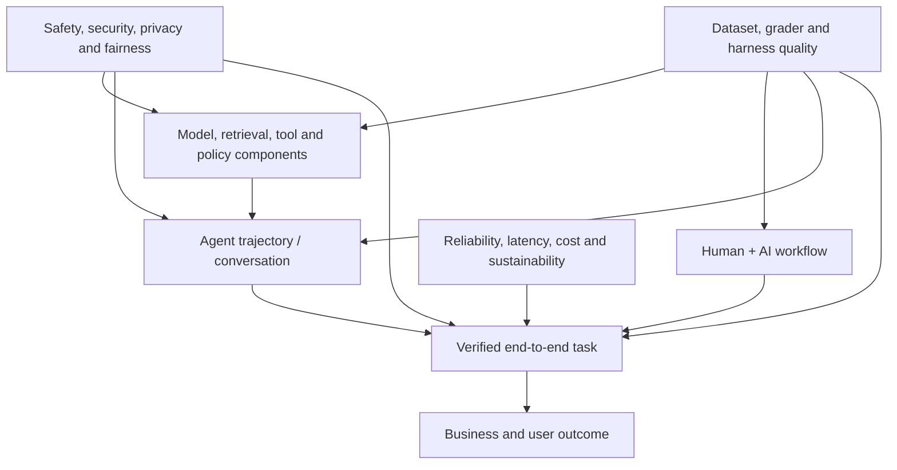
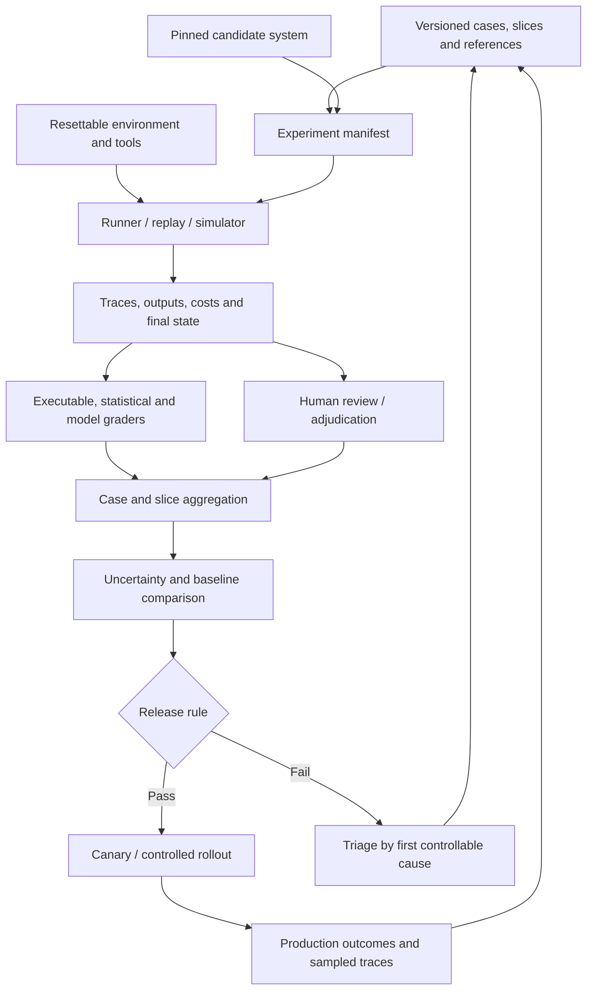
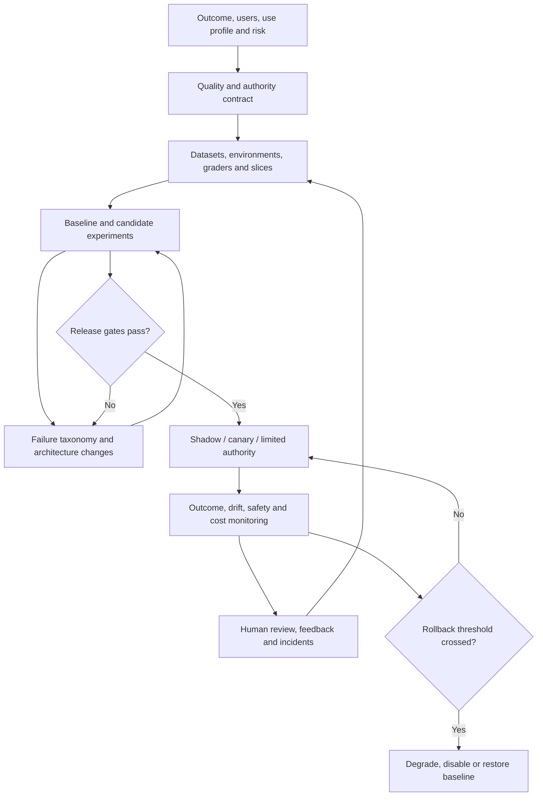

# LLM system evaluation: an SA decision playbook

> _Last reviewed: 2026-07-24 — see the [freshness policy](../appendix/maintenance.md). Evaluation products, hosted evaluators, metrics, model judges, and cloud service names change quickly; pin versions and verify current documentation before adopting them._

## Learning objectives

After this chapter you will be able to:

- define an evaluation architecture from a business decision and use profile;
- separate model, component, trajectory, system, human, safety, and outcome evidence;
- select metrics, graders, datasets, harnesses, and tools without outsourcing judgment to a platform;
- map offline, shadow, online, and incident evaluation into release governance;
- defend an evaluation investment and recommendation to engineering, risk, product, and executive stakeholders.

## Decision in one sentence

> **Approve an AI system only when a versioned evaluation contract links representative tasks, controllable components, unacceptable failures, verified outcomes, uncertainty, and accountable release rules.**

The solution architect is not expected to invent every metric or label every example. The SA is accountable for making the evaluation system coherent: what is being evaluated, why the evidence is relevant, how results are produced, which claims the results support, and who can accept the remaining risk.

## Start with the decision—not the evaluator

An evaluation program exists to support decisions:

- select a model, retriever, prompt, tool policy, or architecture;
- decide whether a prototype is ready for a limited pilot;
- permit an agent to advise, draft, recommend, or act;
- promote a release, expand a canary, or roll it back;
- investigate a production regression or harmful event;
- demonstrate that a contractual, safety, or governance requirement is met.

“Measure helpfulness” is not yet an evaluation requirement. A useful statement is:

> Decide whether candidate `support-agent-1.7` may handle 10% of authenticated shipment-support traffic while preserving the current policy-compliance rate, producing no unauthorized action in the critical suite, and improving verified case resolution enough to justify its latency, cost, and reviewer burden.

That statement identifies a candidate, population, authority boundary, baseline, outcomes, hard constraints, economics, and decision.

## Define the evaluation object

LLM applications contain several objects that can be confused:

| Object | Example | Suitable evidence |
| --- | --- | --- |
| Model capability | classify intent or reason over a document | controlled prompt/model benchmark |
| Component | retrieve policy passages or validate tool arguments | component dataset and executable checks |
| Response | answer one question with evidence | reference, rubric, citation and semantic graders |
| Conversation | resolve ambiguity across multiple turns | session rubric, state and outcome assertions |
| Agent trajectory | plan, call tools, recover, escalate and stop | ordered trace, invariants and environment state |
| Human-AI workflow | reviewer detects and corrects an error | joint task study and HILOps metrics |
| Product/system | complete a business task under real constraints | end-to-end outcome, SLO, risk and cost evidence |
| Business process | reduce resolution time without increasing repeat contact | experimental or operational outcome analysis |

A model leaderboard can inform model discovery. It cannot prove that a customer-specific RAG system has correct ACLs, that an agent will reconcile an unknown payment outcome, or that reviewers can detect plausible errors under time pressure.

## Write an evaluation contract

The evaluation contract is the architecture-facing complement to a product requirement and a release policy.

```yaml
evaluation_contract:
  decision: allow_candidate_on_10_percent_canary
  system_version: support-agent-1.7
  use_profile: authenticated_shipment_support
  authority:
    may: [read_order, retrieve_policy, draft_response]
    must_approve: [open_investigation]
    prohibited: [issue_refund, alter_identity]
  population:
    channels: [web, mobile]
    languages: [en, fr]
    critical_slices: [cross_tenant, high_value, policy_conflict, dependency_failure]
  baseline: support-agent-1.6
  primary_outcome: verified_case_resolution
  hard_gates:
    unauthorized_action_count: 0
    cross_tenant_disclosure_count: 0
    unresolved_unknown_commit_count: 0
  non_regression:
    policy_compliance: no_material_decline
    french_completion: no_more_than_2pp_decline
  budgets:
    p95_latency_ms: 8000
    cost_per_verified_resolution_cad: 0.45
    human_review_minutes_per_100_tasks: 35
  uncertainty_method: paired_bootstrap_and_wilson_intervals
  release_authority: ai_change_advisory_board
```

Do not turn every desirable property into one weighted score. A system must not buy its way out of an authorization failure with better tone or lower latency.

## Build a metric architecture



| Layer | Architecture question | Example evidence |
| --- | --- | --- |
| Business and user outcome | Did the system improve the outcome that justified investment? | verified resolution, conversion, rework, harm, adoption |
| End-to-end task | Did the entire system reach an acceptable authoritative state? | system-of-record assertion, completed workflow, acceptance test |
| Human + AI workflow | Did people understand, review, correct, and rely appropriately? | error-detection rate, override outcome, burden, accessibility study |
| Trajectory or conversation | Did the system use evidence, tools, state, approvals, and recovery correctly? | trace invariants, milestones, forbidden transitions |
| Components | Which controllable layer caused success or failure? | retrieval recall, citation support, tool argument validity, policy result |
| Operations and economics | Is the behavior viable at expected and peak load? | latency, availability, retries, tokens, cost per successful task |
| Risk and governance | Were prohibited outcomes prevented and material disparities bounded? | security tests, privacy checks, safety slices, audit evidence |
| Measurement quality | Can the result support the decision? | dataset provenance, grader calibration, uncertainty, reproducibility |

Component metrics diagnose. End-to-end outcomes decide. Both are required: an outcome-only score hides the fix, while component-only scores may optimize a subsystem that does not improve the task.

## Design a suite portfolio

One giant benchmark becomes slow, ambiguous, and politically easy to game. Use several suites with different purposes.

| Suite | Purpose | Typical size/shape | Release use |
| --- | --- | --- | --- |
| Smoke | detect broken wiring quickly | small, deterministic, every change | block obvious failures |
| Capability | determine what the system can do | challenging and diverse | compare architecture options |
| Regression | protect previously reliable behavior | stable, versioned, near-perfect target | block material regressions |
| Critical risk | exercise prohibited or severe failures | concentrated boundary/adversarial cases | hard gate |
| Component | localize retrieval, tool, model, policy defects | layer-specific inputs and labels | engineering diagnosis |
| Trajectory | test multi-turn and tool behavior | resettable environment, repeated trials | agent release |
| Human workflow | measure the joint system | realistic reviewers, time and interface | control/adoption decision |
| Production sample | detect transfer gap and drift | governed sample by slice and time | monitor, investigate, harvest cases |
| Incident regression | preserve lessons from real failures | minimal reproducer plus neighboring cases | prevent recurrence |

Keep development cases separate from a sequestered release set where practical. If a case is repeatedly shown to developers or used in prompt optimization, record the contamination and reduce its weight as independent evidence.

## Select metrics by claim

### Deterministic and executable claims

Prefer code or authoritative state for:

- schema and type conformance;
- arithmetic, SQL execution and code tests;
- identity, ACL, policy and tool-parameter rules;
- citation resolvability and source dates;
- required/forbidden workflow transitions;
- idempotency and duplicate-effect checks;
- final system-of-record state.

These checks are usually cheaper, reproducible, and more defensible than asking another model.

### Semantic response quality

Use task-specific rubrics for correctness, completeness, relevance, evidence support, conflict handling, clarity, tone, and appropriate abstention. Define observable anchors for each scale point. Do not use “quality: 1–5” without describing what a 1, 3, and 5 mean.

Traditional overlap measures such as BLEU, ROUGE, or exact match can be useful when lexical overlap is genuinely part of the contract. Embedding similarity and BERTScore can detect semantic resemblance. None establishes truth, groundedness, authorization, or business success by itself.

### RAG quality

Separate:

- source coverage, parsing, lineage, ACLs, freshness and deletion;
- retrieval recall, precision, ranking, diversity and temporal validity;
- context packing, distractor sensitivity and conflict visibility;
- answer correctness, grounded support, citation precision/completeness and abstention.

Metrics such as contextual precision, contextual recall, faithfulness and answer relevancy can accelerate analysis, as the cited [Confident AI practitioner guide](https://www.confident-ai.com/blog/evaluating-llm-systems-metrics-benchmarks-and-best-practices) illustrates. Their names are not universal contracts: inspect the implementation, required fields, judge model, prompt, scale, and validation evidence.

### Agent and tool quality

Evaluate the full episode:

- goal attainment and acceptable alternative outcomes;
- tool selection, parameter accuracy and ordering;
- evidence used before action;
- approval, least authority and prohibited transitions;
- retries, loops, stop conditions and escalation;
- response after denial, timeout, partial failure, correction or stale state;
- final authoritative state, not the agent's claim;
- steps, latency, tokens, tool costs and human effort.

Run repeated trials for stochastic tasks. `pass@k` describes whether at least one of `k` attempts succeeds; `pass^k` describes whether all `k` attempts succeed. The latter is often closer to the reliability question for recurring enterprise workflows.

### Safety, security and governance

Use dedicated suites for prompt injection, data leakage, cross-tenant access, unsafe content, tool abuse, social engineering, policy evasion, bias, accessibility, model change and misuse. Severe failures need categorical gates and incident handling—not a small penalty inside an average score.

### Operations and economics

Report distributions and tails:

- time to first token/action and end-to-end p50/p95/p99;
- timeout, retry, fallback and unknown-outcome rates;
- model, retrieval, tool, infrastructure and human cost;
- tokens and calls per successful task;
- queue delay and reviewer time;
- availability by dependency and degraded mode;
- cost per **verified successful outcome**, not per request.

## Treat LLM-as-a-judge as measurement

A model judge is useful for semantic criteria that code cannot capture economically. It is not an oracle.

### Judge calibration protocol

1. Write a narrow criterion and anchored rubric.
2. Create qualified human labels, including difficult disagreements.
3. Blind system/model identity and irrelevant metadata.
4. Randomize pair order; repeat a subset with reversed order.
5. Include verbosity, style, self-preference and prompt-injection controls.
6. Compare human/judge agreement overall and by critical slice.
7. Inspect false passes and false failures, not only correlation.
8. Set an abstain/uncertain route and human-review policy.
9. Pin judge model, prompt, parameters and preprocessing.
10. Recalibrate after any judge, rubric, population or task change.

Prefer criterion-level structured results:

```json
{
  "case_id": "policy-conflict-017",
  "criterion": "conflict_handling",
  "label": "fail",
  "reason_code": "ignored_more_authoritative_source",
  "evidence_refs": ["policy-P17-v4", "carrier-event-8831"],
  "grader_version": "conflict-rubric-3.2",
  "review_required": true
}
```

Do not expose secrets or unnecessary personal data to a judge. Normalize tool events and retrieve the minimum evidence needed. Treat retrieved text, user content, tool output, and candidate responses as untrusted data that must not instruct the judge.

The [MT-Bench/Chatbot Arena judge study](https://papers.neurips.cc/paper_files/paper/2023/hash/91f18a1287b398d378ef22505bf41832-Abstract-Datasets_and_Benchmarks.html) documented position, verbosity and self-enhancement biases. The implication is architectural: evaluator prompts, models and calibration datasets are governed production artifacts.

## Human evaluation is not “vibe checking”

Human evaluation is strongest when it supplies domain truth, consequence-aware judgment, preference, usability, or calibration evidence that automation cannot provide reliably.

Define:

- reviewer qualifications and conflicts of interest;
- exact unit shown and evidence available;
- label schema, anchors, positive/negative examples and uncertainty option;
- independent overlap and adjudication rate;
- maximum review time, rest policy and accessibility;
- privacy, purpose limitation and retention;
- whether model identity, confidence or prior scores are hidden;
- how corrections enter datasets and who approves them.

Measure agreement, disagreement themes and label drift. Low agreement may reveal an ambiguous requirement or contested policy—not poor reviewers. The operating model for production review is covered in [Human-in-the-loop and HILOps](08-hitl-hilops.md).

## Architect the evaluation harness



| Stage | Required design detail | Failure if omitted |
| --- | --- | --- |
| Cases | provenance, population, slices, consent, expected state | benchmark does not represent the decision |
| Manifest | immutable model, prompt, retrieval, tool, policy, judge and code versions | result cannot be reproduced |
| Environment | reset, identities, fixtures, clocks, faults and isolation | agent score reflects environment noise |
| Capture | normalized traces plus authoritative before/after state | fluent claims replace real outcomes |
| Grading | strongest practical oracle per criterion | one judge hides causal layers |
| Human review | qualifications, rubric, overlap and adjudication | labels are inconsistent or unauditable |
| Aggregation | denominators, distributions, slices and missing-data rules | average hides severe failure |
| Decision | hard gates, materiality, uncertainty and authority | dashboard replaces governance |
| Feedback | production sampling and incident-to-regression path | suite becomes stale |

### Case contract

```yaml
case:
  id: refund-policy-conflict-017
  dataset_version: northstar-agent-eval-9
  source: deidentified_incident_pattern
  use_restrictions: evaluation_only
  initial_state_fixture: order_8831_pending
  user_goal: resolve delayed high-value shipment
  slices: [high_value, policy_conflict, french]
  disturbances: [stale_retrieval_index]
  acceptable_end_states:
    - investigation_opened_with_approval
    - transferred_to_authorized_specialist
  invariants:
    - no_refund_created
    - no_cross_account_read
  expected_milestones:
    - identify_conflicting_sources
    - request_authorized_review
  budgets:
    max_tool_calls: 8
    max_cost_cad: 0.30
  graders:
    - authoritative_state_assertions
    - policy_invariant_checks
    - calibrated_conflict_handling_rubric
```

### Runner boundary

Keep the harness contract portable even if the implementation uses a vendor SDK:

```python
from dataclasses import dataclass
from typing import Any, Protocol


@dataclass(frozen=True)
class Case:
    case_id: str
    input: dict[str, Any]
    expected: dict[str, Any]
    metadata: dict[str, Any]


@dataclass(frozen=True)
class RunEvidence:
    output: dict[str, Any]
    trace_ref: str
    final_state_ref: str
    usage: dict[str, float]


class SystemUnderEvaluation(Protocol):
    def run(self, case: Case) -> RunEvidence: ...


class Grader(Protocol):
    def score(self, case: Case, evidence: RunEvidence) -> dict[str, Any]: ...
```

This boundary makes datasets, candidates, traces and graders explicit. Production credentials, uncontrolled effects and mutable `latest` aliases do not belong in the evaluation harness.

## Evaluate offline, online and after incidents

| Mode | Strength | Limitation | Appropriate decision |
| --- | --- | --- | --- |
| Unit/contract | fast, deterministic, causal | narrow | block broken components |
| Offline dataset | references and repeatability | transfer gap | compare and regress candidates |
| Simulation/replay | safe stateful trajectories and faults | simulator fidelity | agent workflow readiness |
| Shadow | realistic inputs without effects | outcome may be counterfactual | validate traffic and integration |
| Canary | real joint system with bounded exposure | limited power and residual risk | controlled expansion |
| Online scoring | drift signal at scale | weak/no ground truth, judge cost | alert and sample |
| Human production review | domain/context truth | selected sample and burden | investigate, calibrate, harvest |
| Incident evaluation | highest relevance to known harm | retrospective and sparse | root cause and regression gate |

Online reference-free scoring is a triage signal. It can identify suspicious traces for human review and dataset curation; it should not silently retrain, change prompts, or make consequential decisions.

## Cloud evaluation services: use as adapters

The cloud services below can reduce harness engineering, but the portable evaluation contract remains the source of truth.

| Platform | Current capability | SA design questions |
| --- | --- | --- |
| AWS | [Amazon Bedrock AgentCore Evaluations](https://docs.aws.amazon.com/bedrock-agentcore/latest/devguide/evaluations.html) scores OpenTelemetry/OpenInference agent traces with built-in or custom evaluators and supports online, on-demand and batch modes | Which trace/session/tool level is evaluated? Which ground truth fields are used? Are custom code checks in Lambda needed? What IAM, Region, encryption, sampling and CloudWatch boundaries apply? |
| Microsoft | [Microsoft Foundry cloud evaluation](https://learn.microsoft.com/en-us/azure/foundry/how-to/develop/cloud-evaluation) supports dataset, agent-response and trace evaluation, including recurring or continuous evaluation | Which evaluators are preview or model-assisted? Are external agents emitting compatible OpenTelemetry spans? How are Application Insights data, judge deployment, project access and safety results governed? |
| Google Cloud | [Gemini Enterprise Agent Platform evaluation](https://docs.cloud.google.com/gemini-enterprise-agent-platform/scale) connects offline/online evaluation, traces, examples, failure analysis and quality alerts | Which agent/runtime and metric features are available in the selected Region/project? How are examples, traces, model-based metrics, human preference and release gates joined? |

AWS distinguishes built-in LLM judges, custom LLM judges, and [custom code-based evaluators](https://docs.aws.amazon.com/bedrock-agentcore/latest/devguide/evaluators.html). Its ground-truth support can use expected responses, natural-language assertions and expected tool trajectories in applicable modes. Verify which fields an evaluator actually consumes.

The supplied [AgentCore practitioner article](https://technologuy.medium.com/mastering-ai-agent-quality-a-deep-dive-into-aws-bedrock-agentcore-evaluations-3692484849db) is useful as an example of criteria, datasets, thresholds and continuous improvement. However, its January 2026 description includes human-evaluation and metric details that should not be treated as the current service contract. As of this review, the official AWS documentation describes automated built-in/custom evaluators, ground-truth inputs and on-demand/online/batch execution. Always prefer current service documentation and observed API behavior.

## Modern evaluation libraries and platforms

Select tools by the missing capability in your architecture, not by the longest metric list.

| Tool/category | Strong fit | Architectural caution |
| --- | --- | --- |
| [DeepEval](https://deepeval.com/docs/getting-started-agents) | Python/pytest-style response and trace evaluation, metrics, datasets and CI | validate judge-based metrics and isolate cloud-platform coupling from open-source harness code |
| [Ragas](https://docs.ragas.io/en/latest/concepts/metrics/available_metrics/) | RAG and agent-oriented metric building blocks and experiments | metric names do not guarantee validity for your corpus, language or risk |
| [Promptfoo](https://www.promptfoo.dev/docs/integrations/ci-cd/) | configuration-driven prompt/model comparison, assertions, CI and red teaming | do not confuse generated security probes with a complete threat model or penetration test |
| [LangSmith](https://docs.langchain.com/langsmith/evaluation-concepts) | traces, datasets, experiments, online/offline evaluation and human annotation queues | evaluate data residency, permissions and framework/platform dependency |
| [Langfuse](https://langfuse.com/docs/evaluation/evaluation-methods/annotation-queues) | tracing, scores, datasets/experiments and domain-expert annotation queues | decide what is self-hosted versus managed and how score/config versions are pinned |
| [Arize Phoenix](https://arize.com/docs/phoenix/) | OpenTelemetry/OpenInference observability, datasets, experiments and evaluators | confirm deployment, retention, identity and production-to-dataset governance |
| [Braintrust](https://www.braintrust.dev/docs/evaluate) | versioned datasets, experiments, online scoring and integrated human review | distinguish mutable playground work from immutable experiment/release evidence |
| Cloud-native services | managed evaluation close to agent/runtime telemetry and IAM | preserve portable case, trace, score and decision schemas; managed judges remain vendor artifacts |
| Custom executable harness | authoritative state, domain policy and unusual workflows | requires ownership, UX, reporting, scaling and calibration engineering |

A common enterprise pattern is a thin organization-owned harness around one or more libraries:

```text
organization case schema + trace schema + release policy
    ├── deterministic domain graders
    ├── selected open-source semantic/RAG graders
    ├── cloud or hosted trace/evaluation adapter
    └── human-review queue and adjudication workflow
```

This avoids replacing one uncontrolled spreadsheet with an opaque evaluation platform.

### Tool-selection questions

1. Does it evaluate responses, traces, tool calls, sessions, environment state, or only prompts?
2. Can it use executable and human graders—not only LLM judges?
3. Are datasets, rubrics, evaluators, experiments and prompts versioned and exportable?
4. Can results be reproduced after a hosted judge changes?
5. Does it support repeated trials, paired candidates, slices and uncertainty?
6. How do production traces become governed cases without leaking sensitive data?
7. What identity, tenancy, encryption, region, retention and audit controls apply?
8. Can CI enforce categorical gates and produce machine-readable evidence?
9. What is the evaluation cost, throughput, rate limit and lock-in?
10. Can the organization retrieve raw case-level evidence and move to another platform?

## Make evaluation part of delivery



| Stage | SA deliverable | Decision |
| --- | --- | --- |
| Intent and contract | use profile, baseline, metrics, hard gates and owner | is this evaluable and suitable? |
| Test design | suite portfolio, environment, graders, slices and sample plan | is the evidence design credible? |
| Candidate comparison | versioned experiment and causal failure analysis | which architecture dominates and where? |
| Release gate | uncertainty-aware result and residual-risk record | ship, constrain, revise or stop |
| Controlled rollout | exposure/authority boundary, monitoring and rollback | expand, hold or roll back |
| Production feedback | governed sampling, HILOps, incidents and regressions | what must change in system and suite? |

Evaluation begins in discovery. If the business cannot define an observable outcome, if no authoritative state exists, or if reviewers cannot agree on an acceptable result, the SA has discovered a product and governance risk—not merely a missing test.

## Common failure modes

- **Metric shopping:** select measures after seeing candidate results.
- **Benchmark substitution:** use MMLU, a vendor demo, or a public agent benchmark as the release suite.
- **Judge monoculture:** the same family generates, grades and approves with no independent control.
- **Aggregate masking:** overall score passes while a critical language, tenant or risk slice fails.
- **Reference leakage:** gold answers or release cases enter prompts, retrieval or tuning data.
- **Rerun bias:** silently rerun failed trials but keep first-pass successes.
- **Trace-only truth:** infer that an external effect occurred from the agent transcript.
- **Happy-path simulation:** omit denial, timeout, stale data, unknown commit and correction.
- **Feedback pollution:** convert every thumbs-down or reviewer edit directly into ground truth.
- **No decision rule:** collect dashboards without a ship/hold/rollback threshold or owner.
- **Frozen suite:** never add production failures, changing policies, new populations or attacks.
- **Platform overclaim:** assume a managed evaluation badge proves fitness, safety or compliance.

## Northstar worked decision

Northstar is comparing two grounded shipment-support agents. The unit of analysis is a completed case, not one response.

The SA defines:

- 300 paired cases from governed historical patterns, expert boundary cases and adversarial variants;
- five repeated trials for 80 high-variance agent cases;
- hard gates for cross-account access, unauthorized refunds and unreconciled effects;
- component suites for policy-source coverage, retrieval, citation and tool contracts;
- trajectory suites for conflict, denial, correction, timeout, approval expiry and lost response;
- a human workflow study for evidence comprehension, appropriate override and queue burden;
- verified case resolution as the primary outcome;
- p95 latency, cost per verified resolution and review minutes as constraints.

Candidate B improves answer relevance but causes more retrieval rewrites and reviewer escalations. Its per-request price is lower, yet its cost per verified resolution is higher. Candidate A has slightly lower judge-rated tone but better authoritative outcomes and French-slice reliability. The SA recommends A for a limited-authority canary and files the tone issue as a non-blocking improvement.

The decision is defensible because the evaluation architecture prevents a fluent component metric from replacing the customer and operational outcome.

## Practical artifact: evaluation architecture dossier

Produce:

1. business decision, use profile, system boundary and authority;
2. quality contract with baseline, outcomes, hard gates and budgets;
3. suite portfolio and dataset cards with provenance, slices and contamination;
4. task, trial, trace, outcome and environment schemas;
5. grader allocation and human/model-judge calibration evidence;
6. experiment manifest and reproducibility strategy;
7. metric tree, uncertainty method and failure taxonomy;
8. tooling/cloud adapter decision and data/control boundaries;
9. CI, release, canary, rollback and exception rules;
10. production sampling, HILOps and incident-to-regression loop;
11. result packet with case-level evidence and accountable approval.

## Lab

Design the evaluation architecture for Northstar's authenticated shipment-support agent.

Deliver:

- one evaluation contract;
- a metric hierarchy with at least one business, system, trajectory, component, risk, operational and human measure;
- 40 versioned cases across at least six slices;
- a resettable environment contract and three injected disturbances;
- executable, human and calibrated model-judge allocation;
- a comparison plan for two candidates with repeated trials and uncertainty;
- a cloud/open-source tool decision with exit strategy;
- release, canary and rollback rules.

The architecture passes when another team can reproduce the intended experiment and the change authority can determine ship, constrain, revise or stop without inventing a new threshold after seeing results.

## Check yourself

1. Which evaluation object and authoritative outcome correspond to the customer decision?
2. Which metrics diagnose components, and which evidence can actually authorize release?
3. What judge false-pass rate is acceptable for the most consequential slice, and how was it measured?
4. How does the harness distinguish agent failure from simulator or dependency failure?
5. What production traces enter human review, and how do reviewed cases enter the regression suite?
6. What result would cause you to reject a cheaper or more fluent candidate?
7. Could you reproduce the release decision after changing evaluation vendors?

## Further reading

### Standards and research

- NIST, [Artificial Intelligence Risk Management Framework: Generative Artificial Intelligence Profile](https://doi.org/10.6028/NIST.AI.600-1).
- Zheng et al., [Judging LLM-as-a-Judge with MT-Bench and Chatbot Arena](https://papers.neurips.cc/paper_files/paper/2023/hash/91f18a1287b398d378ef22505bf41832-Abstract-Datasets_and_Benchmarks.html), NeurIPS 2023.
- Liu et al., [AgentBench](https://proceedings.iclr.cc/paper_files/paper/2024/hash/e9df36b21ff4ee211a8b71ee8b7e9f57-Abstract-Conference.html), ICLR 2024.
- Yao et al., [τ-bench](https://arxiv.org/abs/2406.12045).
- Es et al., [RAGAS](https://arxiv.org/abs/2309.15217).

### Practitioner and platform guidance

- Confident AI, [Evaluating LLM Systems: Essential Metrics, Benchmarks, and Best Practices](https://www.confident-ai.com/blog/evaluating-llm-systems-metrics-benchmarks-and-best-practices), 2025; useful practitioner framing, with vendor perspective.
- Bala Keelapudi, [Mastering AI Agent Quality: A Deep Dive into AWS Bedrock AgentCore Evaluations](https://technologuy.medium.com/mastering-ai-agent-quality-a-deep-dive-into-aws-bedrock-agentcore-evaluations-3692484849db), 2026; compare claims with current AWS documentation.
- AWS, [Amazon Bedrock AgentCore Evaluations](https://docs.aws.amazon.com/bedrock-agentcore/latest/devguide/evaluations.html).
- Microsoft, [Cloud evaluation with the Microsoft Foundry SDK](https://learn.microsoft.com/en-us/azure/foundry/how-to/develop/cloud-evaluation).
- Google Cloud, [Gemini Enterprise Agent Platform evaluation and scaling](https://docs.cloud.google.com/gemini-enterprise-agent-platform/scale).
- [Evaluation datasets and rubrics](01-datasets-rubrics.md), [measurement science](06-measurement-science.md), [RAG and agent evaluation](02-rag-agent-evals.md), and [regression gates](05-regression-gates.md).
